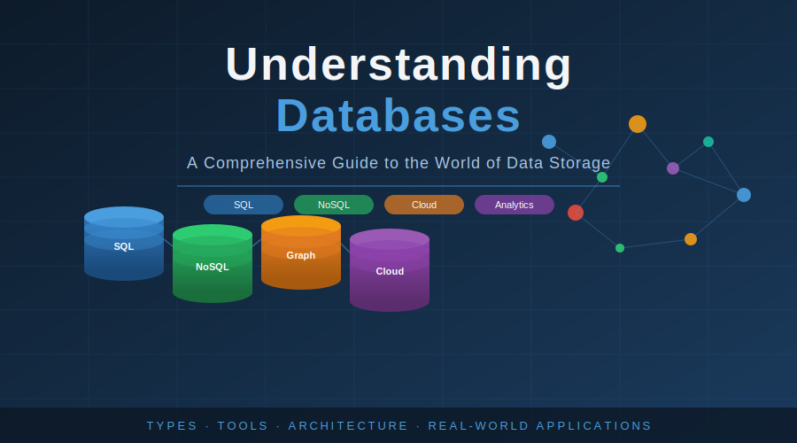
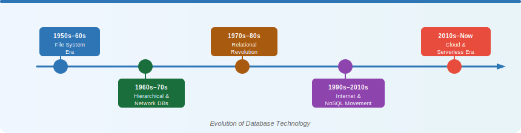
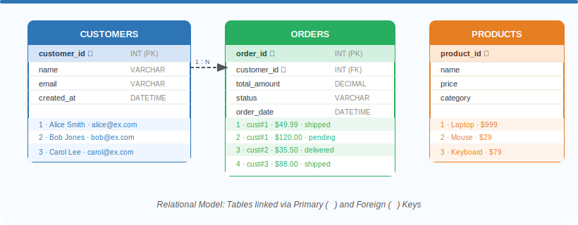
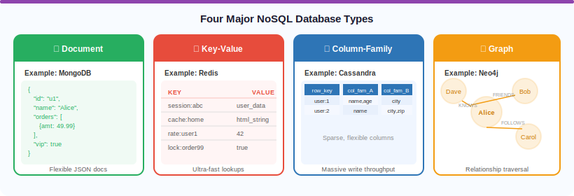
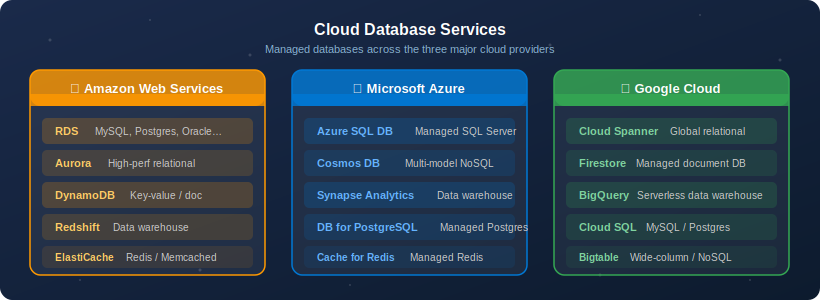
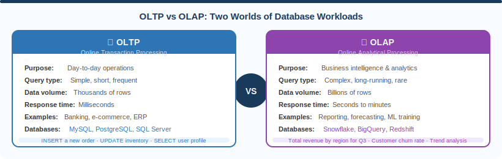

##Understanding Databases##

###A Comprehensive Guide to the World of Data Storage

─────────────────────────────

Types, Tools, Architecture & Real-World Applications

###Introduction

In the modern digital world, data is often described as the new oil.
Every application you use, every website you visit, every purchase you
make --- all of it generates, consumes, and relies on data stored
somewhere. That somewhere is a database.

A database is an organized collection of structured or unstructured
information that is stored electronically and designed to be efficiently
accessed, managed, queried, and updated. At its most fundamental level,
a database is simply a system for persistently storing data so it can be
retrieved later. But in practice, databases are extraordinarily
sophisticated systems that must balance competing requirements: speed
versus accuracy, flexibility versus structure, scale versus cost.

The landscape of databases has exploded over the past few decades. What
began as simple file-based systems in the 1960s has evolved into a vast
ecosystem of relational databases, document stores, graph databases,
time-series engines, cloud data warehouses, and more. Each category
exists because different problems call for different solutions, and as
the internet has scaled to billions of users and petabytes of data,
engineers have had to invent increasingly specialized tools to keep up.

This essay provides a comprehensive tour of the database world ---
covering what databases are, how they work internally, the major
categories and their trade-offs, the most widely used products in each
category, the management tools used to interact with them, and how cloud
computing has transformed the entire landscape.

**A Brief History of Databases**

To understand why so many types of databases exist, it helps to
understand where they came from.

**The File System Era (1950s--1960s)**

Before databases, applications stored data in flat files --- essentially
text files on disk. Programs would read and write these files directly.
This worked for simple use cases but quickly became unmanageable: there
was no standard way to query data, no protection against two programs
editing the same file simultaneously, and no way to define relationships
between pieces of data.

**Hierarchical and Network Databases (1960s--1970s)**

The first proper databases used hierarchical models, where data was
organized in a tree structure (parent-child relationships). IBM\'s
Information Management System (IMS), created in 1966 for the Apollo moon
program, is the most famous example. Network databases extended this by
allowing records to have multiple parent records, forming a graph-like
structure. While more powerful, these systems required programmers to
know exactly how the data was physically stored --- a significant
limitation.

**The Relational Revolution (1970s--1980s)**

In 1970, Edgar F. Codd, a mathematician at IBM, published a landmark
paper introducing the relational model of data. His insight was simple
but profound: data should be stored in tables of rows and columns, and
queries should describe what data you want rather than how to find it.
This led to the development of SQL (Structured Query Language) and the
first relational database systems. Oracle, IBM DB2, and Microsoft SQL
Server all trace their roots to this era. The relational model became so
dominant that for decades it was virtually synonymous with the concept
of a database.

**The Internet and the NoSQL Movement (1990s--2010s)**

The explosive growth of the internet in the 1990s and 2000s created data
challenges that traditional relational databases struggled to handle.
Companies like Google, Amazon, and Facebook were dealing with data at a
scale and variety that no one had ever encountered before. They needed
databases that could store billions of records across thousands of
servers, handle highly variable data structures, and serve millions of
concurrent users.

This pressure gave birth to the NoSQL movement --- a broad category of
databases that abandoned some or all of the constraints of the
relational model in exchange for scalability, flexibility, or
performance. The term NoSQL, originally meaning \'No SQL,\' was later
reinterpreted as \'Not Only SQL,\' acknowledging that these databases
weren\'t necessarily replacing relational systems but complementing
them.

**The Cloud Era (2010s--Present)**

The rise of cloud computing brought another transformation. Amazon Web
Services, Microsoft Azure, and Google Cloud Platform began offering
database services that could be spun up in minutes, scaled
automatically, and maintained without dedicated database administrators.
This democratized access to powerful database technology and introduced
entirely new database paradigms, such as serverless databases that
charge per query rather than per server hour.

**Relational Databases (SQL)**

Relational databases remain the backbone of the software industry. They
are based on the relational model proposed by Codd and use Structured
Query Language (SQL) to define, manipulate, and query data.

**Core Concepts**

**Tables and Schema:** Data is organized into tables, where each table
represents a specific entity (e.g., customers, orders, products). Each
table has a defined schema --- a rigid structure specifying the columns,
their data types, and any constraints.

**Rows and Columns:** Each row (also called a record or tuple)
represents one instance of the entity. Each column (also called an
attribute or field) represents a specific property of that entity.

**Primary and Foreign Keys:** A primary key is a unique identifier for
each row. A foreign key is a column in one table that references the
primary key of another table, establishing a relationship between the
two.

**ACID Properties:** Relational databases guarantee four critical
properties: Atomicity (a transaction either fully succeeds or fully
fails), Consistency (the database always moves from one valid state to
another), Isolation (concurrent transactions don\'t interfere with each
other), and Durability (once committed, data survives system failures).
These properties make relational databases exceptionally reliable for
financial and transactional workloads.

**Structured Query Language (SQL)**

SQL is the universal language for interacting with relational databases.
Despite variations between database vendors, core SQL is highly
standardized. SQL operations fall into several categories:

**DDL (Data Definition Language):** Commands like CREATE TABLE, ALTER
TABLE, and DROP TABLE define and modify the structure of the database.

**DML (Data Manipulation Language):** Commands like SELECT, INSERT,
UPDATE, and DELETE read and modify data.

**DCL (Data Control Language):** Commands like GRANT and REVOKE manage
permissions and access control.

**TCL (Transaction Control Language):** Commands like COMMIT and
ROLLBACK manage transactions.

**Major Relational Database Products**

  ---------------- --------------- ---------------- ----------------------
  **Database**     **Developer**   **License**      **Best Known For**

  MySQL            Oracle          Open Source      Web applications, LAMP
                                   (GPL)            stack, ease of use

  PostgreSQL       Community       Open Source      Standards compliance,
                                   (MIT-like)       advanced features,
                                                    extensibility

  Microsoft SQL    Microsoft       Commercial       Enterprise Windows
  Server                                            environments, BI
                                                    integration

  Oracle Database  Oracle          Commercial       Large enterprises,
                                                    mission-critical
                                                    workloads

  SQLite           D. Richard Hipp Public Domain    Embedded systems,
                                                    mobile apps, local
                                                    storage

  MariaDB          MariaDB         Open Source      MySQL-compatible,
                   Foundation      (GPL)            community-driven
                                                    alternative

  IBM Db2          IBM             Commercial       Mainframes, legacy
                                                    enterprise systems
  ---------------- --------------- ---------------- ----------------------

**MySQL**

MySQL is the world\'s most popular open-source relational database and
has powered millions of web applications since its release in 1995. It
is the \'M\' in the famous LAMP stack (Linux, Apache, MySQL, PHP/Python)
and is widely used by companies like WordPress, Twitter (historically),
Facebook (historically), and YouTube. MySQL is praised for its speed,
reliability, and ease of setup. It was acquired by Sun Microsystems in
2008 and later by Oracle, a move that led to the community fork known as
MariaDB.

**PostgreSQL**

PostgreSQL, often called Postgres, is a powerful open-source
object-relational database with a reputation for standards compliance
and advanced features. It supports complex queries, full-text search,
JSON storage (making it partially overlap with NoSQL databases), custom
data types, and an extensive extension ecosystem. PostgreSQL is the
preferred choice for developers who need a robust, feature-rich database
without the licensing costs of commercial alternatives. It has become
increasingly popular in cloud environments and is the foundation for
cloud services like Amazon Aurora.

**Microsoft SQL Server**

SQL Server is Microsoft\'s flagship relational database, first released
in 1989. It is deeply integrated with the Microsoft ecosystem, including
Windows Server, Active Directory, and Azure cloud services. SQL Server
is widely used in large enterprises, particularly those running .NET
applications and using Microsoft\'s business intelligence tools like SQL
Server Reporting Services (SSRS) and SQL Server Integration Services
(SSIS). It comes in multiple editions ranging from Express (free,
limited) to Enterprise (full-featured, expensive).

**Oracle Database**

Oracle Database is the gold standard for large-scale enterprise
databases and has been for decades. It powers many of the world\'s
largest banks, governments, and telecommunications companies. Oracle is
known for its performance optimization features, robust partitioning,
and exceptional reliability. It is also among the most expensive
database products on the market, making it most common in organizations
where the cost of database downtime or data loss would vastly exceed
licensing fees.

**SQLite**

SQLite is unique in that it is not a separate server process but a
library that is embedded directly into the application. It stores the
entire database in a single file on disk. This makes it ideal for mobile
applications (it is built into both iOS and Android), desktop
applications, browsers, and any situation where a lightweight,
zero-configuration database is needed. SQLite is remarkably widely
deployed --- there are estimated to be over one trillion SQLite
databases in existence.

**NoSQL Databases**

NoSQL is not a single type of database but a broad family of database
systems that diverge from the relational model in various ways. They
were designed to address the scalability, flexibility, and performance
challenges that relational databases struggle with at web scale. The
term covers document stores, key-value stores, column-family databases,
and graph databases, among others.

A common trade-off in NoSQL systems is the relaxation of ACID guarantees
in favor of what is called BASE: Basically Available, Soft state,
Eventually consistent. Rather than guaranteeing that every read
immediately reflects the latest write, these systems allow for temporary
inconsistencies that will eventually resolve --- a trade-off that
enables massive horizontal scalability.

**Document Databases**

Document databases store data as semi-structured documents, typically in
JSON or BSON (Binary JSON) format. Each document can have a different
structure, making them far more flexible than relational tables.
Documents can contain nested objects and arrays, naturally modeling
complex real-world entities without requiring joins across multiple
tables.

**MongoDB**

MongoDB is the dominant document database and one of the most widely
used databases of any kind. Released in 2009 by MongoDB Inc., it stores
data as BSON documents in collections (analogous to tables). Each
document can have a completely different structure --- one user document
might have a phone number field, another might not. MongoDB supports
rich query capabilities, aggregation pipelines for complex analytics,
and horizontal scaling through a technique called sharding (distributing
data across multiple servers).

MongoDB is popular for content management systems, real-time analytics,
mobile applications, and any use case where data structures evolve
rapidly or vary significantly between records. Its query language is
JSON-based and considered more intuitive by developers already working
in JavaScript.

**CouchDB**

Apache CouchDB is another document database that emphasizes ease of
replication and multi-master synchronization. It uses HTTP as its API
and is particularly notable for its ability to sync data between devices
--- a feature leveraged by applications that need offline functionality.

**Key-Value Stores**

Key-value databases are the simplest form of NoSQL database. Data is
stored as a collection of key-value pairs, much like a dictionary or
hash map in programming. They offer extremely fast lookups by key but
limited querying capability --- you can only retrieve data if you know
the key.

**Redis**

Redis (Remote Dictionary Server) is the most popular key-value store in
the world, and arguably the most versatile. Originally designed as a
caching layer, Redis supports a rich variety of data structures
including strings, lists, sets, sorted sets, hashes, and more. It stores
data primarily in memory, making it extraordinarily fast --- capable of
handling millions of operations per second.

Redis is commonly used for session storage (keeping track of logged-in
users), caching (storing the results of expensive database queries),
real-time leaderboards (using sorted sets), pub/sub messaging, and rate
limiting. Despite being in-memory, Redis can persist data to disk and
supports replication for high availability.

**Amazon DynamoDB**

DynamoDB is Amazon\'s fully managed key-value and document database,
offered as a cloud service on AWS. It is designed to handle any scale
automatically --- AWS claims it can sustain tens of millions of requests
per second --- without requiring any capacity planning. DynamoDB
underpins some of the world\'s largest-scale applications, including
Amazon\'s own shopping cart.

**Column-Family Databases**

Column-family databases (also called wide-column stores) are organized
into rows and columns like relational databases, but with a critical
difference: different rows can have different columns, and columns are
grouped into families. They are optimized for queries over large
datasets that read or write specific columns rather than entire rows.

**Apache Cassandra**

Cassandra was originally developed at Facebook to power their inbox
search feature and was open-sourced in 2008. It is now maintained by the
Apache Software Foundation and used by companies like Netflix, Apple,
Instagram, and Spotify. Cassandra excels at handling write-heavy
workloads at massive scale --- it is designed so that adding more
servers linearly increases both storage and throughput. It offers no
single point of failure and can be distributed across multiple data
centers.

Cassandra\'s trade-off is that it sacrifices some query flexibility (it
does not support joins or subqueries in the traditional SQL sense) in
exchange for unparalleled write speed and availability.

**Apache HBase**

HBase is built on top of the Hadoop Distributed File System (HDFS) and
is designed for very large tables --- billions of rows and millions of
columns. It is closely modeled after Google\'s internal Bigtable system
and is used for real-time read/write access to large datasets, often in
conjunction with Hadoop-based batch processing.

**Graph Databases**

Graph databases model data as nodes (entities) and edges (relationships
between entities), with properties on both. They are optimized for
queries that traverse relationships, making them ideal for social
networks, recommendation engines, fraud detection, and knowledge graphs.

**Neo4j**

Neo4j is the most widely used graph database in the world. It uses a
query language called Cypher, which allows for expressive, readable
queries that traverse graph relationships. Consider a query like: find
all people who are friends of friends of Alice who also like jazz music.
This kind of query is complex and slow in a relational database
(requiring multiple joins) but natural and fast in a graph database.
Neo4j is used by companies like eBay, Walmart, and NASA.

**Amazon Neptune**

Neptune is Amazon\'s managed graph database service, supporting both
property graph and RDF (Resource Description Framework) graph models. It
supports two query languages: Gremlin (for property graphs) and SPARQL
(for RDF), making it versatile for different graph use cases.

**Search Engines as Databases**

While not traditional databases, search engines like Elasticsearch and
Apache Solr function as specialized data stores optimized for full-text
search. Elasticsearch, built on Apache Lucene, stores data as JSON
documents and provides near-real-time search capabilities across
billions of records. It is widely used for log analysis, application
monitoring, and e-commerce search functionality.

**Time-Series Databases**

Time-series databases are optimized for storing and querying data that
changes over time at regular or irregular intervals --- sensor readings,
stock prices, server metrics, etc. They include specialized compression
and query features for time-based data.

InfluxDB is the most popular dedicated time-series database, used
extensively for infrastructure monitoring, IoT data, and financial
market data. TimescaleDB extends PostgreSQL with time-series
capabilities, offering the familiarity of SQL with time-series
optimizations. Prometheus, while primarily a monitoring tool, includes a
built-in time-series database and is the standard for cloud-native
infrastructure monitoring.

**Database Management Tools**

A database management tool (also called a database client or GUI client)
is software that provides a user interface for connecting to, querying,
and administering a database. These are distinct from the database
itself --- they are applications that speak to the database over a
network connection or local socket.

**SQL Server Management Studio (SSMS)**

SSMS is Microsoft\'s flagship GUI tool for managing SQL Server
databases. It provides a comprehensive interface for writing and
executing SQL queries, designing tables and schemas, managing users and
permissions, setting up replication, monitoring performance, and
configuring backups. SSMS has been the standard tool for SQL Server
administrators and developers for over two decades. It is Windows-only,
free to download, and tightly integrated with SQL Server\'s features.

**Azure Data Studio**

Azure Data Studio is Microsoft\'s newer, cross-platform database tool
built on the same foundation as Visual Studio Code. It runs on Windows,
macOS, and Linux and supports not only SQL Server but also PostgreSQL
and Azure SQL Database. It features a modern notebook-style interface
(similar to Jupyter notebooks), built-in charting of query results,
source control integration, and an extension marketplace. Microsoft has
been investing more heavily in Azure Data Studio and it represents the
future direction for Microsoft\'s database tooling.

**MySQL Workbench**

MySQL Workbench is the official GUI tool for MySQL, developed by Oracle.
It combines database design (with an entity-relationship diagram
editor), SQL development, and server administration in one application.
It supports forward and reverse engineering of database schemas, making
it useful for both creating new databases from diagrams and generating
diagrams from existing databases.

**pgAdmin**

pgAdmin is the most widely used open-source administration and
development platform for PostgreSQL. It provides a web-based or desktop
interface for managing PostgreSQL servers, executing queries, viewing
table data, managing roles and permissions, and monitoring server
activity.

**DBeaver**

DBeaver is a universal database tool that supports virtually every major
database --- MySQL, PostgreSQL, SQLite, Oracle, SQL Server, MongoDB,
Cassandra, Redis, and many more. It is available in a free Community
Edition and a commercial Enterprise Edition. Its universal nature makes
it popular among developers who work with multiple different databases
and don\'t want to maintain separate tools for each.

**TablePlus**

TablePlus is a modern, fast, and lightweight database GUI for macOS,
Windows, and Linux. It supports a wide range of relational and some
NoSQL databases with a clean, native interface. It is particularly
popular among developers for its speed and simplicity.

**DataGrip**

DataGrip, developed by JetBrains (the company behind IntelliJ IDEA and
PyCharm), is a professional IDE for databases. It provides intelligent
code completion, automated refactoring, version control integration, and
sophisticated schema navigation. It is a commercial product popular
among professional database developers.

**Cloud Databases and Database as a Service**

Cloud computing has fundamentally changed how databases are deployed and
managed. Rather than purchasing servers, installing database software,
configuring backups, and managing updates --- all of which requires
dedicated expertise --- organizations can now provision fully managed
database services in minutes.

**What is DBaaS?**

Database as a Service (DBaaS) refers to cloud-hosted databases that are
managed by the cloud provider. The provider handles provisioning,
patching, backups, replication, scaling, and monitoring. The customer
simply connects to the database and uses it. This dramatically reduces
operational overhead and lowers the barrier to entry for sophisticated
database capabilities.

**Major Cloud Database Services**

  ------------------ -------------- ----------------------------- ------------------
  **Service**        **Provider**   **Based On**                  **Category**

  Amazon RDS         AWS            MySQL, PostgreSQL, Oracle,    Managed relational
                                    SQL Server, MariaDB           

  Amazon Aurora      AWS            MySQL/PostgreSQL-compatible   High-performance
                                                                  managed relational

  Amazon DynamoDB    AWS            Proprietary                   Managed key-value
                                                                  / document

  Azure SQL Database Microsoft      SQL Server                    Managed relational

  Azure Cosmos DB    Microsoft      Proprietary multi-model       Managed
                                                                  multi-model NoSQL

  Google Cloud       Google         Proprietary                   Globally
  Spanner                                                         distributed
                                                                  relational

  Google Firestore   Google         Proprietary                   Managed document
                                                                  database

  Snowflake          Snowflake Inc. Proprietary                   Cloud data
                                                                  warehouse

  MongoDB Atlas      MongoDB        MongoDB                       Managed document
                                                                  database
  ------------------ -------------- ----------------------------- ------------------

**Azure and Microsoft\'s Cloud Ecosystem**

Microsoft Azure deserves special attention because it is commonly
confused with a database itself. Azure is actually a comprehensive cloud
computing platform offering over 200 products and services. Within that
platform, Azure offers numerous database services: Azure SQL Database (a
fully managed version of SQL Server), Azure Database for MySQL, Azure
Database for PostgreSQL, Azure Cosmos DB (a globally distributed
multi-model NoSQL database), and Azure Synapse Analytics (a data
warehouse and analytics service).

Azure Data Studio, mentioned earlier, is a database client tool that can
connect to databases running on Azure or anywhere else. The distinction
between Azure the platform, Azure Data Studio the tool, and the specific
Azure database services is a common source of confusion for those new to
the field.

**Serverless Databases**

A recent evolution in cloud databases is the serverless model, where the
database automatically scales to zero when not in use and charges per
query or per request unit rather than per hour of server time. Amazon
Aurora Serverless, PlanetScale, and Neon (for PostgreSQL) exemplify this
approach. Serverless databases are particularly well-suited for
development environments, small projects, and applications with highly
variable load.

**Data Warehouses and Analytical Databases**

Databases can be broadly categorized by their workload type into two
camps: OLTP and OLAP.

**OLTP (Online Transaction Processing):** Optimized for fast, short
transactions --- inserting a new order, updating a customer record,
querying a single user\'s data. This is what most application databases
do.

**OLAP (Online Analytical Processing):** Optimized for complex
analytical queries that aggregate and analyze large amounts of
historical data --- calculating total sales by region for the past year,
identifying customer churn patterns, running machine learning model
training. These queries touch enormous amounts of data but don\'t need
to return results in milliseconds.

Data warehouses are databases optimized for OLAP workloads. They use
column-oriented storage (storing all values of a column together rather
than all values of a row), aggressive compression, and massively
parallel query execution to handle analytics at scale.

Snowflake is one of the most celebrated modern data warehouses, offering
a cloud-native, multi-cluster architecture that separates storage from
compute --- meaning queries can scale independently of storage. Amazon
Redshift, Google BigQuery, and Azure Synapse Analytics are the major
cloud competitors. Traditional enterprise data warehouses include
Teradata and IBM Netezza.

**How to Choose the Right Database**

Choosing a database is one of the most consequential technical decisions
in software development, and there is rarely a single right answer. The
decision depends on several factors:

**Data Structure**

If your data is highly structured with clear relationships and
well-defined schemas, a relational database is usually the best fit. If
your data is semi-structured, varies between records, or is naturally
hierarchical (like a product catalog with varying attributes), a
document database may serve better. If your data is inherently
graph-like (social connections, recommendation networks), a graph
database is the obvious choice.

**Scale and Performance Requirements**

For most applications serving thousands to hundreds of thousands of
users, a well-tuned relational database is more than sufficient. When
you need to scale to millions of concurrent users and billions of
records across many servers, NoSQL databases like Cassandra, DynamoDB,
or MongoDB are better suited. For caching and extremely low-latency
reads, Redis is often the answer regardless of what the primary database
is.

**Consistency Requirements**

Applications where data accuracy is non-negotiable --- banking,
healthcare, inventory management --- need ACID-compliant databases.
Applications where it\'s acceptable for different users to see slightly
different versions of the truth for a brief period (social media feeds,
recommendation engines) can often tolerate the eventual consistency of
NoSQL systems.

**Cost**

Open-source databases like PostgreSQL, MySQL, and MongoDB Community
Edition are free to use, though they require expertise to operate.
Commercial databases like Oracle and SQL Server carry significant
licensing costs. Cloud-managed services have operational costs that vary
enormously by usage volume.

**Developer Experience and Ecosystem**

The existing skills of a development team, the libraries available for
their programming language, and the integrations available with their
other tools all factor into the decision. A small team experienced with
PostgreSQL will likely outperform a team using an unfamiliar database,
even if the unfamiliar database is theoretically a better fit.

**Conclusion**

The world of databases is vast, varied, and constantly evolving. What
began as simple flat files has grown into a sophisticated ecosystem of
specialized systems, each designed to solve specific problems in data
storage, retrieval, and analysis.

Relational databases, with their decades of maturity, ACID guarantees,
and universal SQL language, remain the workhorse of the industry. The
NoSQL movement expanded the toolbox dramatically, offering document
stores for flexible schemas, key-value stores for blazing-fast lookups,
column-family databases for massive write throughput, and graph
databases for relationship-centric data.

The tools and clients --- SSMS, Azure Data Studio, pgAdmin, DBeaver ---
are the windows through which developers and administrators interact
with these systems, while cloud platforms have made it easier than ever
to deploy, scale, and maintain databases without deep infrastructure
expertise.

Understanding databases is not just a technical skill --- it is a
fundamental literacy for the modern software world. Whether you are a
developer choosing the right store for your application, a data analyst
querying petabytes of business data, or a product manager trying to
understand why a feature takes time to build, knowing the landscape of
databases and what each type excels at will make you more effective in
the digital age.

The explosion of database types is not a sign of confusion in the
industry --- it is a sign of maturity. Different problems genuinely
require different tools, and the breadth of the modern database
ecosystem reflects the extraordinary diversity of the problems that
software is called upon to solve.

