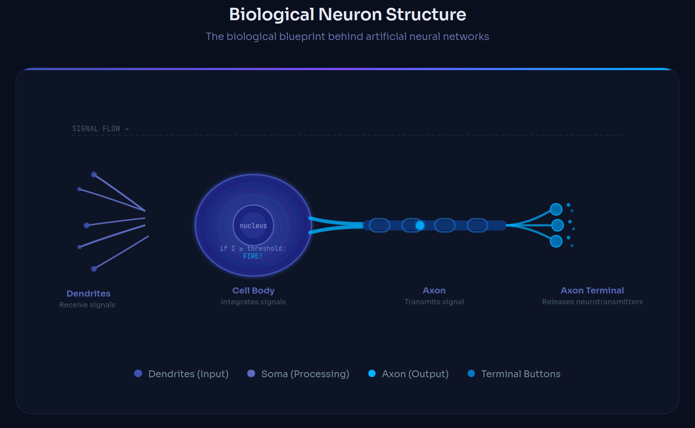
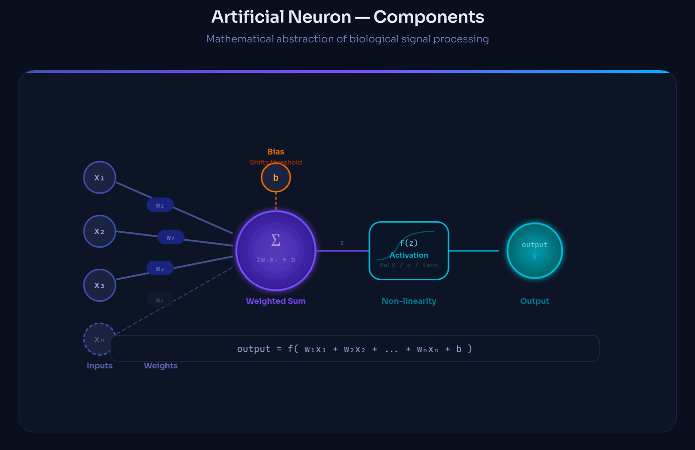
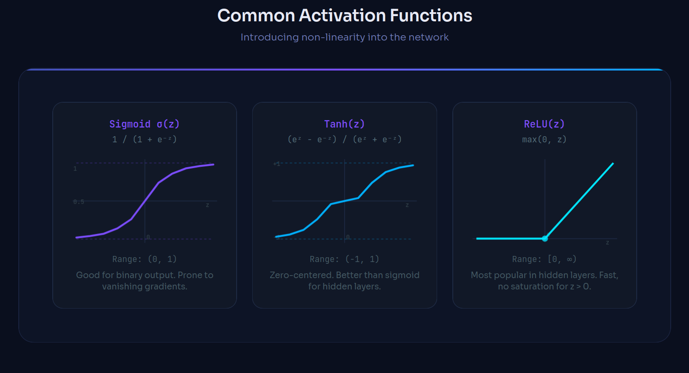
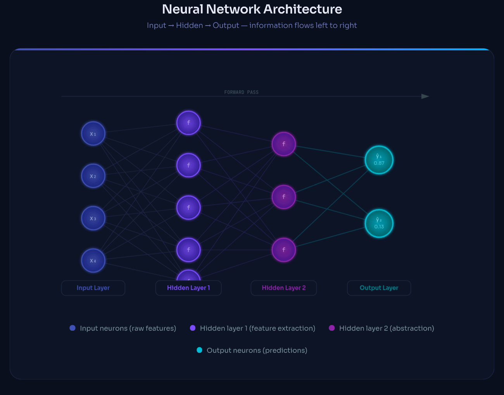

# Neuron in Neural Networks

## 1. Introduction

At the heart of every artificial intelligence system that can recognize your face, translate languages, or predict tomorrow's weather lies a deceptively simple concept: **the neuron**. Neural networks — the engines powering modern AI — are built from millions of these tiny computational units working in concert.

A **neural network** is a computational system loosely modeled after the human brain. It learns patterns from data by adjusting the connections between its neurons, ultimately enabling it to make predictions, classify objects, generate text, and much more.

The inspiration for this architecture comes directly from biology. Neuroscientists observed that the brain processes information through a vast web of interconnected nerve cells called **biological neurons**. Each neuron receives signals, processes them, and decides whether to pass a signal forward — a beautifully elegant mechanism that AI researchers sought to replicate mathematically.

Understanding neurons is foundational to understanding all of deep learning. Every convolutional network, every transformer, every language model — they all reduce, at their core, to neurons receiving input, computing a weighted sum, and passing a signal through an activation function.

---

## 2. Biological Neuron — Brief Overview

Before exploring artificial neurons, it helps to understand their biological inspiration.



A biological neuron has three key structural components:

**Dendrites** are tree-like extensions that receive incoming signals from neighboring neurons. They act as the neuron's "input collectors," gathering electrical and chemical signals from the environment.

**The Cell Body (Soma)** integrates all the incoming signals from the dendrites. If the combined signal exceeds a certain threshold, the neuron "fires" — it generates an electrical impulse called an action potential.

**The Axon** is a long fiber that carries the output signal away from the cell body to the next neuron. At its tip, the axon terminal releases chemical messengers (neurotransmitters) across a gap called the synapse to stimulate the next neuron's dendrites.

This process — receive → integrate → fire (or not) → transmit — is the blueprint that artificial neurons replicate mathematically.

---

## 3. Artificial Neuron

An **artificial neuron** is a mathematical function that mimics the behavior of a biological neuron. It takes multiple numerical inputs, combines them in a weighted fashion, adds a bias, and passes the result through an activation function to produce an output.

The key insight is that a single artificial neuron performs a very simple computation — but when thousands or millions of neurons are connected in layers, they collectively learn to represent extraordinarily complex patterns.

In a neural network, each neuron:

- Connects to neurons in the previous layer (receiving inputs)
- Performs its computation
- Passes its output to neurons in the next layer

---

## 4. Components of an Artificial Neuron



### 4.1 Inputs

Inputs are the raw data values fed into the neuron. They can represent:

- **Pixel values** in an image (e.g., brightness of each pixel)
- **Word embeddings** in a language model
- **Sensor readings** in a prediction system
- **Outputs from neurons** in the previous layer

Each input is a real number, typically denoted as x₁, x₂, x₃, ..., xₙ.

### 4.2 Weights

Every input has a corresponding **weight** — a number that controls how much influence that input has on the neuron's output.

- A **large positive weight** means the input strongly pushes the neuron toward activation
- A **large negative weight** means the input strongly suppresses activation
- A weight **near zero** means the input is relatively unimportant

Weights are the **learnable parameters** of a neural network. Training a neural network means finding the right set of weights so the network produces correct outputs. Weights are denoted w₁, w₂, ..., wₙ.

### 4.3 Bias

The **bias** (b) is an additional learnable parameter that is added to the weighted sum independently of the inputs.

Think of bias as the neuron's "default tendency." Without bias, a neuron's output would always be zero when all inputs are zero. Bias allows the neuron to shift its activation threshold — making it easier or harder to activate regardless of the input values.

Geometrically, bias shifts the decision boundary of the neuron, giving the network more flexibility to fit complex data.

### 4.4 Weighted Sum

Before applying the activation function, the neuron computes a **weighted sum** (also called the pre-activation or linear combination):

```
z = w₁x₁ + w₂x₂ + ... + wₙxₙ + b
```

This is a linear transformation of the input — each input is scaled by its weight, all scaled inputs are summed together, and the bias is added. The result `z` is then passed to the activation function.

---

## 5. Activation Functions

If neurons only computed weighted sums, a neural network — regardless of how many layers it had — would reduce to a single linear transformation. It could only learn linear relationships, making it incapable of modeling the complex, non-linear patterns found in real-world data.

**Activation functions** introduce non-linearity into the network, enabling it to learn curved decision boundaries and complex mappings.



### Sigmoid

$$\sigma(z) = \frac{1}{1 + e^{-z}}$$

- **Output range**: (0, 1)
- Historically popular for binary classification output layers
- **Drawback**: Suffers from the _vanishing gradient problem_ in deep networks — gradients become extremely small, slowing learning

### Tanh (Hyperbolic Tangent)

$$\tanh(z) = \frac{e^z - e^{-z}}{e^z + e^{-z}}$$

- **Output range**: (−1, 1)
- Zero-centered, which often helps training converge faster than sigmoid
- Still suffers from vanishing gradients at extreme values

### ReLU (Rectified Linear Unit)

$$\text{ReLU}(z) = \max(0, z)$$

- **Output range**: [0, ∞)
- Currently the most widely used activation function in hidden layers
- Computationally efficient (just a threshold at zero)
- Does **not** saturate for positive values, mitigating the vanishing gradient problem
- **Drawback**: "Dying ReLU" — neurons can get stuck outputting zero if weights push z into negative territory permanently

---

## 6. Mathematical Representation

Putting it all together, a single neuron computes:

```
output = activation(w · x + b)
```

Where:

- **x** = input vector [x₁, x₂, ..., xₙ]
- **w** = weight vector [w₁, w₂, ..., wₙ]
- **b** = scalar bias
- **w · x** = dot product (weighted sum)
- **activation** = non-linear activation function

**In vector form:**

```
z = wᵀx + b
output = f(z)
```

Where `wᵀx` denotes the transpose of the weight vector multiplied by the input vector — a compact notation for the weighted sum. The function `f` is the chosen activation function.

This compact equation, applied to millions of neurons simultaneously, is the mathematical backbone of all deep learning.

---

## 7. Neurons in Neural Network Architecture



Neurons are organized into **layers**, and the arrangement of these layers defines the network's architecture.

### Input Layer

The input layer receives raw data. Each neuron in this layer corresponds to one feature of the input — for example, in a 28×28 pixel image, the input layer has 784 neurons (one per pixel). These neurons do not perform any computation; they simply pass the values forward.

### Hidden Layers

Hidden layers perform the actual learning. They extract increasingly abstract features from the data:

- In image recognition, early hidden layers might detect edges, middle layers detect shapes, and deeper layers detect objects
- In language models, layers capture grammar, semantics, and context

A network with more than one hidden layer is called a **deep neural network** — the origin of the term "deep learning."

### Output Layer

The output layer produces the network's final prediction. Its configuration depends on the task:

- **Binary classification**: 1 neuron with sigmoid activation (outputs probability 0–1)
- **Multi-class classification**: N neurons with softmax activation (outputs probability distribution over N classes)
- **Regression**: 1 neuron with no activation function (outputs a continuous value)

---

## 8. Training and Learning

A neural network begins with random weights. Training is the process of adjusting those weights so the network's outputs match the desired targets.

### Loss Function

The **loss function** measures how wrong the network's predictions are. Common loss functions include:

- **Mean Squared Error (MSE)** for regression tasks
- **Cross-Entropy Loss** for classification tasks

The goal of training is to minimize the loss.

### Backpropagation

**Backpropagation** is the algorithm that computes how much each weight contributed to the loss. It works by applying the chain rule of calculus, propagating error gradients backwards through the network from the output layer to the input layer.

Once gradients are computed, an optimizer (such as **Gradient Descent** or **Adam**) updates each weight in the direction that reduces the loss:

```
w ← w − η · ∂L/∂w
```

Where `η` is the **learning rate** — a hyperparameter controlling the size of each update step.

This process — forward pass → compute loss → backpropagate → update weights — repeats over many iterations (epochs) until the network learns accurate representations.

---

## 9. Applications

The neuron, replicated millions of times and organized into deep networks, powers some of the most transformative AI applications today:

**Image Recognition**: Convolutional Neural Networks (CNNs) use neurons to detect visual features at multiple scales, enabling systems that can identify objects, faces, diseases in medical scans, and defects in manufacturing.

**Natural Language Processing**: Transformer models like GPT and BERT use neurons in attention layers to process and generate human language — enabling chatbots, translation systems, and code generation tools.

**Prediction Systems**: Recurrent networks and feedforward networks use neurons to model temporal patterns, enabling applications like stock price forecasting, weather prediction, and recommendation engines.

**Generative AI**: Diffusion models and GANs use deep networks of neurons to synthesize photorealistic images, generate music, and create video content indistinguishable from reality.

---

## 10. Conclusion

The artificial neuron is one of the most elegant ideas in computer science — a simple mathematical abstraction of a biological cell that, when combined at scale, gives rise to systems capable of perception, reasoning, and creativity.

From a single equation — `output = activation(w · x + b)` — emerges the entire edifice of modern deep learning. Every image classifier, every language model, every autonomous system ultimately traces its intelligence back to this fundamental building block.

As networks grow deeper and wider, as new architectures emerge, and as hardware accelerates computation further, the neuron remains constant at the center of it all — quietly computing, adjusting its weights, and collectively learning to understand the world.

Understanding neurons is not just academic; it is the lens through which all of modern AI becomes comprehensible.

---

_This article is part of the **AI & Deep Learning** series. Next: [Layers and Architectures in Neural Networks](#)._
