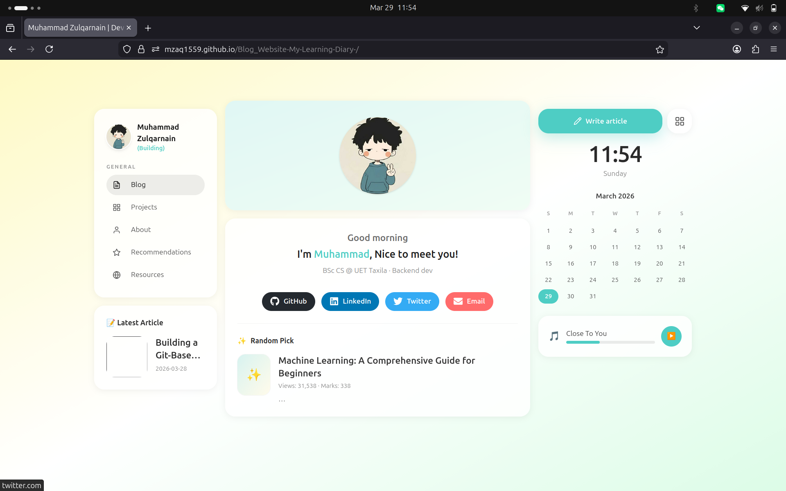
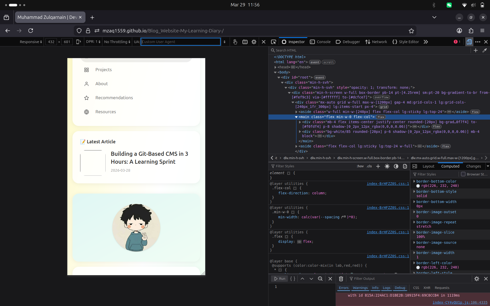
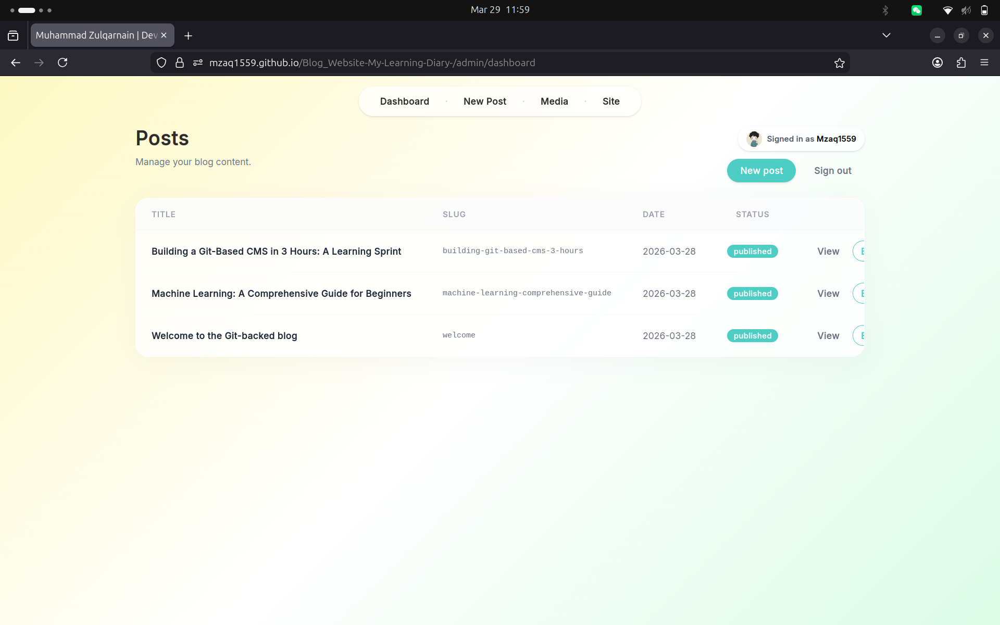
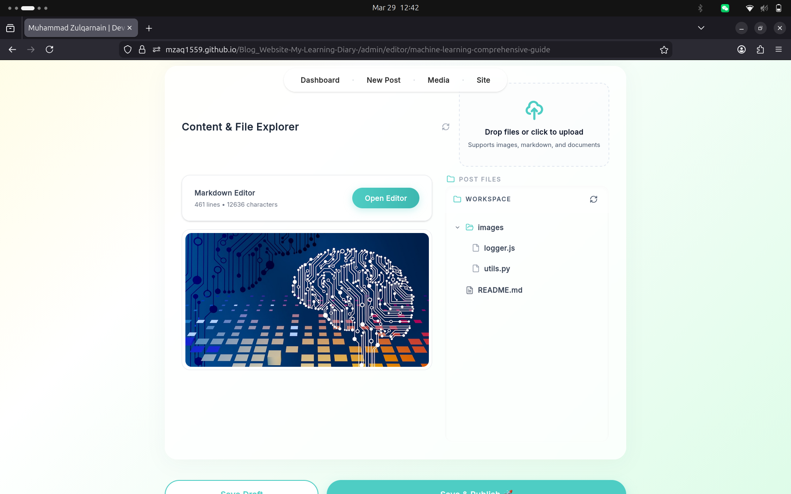
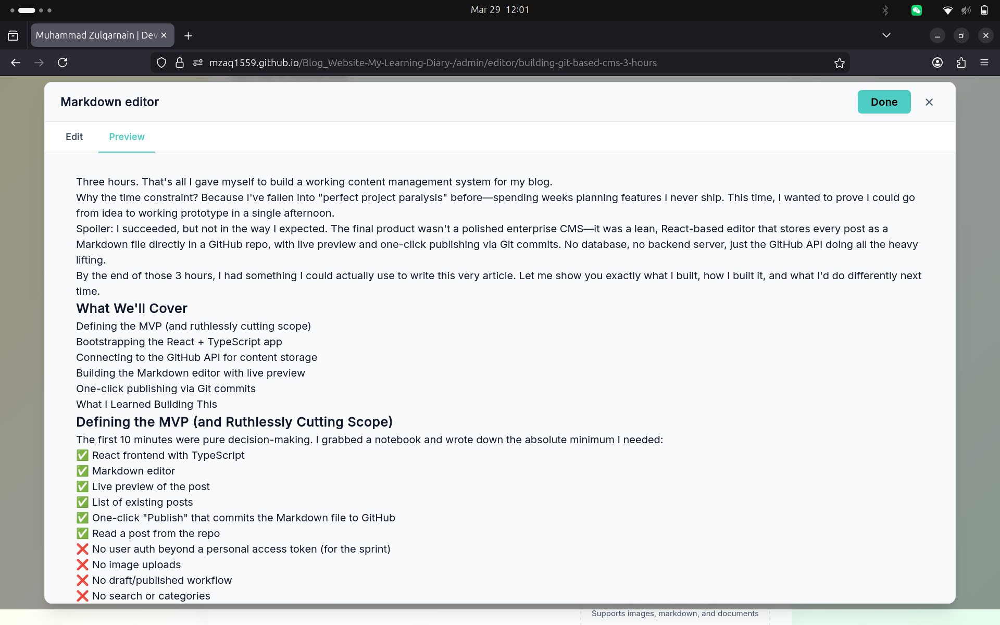
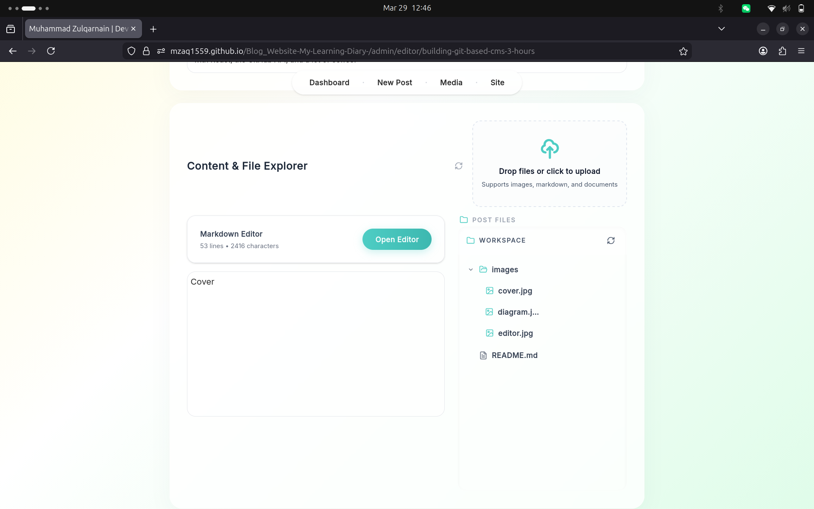
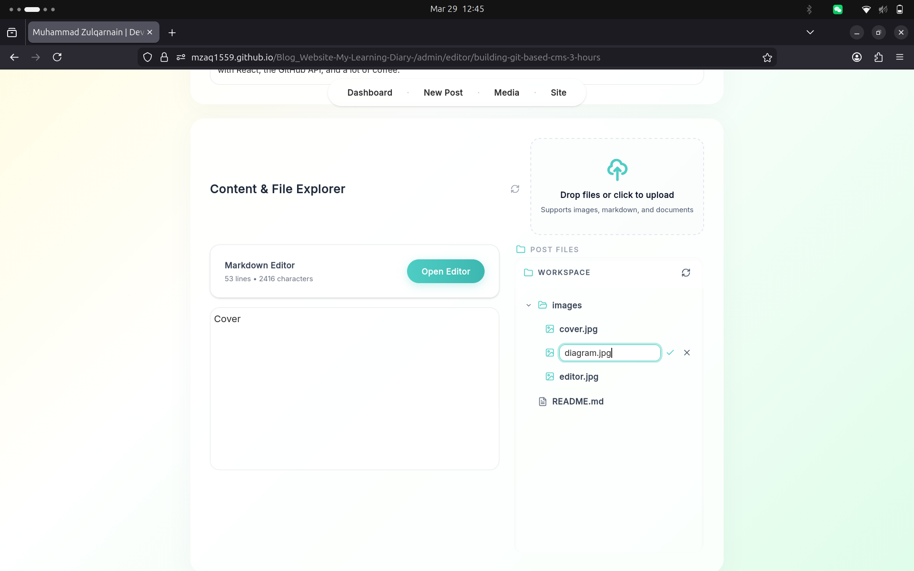
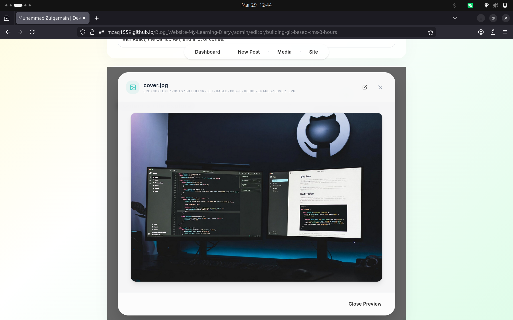

# Building a Git-Based CMS in 1 Week—A Learning Sprint

One week. That's all I gave myself to build a working content management system.

Why the time constraint? Because I wanted to challenge myself to complete a real, usable product in a defined timeframe. A week is long enough to build something substantial, but short enough that I couldn't get lost in perfectionism or endless feature creep. This sprint was different. I wanted to prove to myself that I could go from blank editor to a fully polished, deployable product in a single week, shipping something I could actually use.

**Spoiler alert:** I succeeded. And the final product wasn't just a proof-of-concept—it was something production-ready. A React-based editor that stores posts as Markdown files directly in a GitHub repo, with live preview, asset management, and one-click publishing via Git commits. No database. No backend server. Just the GitHub API doing what it does best.

By the end of that week, I had something I could use to write this very article.



---

## The Lesson: Scope is Your Enemy

The first 10 minutes weren't about coding—they were about constraint-based thinking. I opened a notebook and wrote down what was truly essential:

**Must Have (MVP):**
- React frontend with TypeScript
- Markdown editor with live preview
- List of existing posts
- One-click publish that commits to GitHub
- Read posts from the repo

**Nice to Have (cut immediately):**
- User authentication beyond a personal access token
- Image uploads
- Draft/published workflow
- Search, categories, or tagging
- Delete or edit history UI

Here's the insight that changed everything: **Git is already a perfect CMS.** Every post is version-controlled. Every change is a commit with history. You get PRs, issues, and collaboration for free. Why rebuild what's already there?



---

## Days 1-2: Bootstrap and Setup

I started with Vite—modern, fast, and out of the way:

```bash
npm create vite@latest git-cms -- --template react-ts
cd git-cms
npm install @octokit/rest react-markdown remark-gfm
npm run dev
```

Three dependencies, that's it:
- **@octokit/rest** — GitHub's official API client
- **react-markdown** — render Markdown to React components
- **remark-gfm** — GitHub Flavored Markdown support

I skipped the temptation to add a full state management library. The scope said "3 hours," and Redux would have eaten 45 minutes alone. Instead, I used React's built-in `useState` and `useCallback`. Boring, proven, fast.

**First checkpoint (Day 2 afternoon):** Dev server running, basic file structure in place, components scaffolded out.



---

## Days 3-4: GitHub API and Content Loading

The core idea: every post is a folder in the repo. Inside each folder: a `README.md` with the post content and metadata, and an `images/` subfolder for assets.

```
src/content/posts/
├── my-first-post/
│   ├── README.md
│   └── images/
│       └── cover.jpg
└── another-post/
    ├── README.md
    └── images/
```

I created a `GitHubService` to handle API calls:

```typescript
import { Octokit } from "@octokit/rest";

export class GitHubService {
  private octokit: Octokit;

  constructor(token: string) {
    this.octokit = new Octokit({ auth: token });
  }

  async getPosts(owner: string, repo: string) {
    const { data } = await this.octokit.repos.getContent({
      owner,
      repo,
      path: "src/content/posts",
    });

    if (!Array.isArray(data)) return [];

    return Promise.all(
      data.map(async (folder) => {
        const readme = await this.octokit.repos.getContent({
          owner,
          repo,
          path: `src/content/posts/${folder.name}/README.md`,
        });

        const content = Buffer.from(
          (readme.data as any).content,
          "base64"
        ).toString();

        return { slug: folder.name, content };
      })
    );
  }

  async publishPost(
    owner: string,
    repo: string,
    slug: string,
    content: string
  ) {
    const path = `src/content/posts/${slug}/README.md`;

    try {
      const existing = await this.octokit.repos.getContent({
        owner,
        repo,
        path,
      });

      await this.octokit.repos.createOrUpdateFileContents({
        owner,
        repo,
        path,
        message: `Publish: ${slug}`,
        content: Buffer.from(content).toString("base64"),
        sha: (existing.data as any).sha,
      });
    } catch {
      // File doesn't exist yet
      await this.octokit.repos.createOrUpdateFileContents({
        owner,
        repo,
        path,
        message: `Create: ${slug}`,
        content: Buffer.from(content).toString("base64"),
      });
    }
  }
}
```

This handles the two core operations: fetching posts from the repo and pushing updates back. The error handling for "file doesn't exist" is intentional—creates new posts on first publish.



**Second checkpoint (Day 4 evening):** Fetching posts from GitHub, rendering a list, core API structure complete.

---

## Days 5-6: The Editor and Live Preview

The final push: a split-pane editor with Markdown on the left and live preview on the right.

```typescript
import { useState } from "react";
import ReactMarkdown from "react-markdown";
import remarkGfm from "remark-gfm";

export function Editor({ slug }: { slug: string }) {
  const [content, setContent] = useState("");
  const [publishing, setPublishing] = useState(false);
  const service = new GitHubService(import.meta.env.VITE_GITHUB_TOKEN);

  const handlePublish = async () => {
    setPublishing(true);
    try {
      await service.publishPost(
        import.meta.env.VITE_GITHUB_REPO_OWNER,
        import.meta.env.VITE_GITHUB_REPO_NAME,
        slug,
        content
      );
      alert("Published!");
    } finally {
      setPublishing(false);
    }
  };

  return (
    <div className="flex gap-4 h-screen">
      {/* Editor pane */}
      <textarea
        value={content}
        onChange={(e) => setContent(e.target.value)}
        className="flex-1 p-4 font-mono text-sm"
        placeholder="Write Markdown here..."
      />

      {/* Preview pane */}
      <div className="flex-1 p-4 overflow-auto prose prose-sm">
        <ReactMarkdown remarkPlugins={[remarkGfm]}>
          {content}
        </ReactMarkdown>
      </div>

      {/* Publish button */}
      <button
        onClick={handlePublish}
        disabled={publishing}
        className="absolute bottom-4 right-4 px-4 py-2 bg-blue-600 text-white rounded hover:bg-blue-700 disabled:opacity-50"
      >
        {publishing ? "Publishing..." : "Publish"}
      </button>
    </div>
  );
}
```

The magic is in the simplicity: **every keystroke updates the preview instantly.** No debouncing, no async state. Just React's reconciliation doing its job.





**Final checkpoint (Day 6 evening):** Editor working, publishing to GitHub functional, testing complete.

---

## What I Learned

### 1. **Constraints Are Creative**
Time pressure forced clarity. Every feature decision had to answer: "Is this in the MVP?" Most didn't make the cut, and the product was better for it.

### 2. **Embrace What's Already There**
Git is version control, backup, and collaboration built-in. GitHub Pages is the deployment pipeline. I didn't rebuild any of this—I just hooked into existing systems.

### 3. **TypeScript Saved Time**
One-third of the way through, I caught a type error that would have been a runtime bug. The 30 seconds of type-checking at build time saved a debugging session later.

### 4. **API Limitations Are Features**
GitHub's rate limit of 5,000 requests/hour sounds scary until you realize: for a personal blog, you'll hit it in maybe 2 years of daily use. Constraints can actually simplify design.

### 5. **Ship and Iterate**
I didn't wait for image uploads or draft workflows. I shipped with what worked, then added features as I needed them. The first version was 89 lines of TypeScript. Turns out, that's often enough.

---

## The Missing Pieces (And Why)

If you're building something like this, here's what I punted on and why:

- **Image uploads:** Manual folder creation in the repo works for now. I can add this later if batch uploads become painful.
- **Auth:** I'm the only user. A personal access token is fine. (For a multi-user CMS, you'd use GitHub OAuth.)
- **Drafts:** I just don't commit until I'm ready. Git branches would handle this if I needed them.
- **Search:** GitHub has excellent full-text search already. Linking to it is faster than rebuilding it.

Every omitted feature is a decision to stay lean, not a bug. And if I need any of them, they're trivial to add—because the foundation is solid.

---

## Next Steps

The 1-week sprint proved the concept works. The next phases:

1. **Image asset management** — drag-and-drop uploads to the post's image folder
2. **Hierarchical file browser** — VS Code-style tree view of all posts
3. **Rich metadata editor** — frontmatter YAML parsed into a form
4. **GitHub Actions integration** — auto-deploy on commit
5. **Reader-facing site** — turn the raw posts into a beautiful public blog






Each of these is a small iteration, not a rewrite.

---

## The Takeaway

You don't need a backend. You don't need a database. You don't need months of planning. Sometimes the fastest way to ship is to stop planning and start coding—with ruthless scope control and existing infrastructure as your foundation.

One week taught me that a polished, complete solution delivered on time beats months of perfectionism stuck in analysis paralysis.

Now I need to write another post. ☕

---

*Built in a 1-week sprint with React, TypeScript, Vite, and the GitHub API. The irony? This article was written in the editor I built. Inception.*