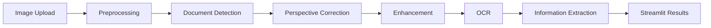

DocVision AI is a separate project from AutoVision, even though both are CPU-only Streamlit computer-vision apps — where AutoVision tracks vehicles in traffic video, DocVision AI turns a phone photo of a paper document into a flattened, cleaned-up scan with extracted text. This one is worth writing up on its own terms, both for what it does and for how it got built.

## What it actually does

The pipeline is entirely classic computer vision — no deep learning, no GPU:

Each stage uses a specific, named CV technique rather than a learned model: Canny edge detection to find candidate document boundaries, contour detection with polygon approximation (`cv2.approxPolyDP`) to reduce those boundaries to a four-point quadrilateral, a classic perspective transform (`cv2.getPerspectiveTransform` + `cv2.warpPerspective`) to flatten it, then denoising, shadow correction, and CLAHE contrast enhancement before Tesseract OCR and a regex-based pass to pull out emails, phone numbers, dates, and similar fields.

The README is explicit that the extracted fields are "automated guesses" from pattern matching, not verified data — a distinction worth keeping when a document scanner is also handling things like ID numbers and amounts.

## The build itself: a single, fast session

What's unusual about this project isn't the CV pipeline — it's the pace it went in at. The initial commit history shows the entire architecture, detection pipeline, enhancement pipeline, OCR integration, entity extraction, Streamlit UI, and a full pytest suite landing between **08:55 and 09:07 on September 17, 2026** — about twelve minutes, across roughly 25 commits, each scoped to one piece of the system (config package, then detector, then perspective correction, then enhancement, then OCR engine, then entity extraction, then the Streamlit interface, then tests).

That pace, and the commit structure itself, matches what the README says directly: the project was pair-programmed with Claude via the GitHub MCP integration, with a commit explicitly crediting that contribution (`docs: credit AI pair-programming contribution`, co-authored by Claude). I'm noting this plainly rather than presenting the build as if I wrote every line solo — the architecture decisions and pipeline design are real and mine to take credit for, but the implementation speed reflects AI-assisted scaffolding, not twelve minutes of manual coding.

## What's actually tested, and what isn't

The test suite covers the CV, OCR-interface, and extraction logic using synthetic in-memory images — no GPU, no network calls. The README is specific about a real limitation here: OCR *execution* itself (running actual Tesseract) was verified manually in a development environment where the Tesseract binary was available, separately from the automated test suite. The OCR engine has explicit handling for the case where Tesseract isn't installed at all, so the app is designed to degrade gracefully rather than crash when OCR is unavailable — a deliberate defensive design choice given this was built for deployment on Streamlit Community Cloud, where the environment isn't fully under my control.

## A privacy decision worth noting

The README includes an explicit privacy section: uploaded images are processed in memory for the session and not written to any database, but standard Streamlit Cloud hosting still means files pass through Streamlit's own infrastructure, and the project doesn't implement or guarantee automatic deletion beyond Streamlit's normal session lifecycle. That's a direct acknowledgment that "processes documents with potentially sensitive fields (IDs, financial details)" and "deployed on a third-party free hosting tier" is a combination that needs a stated caveat, not a project that could honestly claim to be private by default.

## What I learned

This project is a good example of what AI pair-programming through something like the GitHub MCP integration is actually good at: scaffolding a well-structured, modular pipeline very fast once the architecture and the sequence of CV techniques are decided. What it doesn't replace is deciding what the pipeline should be in the first place — Canny → contour → four-point warp → enhancement → OCR → extraction is a specific, deliberate sequence of classical CV techniques, and picking that sequence (and being honest in the README about where it still fails — cluttered backgrounds, torn documents, handwriting) is the part that isn't just scaffolding.

---

| Link | Description |
|------|-------------|
| [GitHub: docvision-ai](https://github.com/Mzaq1559/docvision-ai) | Full CV pipeline, OCR integration, and test suite |
