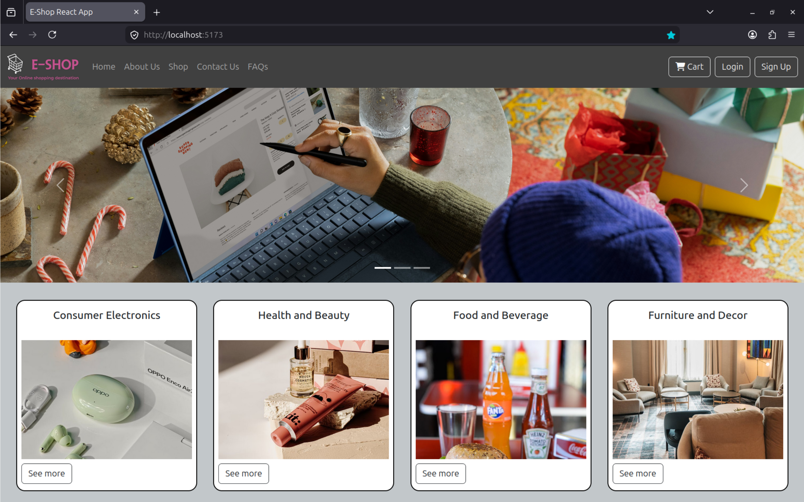
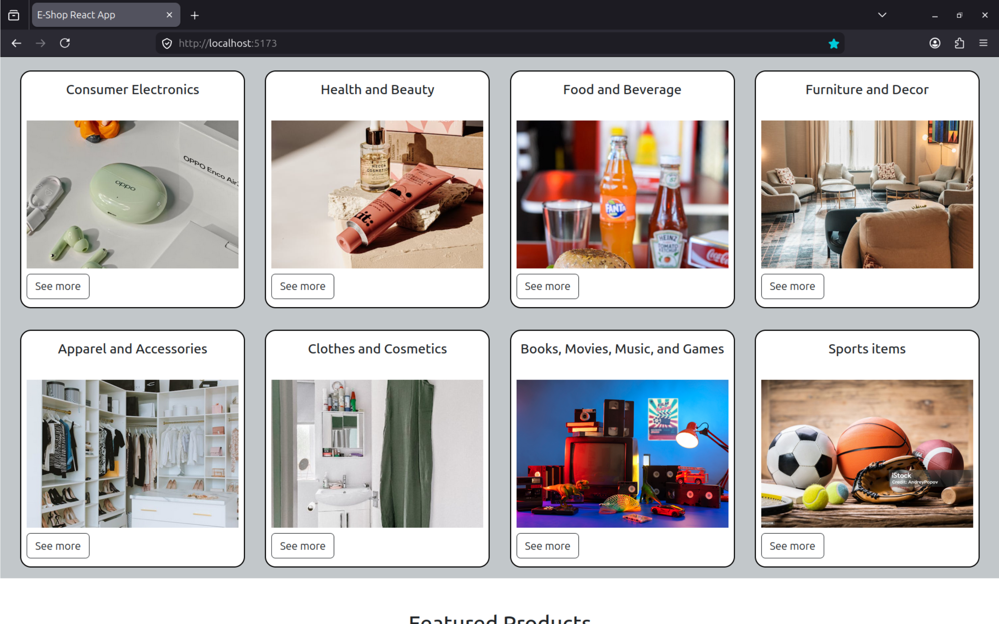
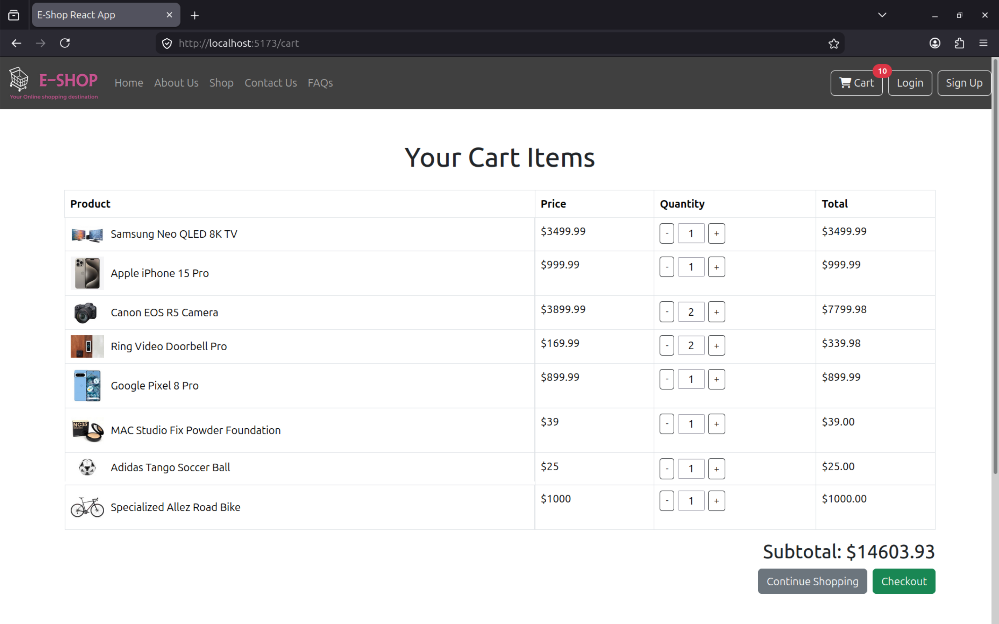
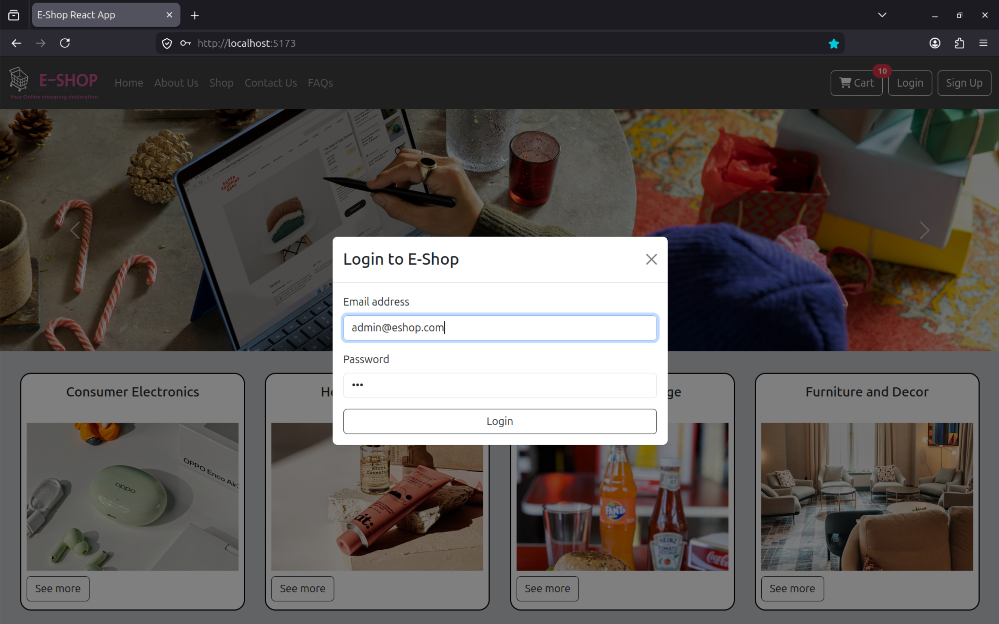
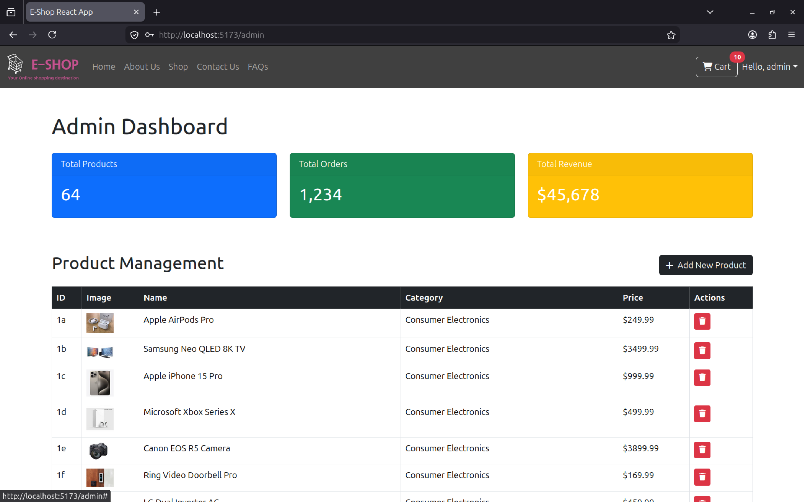

## From a Static HTML Page to a Full React Storefront

This one started as a plain HTML/CSS/Bootstrap semester project, a simple product listing page with no interactivity. Over time I got frustrated with how limited it was, so I rebuilt it from scratch using React and Vite. The result is a fully functional e-commerce frontend with a cart, auth modals, an admin dashboard, and proper state management.

Here's a walkthrough of what I built and how it works.

---

## Project Structure

The app lives under `src/` and is split into pages, components, context, and data — a pretty standard React structure.

```
src/
├── components/
│   ├── Navigation.jsx
│   ├── Footer.jsx
│   ├── ProductCard.jsx
│   ├── LoginModal.jsx
│   └── SignUpModal.jsx
├── context/
│   └── ShopContext.jsx
├── data/
│   └── products.js
└── pages/
    ├── Home.jsx
    ├── Shop.jsx
    ├── Cart.jsx
    ├── About.jsx
    ├── Contact.jsx
    ├── FAQs.jsx
    └── AdminDashboard.jsx
```

The `legacy_site/` folder is still there — it's the original Bootstrap version I started with. Keeping it around as a reminder of how far the project has come.

---

## The Home Page


_Home page — hero carousel, featured products, and navigation_

The home page has a carousel of banner images (`carousel1.jpg`, `carousel2.jpg`, `carousel3.jpg`) and a featured products section that pulls from the `products.js` seed file. Each product displays using the `ProductCard` component.

---

## Shop Page & Product Cards


_Shop page — full product grid with add-to-cart buttons_

The shop renders all products from `products.js` in a grid. Each product has multiple image variants (e.g. `1a.jpg` through `1h.jpg` for colour/view switches) which I handle by cycling through the image array on hover.

The `ProductCard` component is kept simple — product image, name, price, and an "Add to Cart" button that dispatches to the context.

---

## State Management with Context API

Rather than reaching for Redux, I used React's built-in Context API. `ShopContext.jsx` holds:

- The full product list
- Cart state (items + quantities)
- Auth state (logged in / logged out, current user)
- Handlers: `addToCart`, `removeFromCart`, `updateQuantity`, `login`, `logout`, `signup`

Every component that needs cart or auth data consumes this context via `useContext(ShopContext)`. It keeps things clean without over-engineering for a project of this scale.

---

## Cart Page


_Cart page — item list, quantity controls, and order total_

The cart page reads directly from context. Users can increase/decrease quantity or remove items entirely. The total updates reactively as they interact. No backend — everything is in-memory for now, which is fine for a frontend-only project.

---

## Login & Signup Modals


_Login modal — overlays on top of any page_

Auth is handled through two modal components: `LoginModal.jsx` and `SignUpModal.jsx`. They're triggered from the `Navigation` component and rendered as overlays. State (open/closed, form values, errors) is managed locally inside each modal, while the actual auth state lives in `ShopContext`.

---

## Admin Dashboard


_Admin dashboard — product CRUD and access control_

This was the most interesting part to build. The `AdminDashboard.jsx` page is access-controlled — only users with an admin role can reach it. It lets you:

- View all products in a table
- Add a new product via a modal form
- Edit existing product details
- Delete products

The access control check runs at the top of the component and redirects non-admin users back to the home page. Product changes update the context state directly, so the shop reflects them immediately without a page reload.

---

## What I Learned

A few things that stood out building this:

**Context API scales well enough for small apps.** I was initially going to use Redux but Context + `useReducer` handled everything I needed without the boilerplate.

**Component boundaries matter.** Early on I had too much logic inside pages directly. Extracting `ProductCard`, `LoginModal`, and `SignUpModal` into their own components made the pages much easier to reason about.

**The gap between static HTML and a real SPA is huge.** The legacy Bootstrap version is in the same repo and seeing both side by side makes it obvious — routing, state, reactivity — none of that exists in plain HTML.

---

## Stack

| Tool               | Purpose                 |
| ------------------ | ----------------------- |
| React 18           | UI framework            |
| Vite               | Build tool & dev server |
| React Context API  | Global state            |
| Bootstrap (legacy) | Original static version |
| ESLint             | Linting                 |

---

## What's Next

The obvious next step is adding a real backend — an Express or FastAPI server with a proper database, user authentication with JWT, and persistent cart/order data. That would turn this from a frontend demo into something deployable.

For now it serves its purpose: a solid semester project that I actually understand end to end.

---

_Source code on [GitHub](https://github.com/Mzaq1559/E-Shop)_
