# Running Claude Code Through OmniRoute with Gemini 3.8 Flash

I wanted to experiment with Claude Code, but I didn't want to simply install an agent and let it generate everything for me.

My bigger goal was to understand how these coding agents actually work underneath the interface — what endpoint they call, how the model is selected, where authentication happens, and whether I could route an Anthropic-compatible client through a local gateway to a completely different model.

For this experiment, I used **OmniRoute** as the local gateway and **Google AI Studio's Gemini 3.8 Flash** as the underlying model.

The final architecture looked roughly like this:

```text
Claude Code
     │
     │ Anthropic-compatible requests
     ▼
OmniRoute
localhost:20128
     │
     │ provider routing
     ▼
Google AI Studio
     │
     ▼
Gemini 3.8 Flash
```

The interesting part was getting all of those pieces to work together and then actually verifying that the requests were being routed the way I expected.

---

## 1. Starting with Google AI Studio

The first part was getting access to a Gemini API key through Google AI Studio.

The API key page showed my Google AI Studio project and the available API credentials.

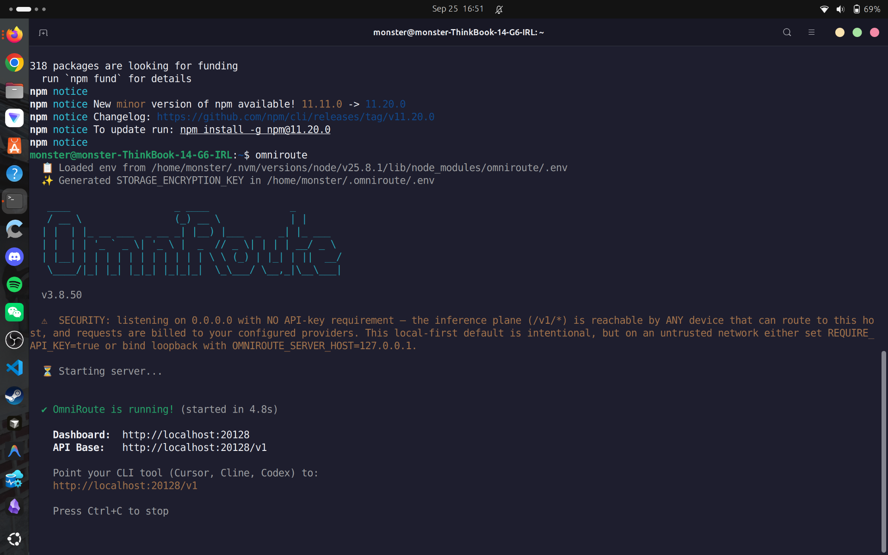

At this point, the goal was simple: get a Gemini provider that I could connect to OmniRoute.

I was using the free tier, so I also had to keep the API limits in mind.

---

## 2. Starting with a clean OmniRoute installation

After getting the Gemini credentials, I launched OmniRoute locally.

The initial dashboard was basically empty.

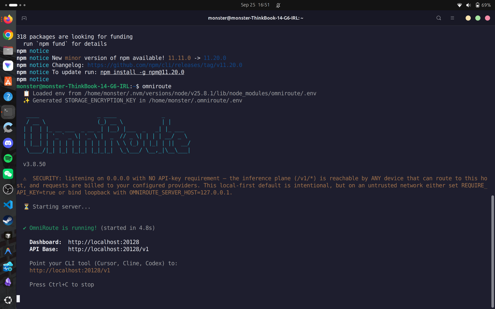

OmniRoute's setup flow was fairly straightforward:

1. Create an API key.
2. Connect a provider.
3. Point the client to OmniRoute.
4. Monitor the requests.

The provider section initially had nothing connected.

I then went through the provider setup flow.

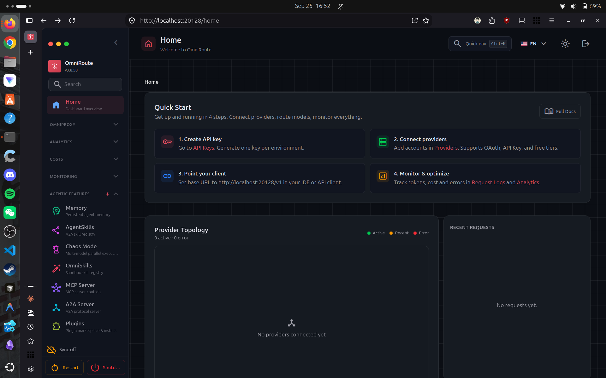

The idea was to use Google AI Studio as the upstream provider rather than an Anthropic model.

Once the provider was configured, OmniRoute showed the Gemini connection and its available models.

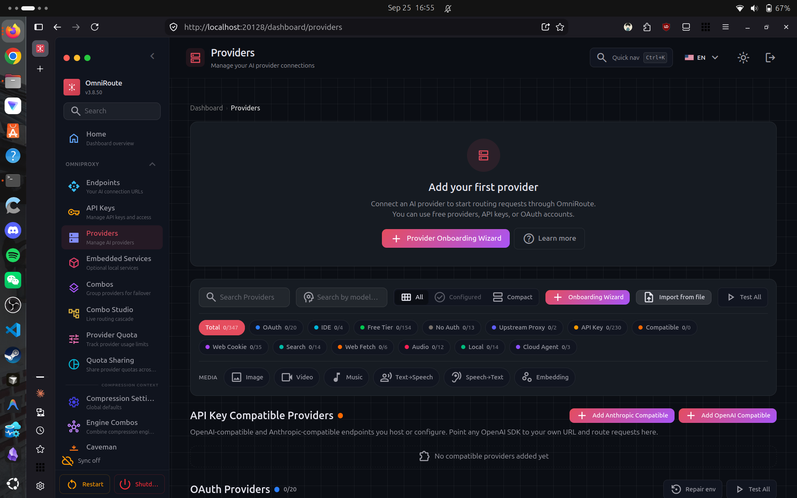

This was the first point where the architecture started making sense to me.

OmniRoute wasn't the model itself. It was acting as the middle layer between the client and the actual model provider.

---

## 3. Looking at the Claude Code integration

OmniRoute also had a dedicated configuration page for Claude Code.

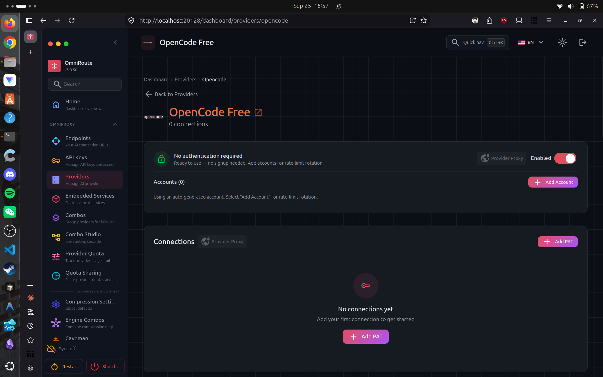

The important part here was the local base URL.

Instead of Claude Code talking directly to an Anthropic endpoint, the client could be configured to send its requests to:

```text
http://localhost:20128
```

The configuration also exposed environment variables for Claude Code.

Conceptually, this meant:

```text
ANTHROPIC_BASE_URL=http://localhost:20128
```

and an OmniRoute API key would be used for authentication.

At this point I had the pieces, but I still needed to actually run the client.

---

## 4. Getting Claude Code running

I launched Claude Code from my terminal.

The version I was using was:

```text
Claude Code v2.1.282
```

The working directory was:

```text
~/Desktop/Coding/Practice
```

Claude Code started with:

```text
gemini/gemini-3.8-flash
```

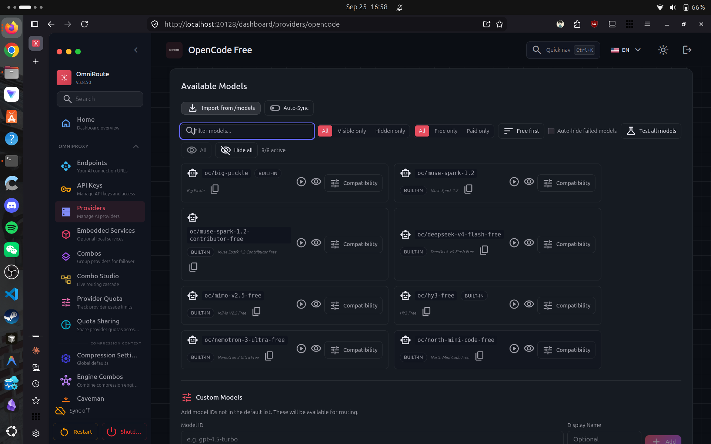

There was an interesting warning:

```text
"gemini/gemini-3.8-flash" isn't described by this version's model catalog
```

Claude Code was essentially telling me that this wasn't one of the models it normally knew about.

But instead of immediately stopping, I decided to test it.

I typed:

```text
Hi
```

and got:

```text
Hello! How can I help you today?
```

The response took around **27 seconds**.

So despite the warning, the basic request path was working.

That was my first real proof that the setup wasn't completely broken.

---

# 5. Looking at what was actually happening

At this point, I didn't want to stop at:

> “It replied, therefore it works.”

A successful response doesn't necessarily tell me where the request went.

I wanted to know:

* What model was actually running?
* Was Claude Code talking directly to Google?
* Was OmniRoute actually in the middle?
* Was the `ANTHROPIC_BASE_URL` setting doing anything?
* Could I verify the routing from inside the running agent?

So I started digging.

The OmniRoute Claude Code page initially showed the client configuration state.

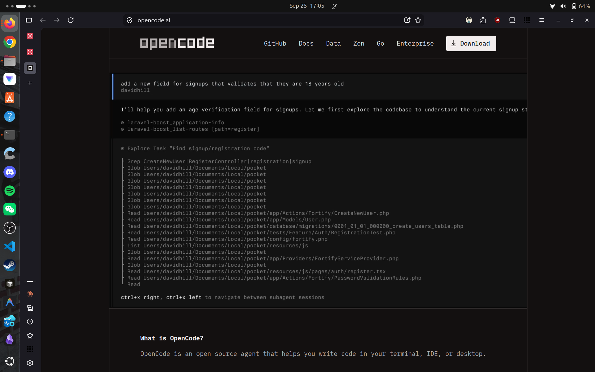

The configuration included the local base URL:

```text
http://localhost:20128
```

The page also showed the model mappings and the environment configuration that Claude Code could use.

---

## 6. Running OmniRoute locally

I also checked the actual OmniRoute process running in the terminal.

The command was simply:

```bash
omniroute
```

OmniRoute started with version:

```text
v3.8.50
```

and reported:

```text
Dashboard: http://localhost:20128
API Base:  http://localhost:20128/v1
```

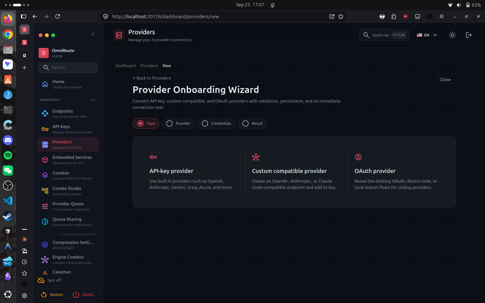

One thing immediately caught my attention.

The startup output warned that the server was listening on:

```text
0.0.0.0
```

and that the inference plane did not require an API key by default.

That is something I'd definitely pay attention to if this were exposed beyond my local machine.

For this experiment, though, the gateway was running locally.

---

## 7. The provider state mattered

When I opened the main CLI Code management page, OmniRoute showed:

```text
No active providers.
```

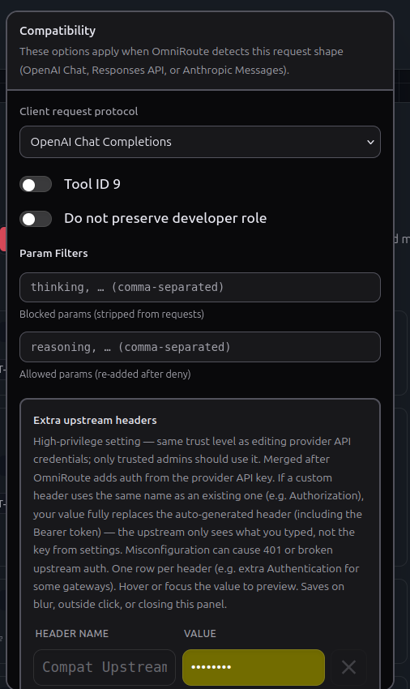

This was useful because it showed that OmniRoute wasn't going to magically configure everything just because the CLI integration existed.

The client configuration and the backend provider configuration were separate pieces.

That distinction became important while debugging the setup.

---

# 8. The first successful Claude Code request

After getting the provider and client configuration into place, I ran Claude Code again.

The result was the same basic test:

```text
Hi
```

→

```text
Hello! How can I help you today?
```

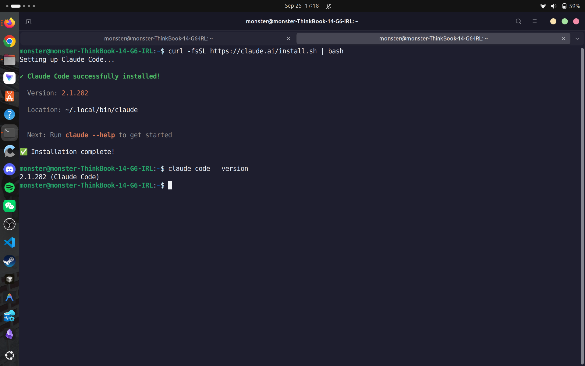

The response still took around:

```text
27s
```

And the model catalog warning was still present.

So I had two separate things happening:

**Warning:**

Claude Code didn't recognize the Gemini model in its normal model catalog.

**Reality:**

The request still reached the model and produced a response.

That distinction was important.

A warning about the client's model metadata didn't necessarily mean the underlying request couldn't be executed.

---

# 9. I wanted proof that OmniRoute was actually being used

This was probably the most interesting part of the experiment.

Instead of trusting the dashboard, I asked Claude Code directly to investigate its environment.

I asked it what model it was actually running and whether requests were being routed through OmniRoute.

Claude Code then started inspecting its environment.

One of the commands it executed was:

```bash
env | grep -i -E 'omni|route|model|anthropic|gemini'
```

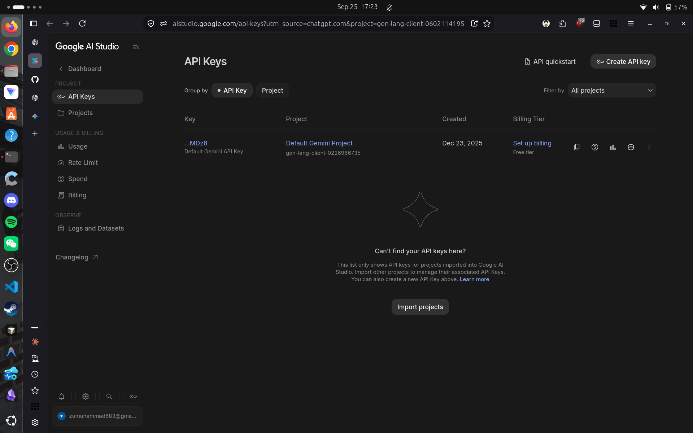

This was useful because I could see the agent interacting with the actual shell environment instead of simply giving me a generic answer.

I also checked the local listener:

```bash
ss -tulpn | grep 20128
```

That allowed us to verify that something was actually listening on the OmniRoute port.

---

# 10. The routing was confirmed

The diagnostic eventually produced the model ID:

```text
gemini/gemini-3.8-flash
```

and explicitly reported that the requests were being routed through OmniRoute.

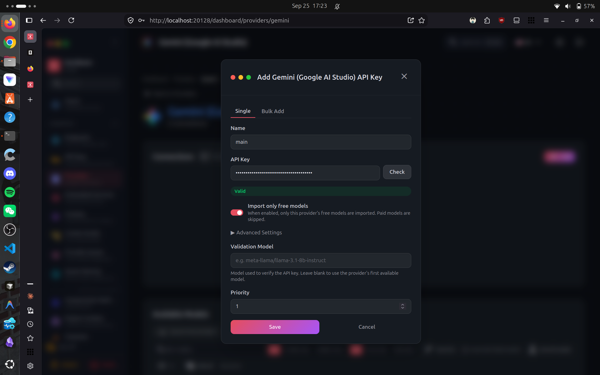

The important environment variable was:

```text
ANTHROPIC_BASE_URL=http://localhost:20128
```

That meant Claude Code's Anthropic-compatible requests were being sent to my local OmniRoute instance.

OmniRoute then handled the provider-side routing toward Gemini.

This was much more convincing than simply seeing a successful response.

The flow was now:

```text
Claude Code
    │
    │ ANTHROPIC_BASE_URL
    ▼
localhost:20128
    │
    │ OmniRoute
    ▼
Gemini 3.8 Flash
```

---

# 11. Restarting things and testing again

During the process I restarted OmniRoute several times while changing and checking the configuration.

The startup sequence was consistent:

```text
OmniRoute v3.8.50
Dashboard: http://localhost:20128
API Base: http://localhost:20128/v1
Startup: 4.8s
```

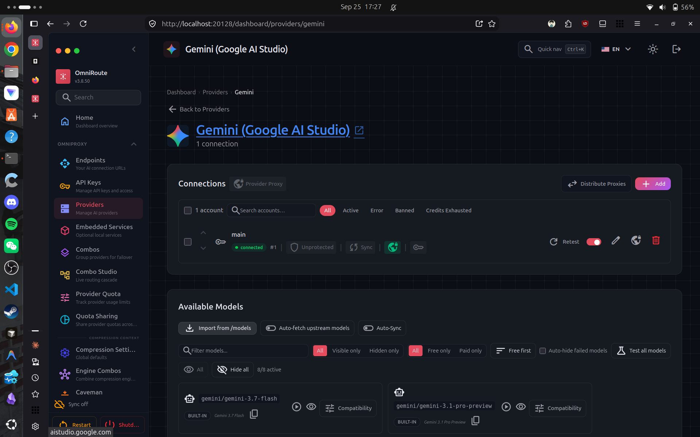

I also had another startup session showing the same behavior.

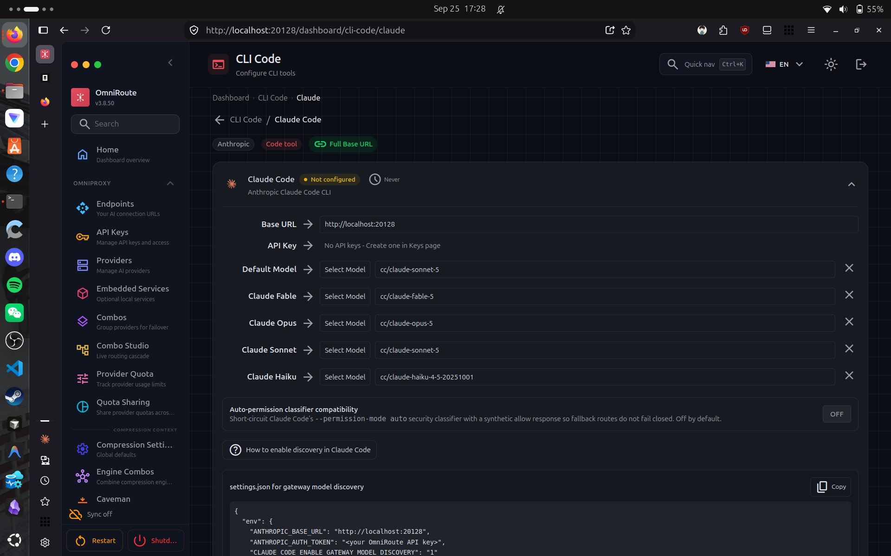

The important thing here wasn't the repeated startup itself.

It was that I was testing the system repeatedly instead of assuming that one successful request meant the entire configuration was stable.

---

# 12. Testing Claude Code again

Another Claude Code session successfully used:

```text
gemini/gemini-3.8-flash
```

with the same model catalog warning.

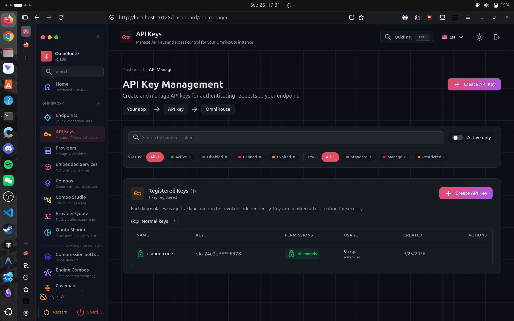

Again:

```text
Hi
```

produced:

```text
Hello! How can I help you today?
```

with roughly 27 seconds of latency.

At this point the basic integration was clearly functional.

But there was still one part of the configuration I wanted to clean up.

---

# 13. Creating a dedicated OmniRoute API key

The OmniRoute setup initially warned about the inference plane not requiring an API key.

I didn't want the client configuration to remain dependent on an open local inference endpoint.

So I created a dedicated API key for Claude Code.

The key was named:

```text
claude-code
```

and was configured with access to all models.


I intentionally won't include the actual key value here.

The important concept is the separation:

```text
Claude Code
    │
    │ authenticated with OmniRoute key
    ▼
OmniRoute
    │
    ▼
Gemini
```

This made the client-to-gateway boundary explicit.

---

# 14. Checking the gateway again

I continued restarting and checking the gateway while testing the configuration.

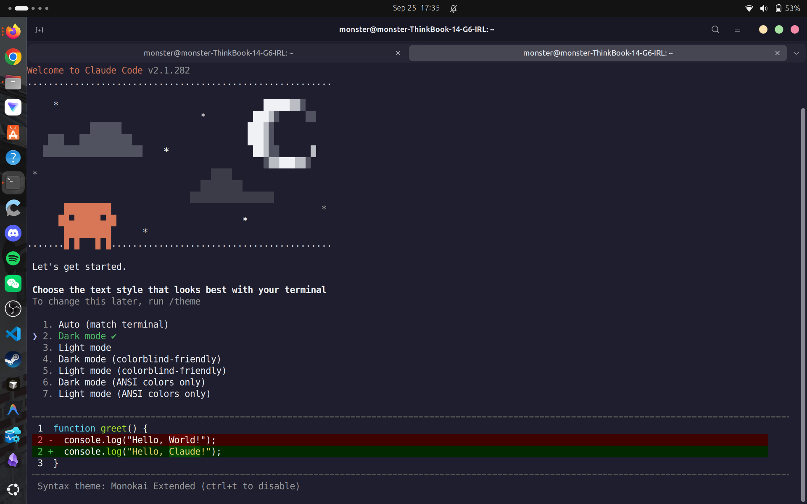

The Gemini provider itself was still shown as connected in OmniRoute.

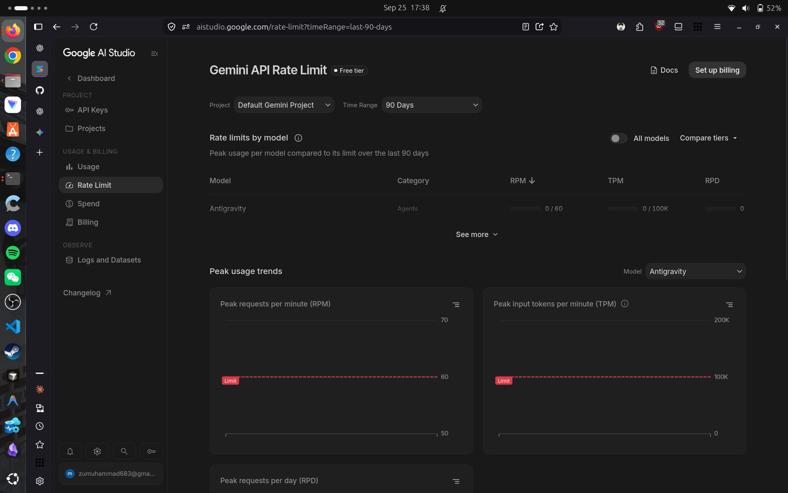

The connected account was listed as:

```text
main
```

with a green connected status.

The dashboard also showed available Gemini models.

So there were now three things I could verify independently:

1. OmniRoute was running.
2. Gemini was connected as an upstream provider.
3. Claude Code could successfully communicate through the gateway.

---

# 15. Looking at other coding-agent tooling

During this process I also came across OpenCode and looked through some of its documentation and examples.

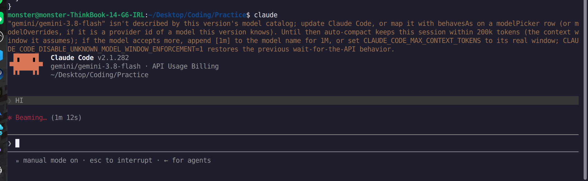

This wasn't a core part of the final Claude Code + OmniRoute setup, but it was part of the broader exploration I was doing around AI coding agents.

My main question was becoming less about:

> “Which AI writes code for me?”

and more about:

> “How do these coding agents actually work, and how can I use them without becoming dependent on them?”

That distinction matters to me because I'm currently trying to get better at writing code myself rather than letting an AI generate entire projects that I don't fully understand.

---

# 16. Checking the OmniRoute dashboard

At different points the OmniRoute home dashboard showed an empty provider/request state.

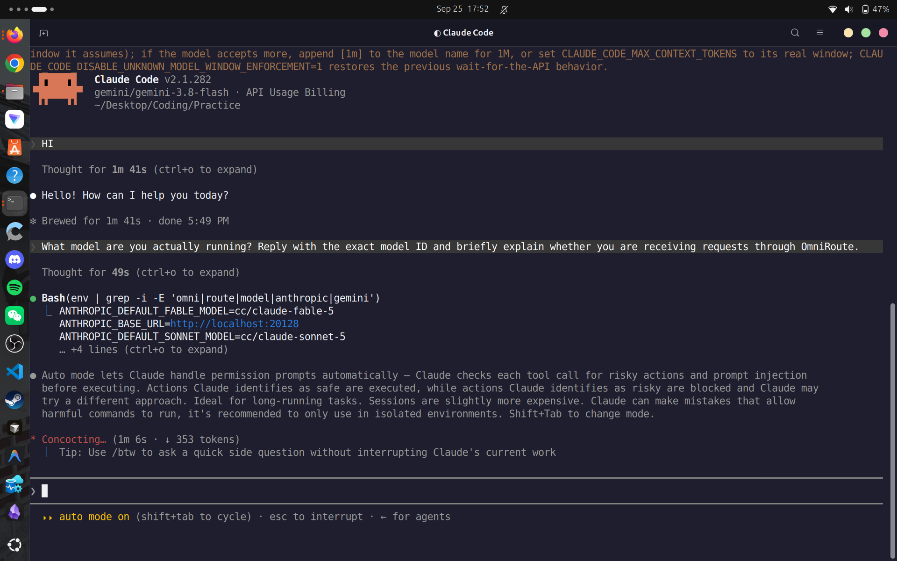

This was one of those moments where the dashboard alone could be misleading.

For example, seeing:

```text
0 active
0 error
No requests yet
```

doesn't necessarily mean the entire integration never worked.

Other parts of the system had already shown successful provider connections and successful Claude Code requests.

This was a good reminder to check the actual request path rather than relying on a single dashboard view.

---

# 17. More gateway restarts

I continued testing the local gateway.

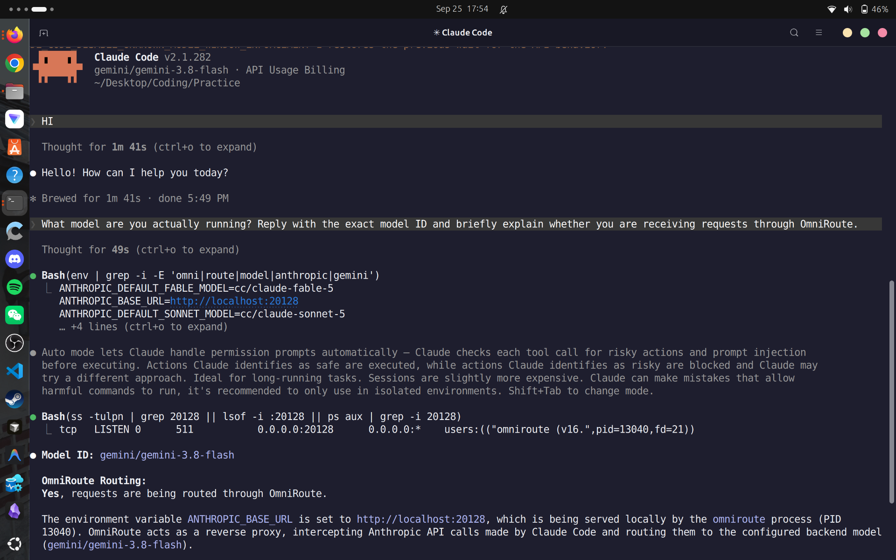

And again:

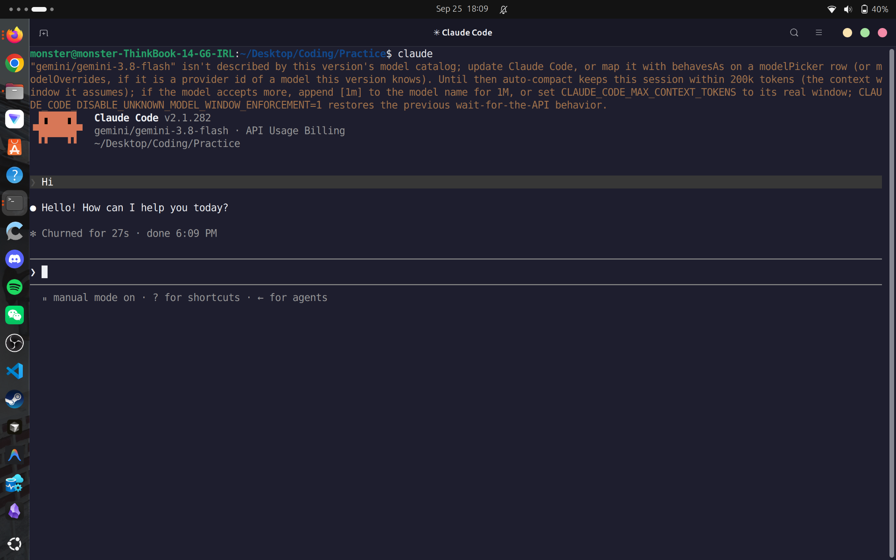

The repeated startup logs weren't particularly interesting by themselves, but they confirmed that the local proxy could consistently be brought back up on the same endpoint.

---

# 18. Another successful end-to-end test

Claude Code was still able to send a request to:

```text
gemini/gemini-3.8-flash
```

and receive a response.

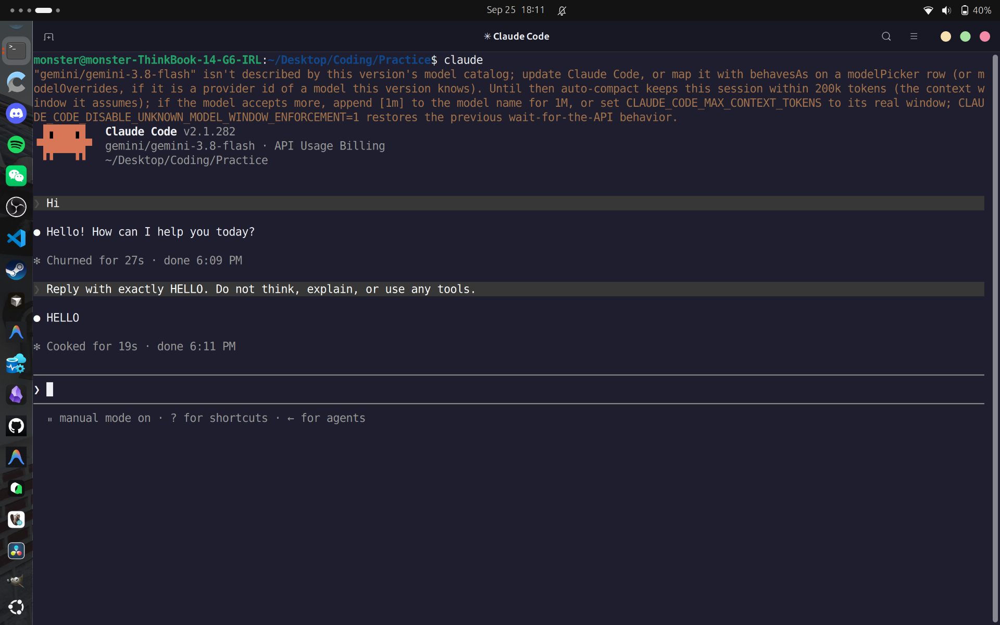

So by this point, I had successfully demonstrated the full round trip multiple times.

---

# 19. Verifying the API key configuration

I checked the OmniRoute API manager again.

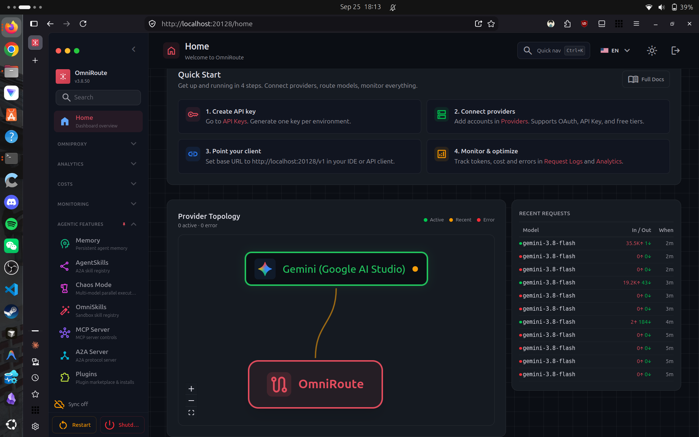

The dedicated:

```text
claude-code
```

credential was present.

Again, I won't publish the key itself.

The important part was that Claude Code now had an explicit authentication path to the local gateway instead of depending on an unauthenticated inference endpoint.

---

# 20. Inspecting Claude Code's environment directly

I went back into the Claude Code session and inspected the environment again.

The output showed variables including:

```text
ANTHROPIC_BASE_URL=http://localhost:20128
```

alongside the Claude Code model configuration variables.

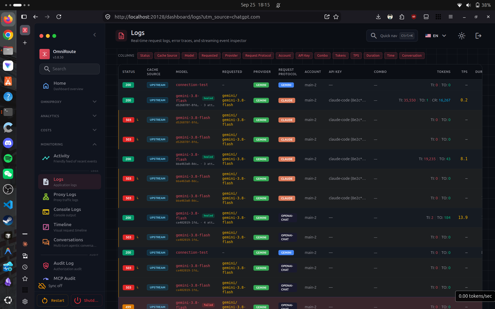

This was probably the strongest piece of evidence from the client side.

Instead of just assuming that my configuration file was being respected, I could see the environment variable inside the running Claude Code process.

---

# 21. Claude Code itself

The final screenshot in the set shows the Claude Code welcome/configuration interface.

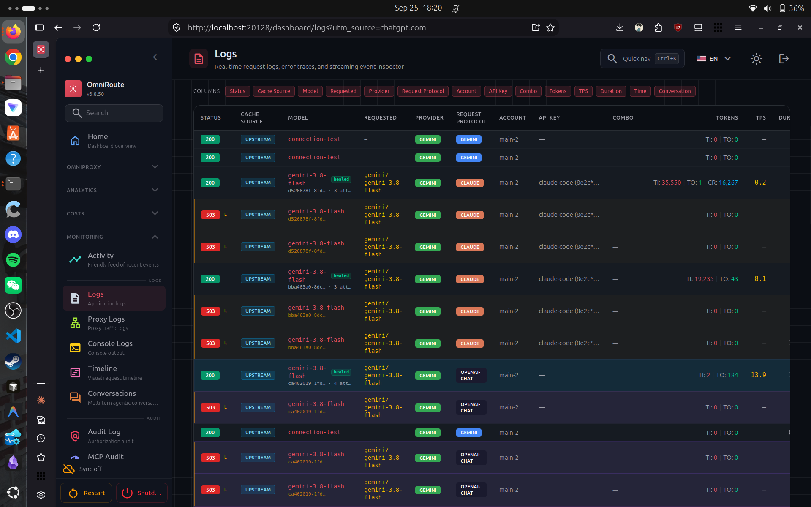

Claude Code was running:

```text
v2.1.282
```

with the terminal configured in dark mode.

At this point the setup was no longer just an experiment sitting in a dashboard.

I had a working local coding-agent setup where Claude Code could communicate with a Gemini model through OmniRoute.

---

# 22. The latency problem

There was, however, one major issue I couldn't ignore:

**It was slow.**

A simple:

```text
Hi
```

could take around 27 seconds from the Claude Code interface.

The OmniRoute logs also showed a mixture of successful requests and upstream `503` responses.

So although the architecture worked, the experience wasn't particularly fast or stable.

I also tested the model more directly and saw that Gemini could sometimes respond quickly, while at other times the upstream service reported temporary high demand.

That suggested that the latency wasn't simply:

```text
Claude Code → OmniRoute
```

being slow.

There was also behavior from the upstream model/provider side.

I decided not to spend the rest of the experiment trying to optimize every second of latency.

For now, proving the architecture was working was more important.

---

# 23. The model catalog warning

Another thing I left unresolved was the warning:

```text
"gemini/gemini-3.8-flash" isn't described by this version's model catalog
```

Claude Code expected its own known model catalog, while I was effectively giving it a model identifier coming through OmniRoute.

The warning suggested options such as model mapping or adjusting the assumed context window.

I decided to leave that alone for the moment.

The model was responding, the routing worked, and I didn't want to introduce another layer of configuration before understanding the basic architecture.

---

# 24. What I actually learned

The most useful part of this experiment wasn't getting Gemini to answer:

```text
Hello! How can I help you today?
```

That part is easy.

The useful part was understanding the layers involved.

### Claude Code is the client/agent interface

Claude Code provides the coding-agent experience:

* terminal interaction
* tools
* shell commands
* file operations
* context
* model interaction

But it doesn't necessarily mean the underlying model has to be an Anthropic model in this kind of gateway setup.

### OmniRoute is the routing layer

OmniRoute sits between the client and the model provider.

It can expose an Anthropic-compatible endpoint while routing requests toward a different provider/model.

In my case:

```text
Anthropic-compatible client
          ↓
       OmniRoute
          ↓
Google AI Studio / Gemini
```

### Gemini is the actual model

The model reported during the working setup was:

```text
gemini/gemini-3.8-flash
```

So saying:

> “I'm running Claude”

would be misleading in this particular setup.

I was using **Claude Code as the coding-agent interface**, while **Gemini 3.8 Flash was the underlying model**.

That distinction was one of the main things I wanted to understand.

---

# 25. Final setup

The resulting configuration can be summarized as:

```text
┌──────────────────────────────┐
│          Claude Code         │
│          v2.1.282            │
└──────────────┬───────────────┘
               │
               │ Anthropic-compatible API
               │
               ▼
┌──────────────────────────────┐
│          OmniRoute           │
│          v3.8.50             │
│       localhost:20128        │
└──────────────┬───────────────┘
               │
               │ Provider routing
               ▼
┌──────────────────────────────┐
│       Google AI Studio       │
│                              │
│    Gemini 3.8 Flash          │
└──────────────────────────────┘
```

The important configuration on the Claude Code side was essentially:

```text
ANTHROPIC_BASE_URL=http://localhost:20128
```

with the OmniRoute API credential used for authentication.

---

# 26. What I'd do differently next time

There are a few things I'd change if I repeated this setup.

### 1. Verify the provider before debugging the client

It is much easier to debug:

```text
Gemini API
    ↓
OmniRoute
```

before adding:

```text
Claude Code
```

on top.

Each layer should be tested independently.

### 2. Don't trust a successful response blindly

The first `Hello!` proved that *something* responded.

It didn't prove that my intended model or proxy was being used.

The environment inspection and port checks were much more useful.

### 3. Keep authentication explicit

The initial OmniRoute startup warning about the inference plane being unauthenticated was something I didn't want to ignore.

Even for local experiments, it's worth understanding which endpoint is protected and which isn't.

### 4. Don't immediately optimize every warning

The model catalog warning looked scary at first, but the actual request path worked.

I chose to document it and continue rather than immediately changing several variables at once.

That made the debugging process easier to follow.

---

# 27. The bigger reason I did this

This experiment is part of a bigger change in how I'm trying to use AI coding tools.

I've used Claude and other AI tools quite heavily for writing code.

And honestly, I've reached the point where I don't want that to become a dependency.

I don't want to be someone who can describe a project to an AI, accept 5,000 lines of generated code, and then struggle to explain what those 5,000 lines actually do.

So I'm trying to shift toward using coding agents as **pair programmers and tutors**, rather than simply outsourcing the programming.

Understanding the infrastructure underneath them is part of that.

Instead of treating:

```text
AI coding tool
```

as a magic box, I want to understand:

```text
Client
  ↓
Agent
  ↓
Tools
  ↓
API
  ↓
Gateway
  ↓
Provider
  ↓
Model
```

Once I understand those layers, I can make much better decisions about how I use these tools.

---

## Final result

The experiment worked.

I ended up with:

```text
Claude Code v2.1.282
        ↓
OmniRoute v3.8.50
        ↓
Gemini 3.8 Flash
```

running locally through:

```text
http://localhost:20128
```

The setup wasn't perfect.

There were model-catalog warnings, slow responses, and intermittent upstream `503` errors.

But those problems were actually useful because they forced me to look underneath the interface instead of treating the whole thing as a black box.

And that's probably the main thing I took away from this experiment:

**Getting an AI coding agent to work is one thing. Understanding what is actually happening behind it is much more valuable.**

