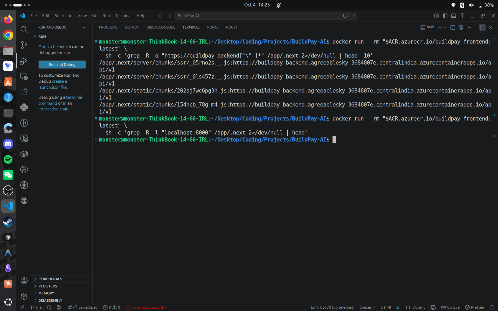
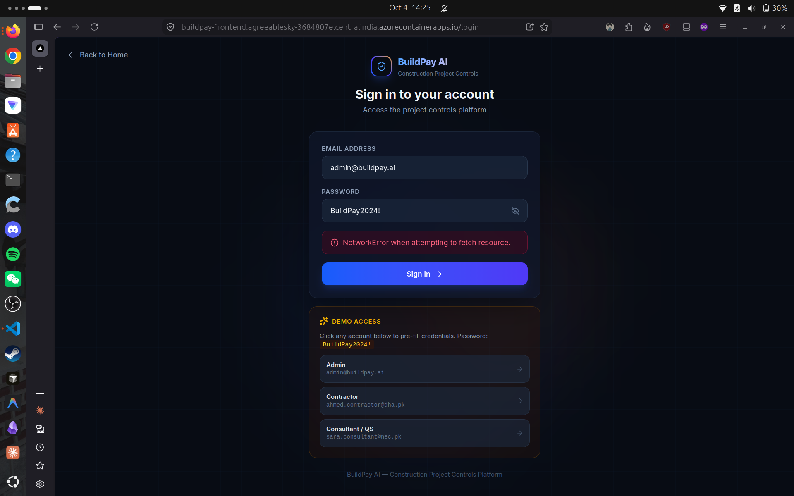
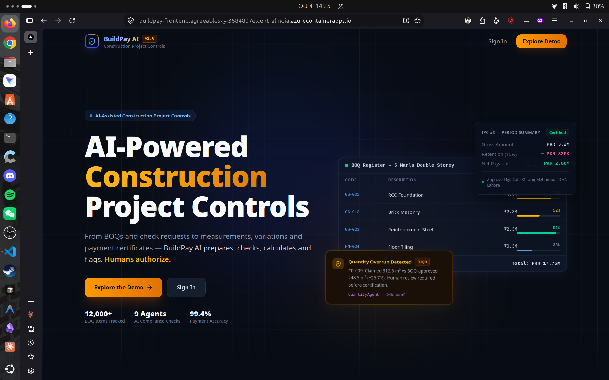
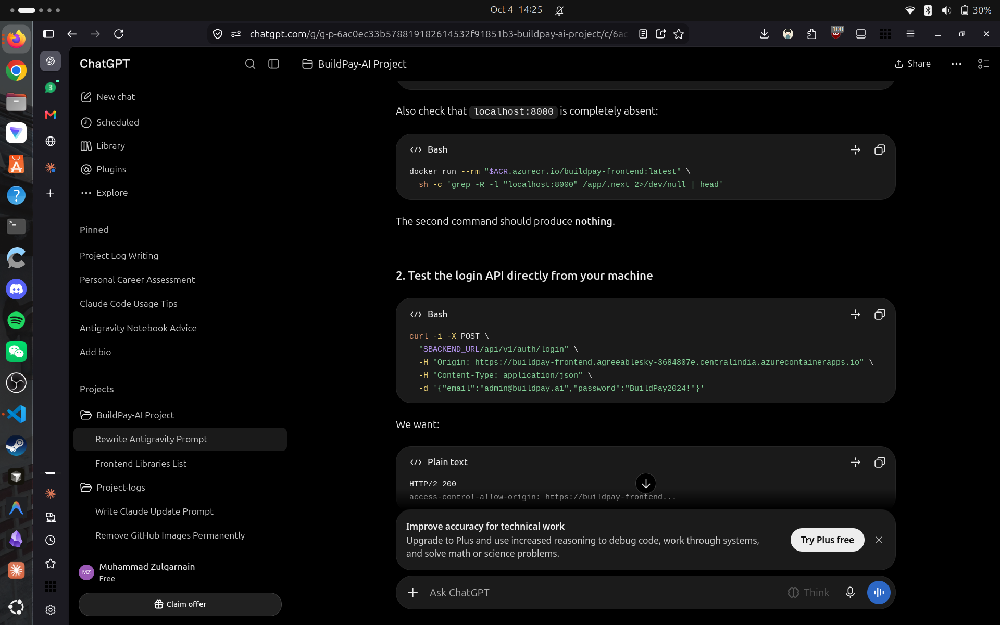
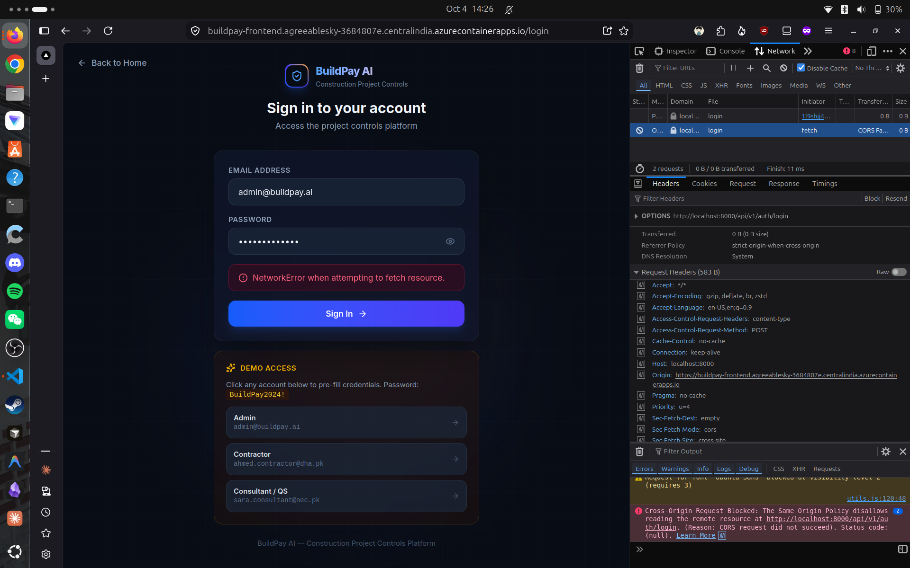

# Deploying BuildPay AI to Azure — From Local Docker Compose to a Working Production Stack

## What I Was Building

BuildPay AI is an AI-assisted construction project controls and payment platform.

The core principle is:

> **AI prepares, checks, calculates, and flags — humans authorize.**

The application covers:

- Projects
- BOQs (Bills of Quantities)
- Check Requests
- Measurements
- Variations
- IPCs / Payment Certificates
- Documents and evidence
- AI findings
- Reports
- Audit trails
- Role-based approvals

The backend is built with **FastAPI** and PostgreSQL. The frontend is a **Next.js + React** application using Tailwind CSS, Radix UI, Lucide, Framer Motion, and Recharts.

The application has separate roles for Contractor, Consultant, Quantity Surveyor, Client, Project Manager, and Admin.

After getting the local Docker Compose setup into a usable state, I decided it was time to deploy the complete stack to Azure.

The goal was simple:

> **Get the real BuildPay AI application running publicly on Azure, with the frontend, backend, database, authentication, and demo workflows connected.**

The deployment worked.

The login didn't.

This post documents the entire process.

---

## The Application Architecture

Locally, the stack was roughly:

```
Frontend — Next.js :3000
        |
        v
Backend — FastAPI :8000
        |
        v
PostgreSQL :5432
```

The Azure deployment changed that into:

```
                         Internet
                            |
                            v
              +-------------------------+
              |   Azure Container Apps  |
              |                         |
              |     BuildPay Frontend  |
              |       Next.js           |
              |        :3000            |
              +------------+------------+
                           |
                           | HTTPS
                           v
              +-------------------------+
              |   Azure Container Apps  |
              |                         |
              |     BuildPay Backend   |
              |       FastAPI           |
              |        :8000            |
              +------------+------------+
                           |
                           | PostgreSQL
                           v
              +-------------------------+
              | Azure PostgreSQL        |
              | Flexible Server         |
              |                         |
              | Database: buildpay      |
              +-------------------------+

              Azure Container Registry
                       |
              +--------+--------+
              |                 |
              v                 v
        Backend Image     Frontend Image
```

The main Azure resources were:

- Resource group: `buildpay-ai-rg`
- Container Apps environment: `buildpay-ai-env`
- Container Registry: `buildpayaiacr5908`
- Frontend Container App: `buildpay-frontend`
- Backend Container App: `buildpay-backend`
- PostgreSQL server: `buildpay-pg-3136`
- Database: `buildpay`
- Region: Central India

Docker images were built locally, pushed to Azure Container Registry, and then deployed to Azure Container Apps.

---

## First Signs of Success

The backend came up correctly.

Its health endpoint returned:

```json
{
  "status": "healthy",
  "app": "BuildPay AI",
  "version": "1.0.0"
}
```

The frontend also loaded successfully.

More importantly, the new public landing page appeared instead of the old dashboard-style root page.

The intended application flow was now:

```
Visitor
  |
  v
Landing Page
  |
  v
Login
  |
  v
Dashboard
  |
  v
Authenticated Project Workflows
```

At this point it looked like the deployment was basically done.

Then I tried logging in.

---

## The Login Failure

I used the demo administrator account:

```
admin@buildpay.ai
```

Instead of reaching the dashboard, the frontend displayed:

```
NetworkError when attempting to fetch resource
```



At first, this could have meant almost anything:

- Backend unavailable
- Database failure
- Authentication failure
- Azure networking problem
- CORS problem
- Wrong frontend API URL
- Stale frontend build
- Incorrect container deployment

So rather than changing things randomly, I started testing each layer independently.

---

## Checking the Backend Directly

The first question was:

> Is the production authentication endpoint actually working?

I tested it directly with `curl`.

The production API returned:

```
HTTP/2 200
```

and returned the expected authentication response.

That ruled out a lot.

The backend was alive.

The authentication endpoint was alive.

The database-backed login flow was working.

So the problem was likely somewhere between the browser and the API.

---

## Inspecting the Frontend Build

The frontend API client uses:

```typescript
process.env.NEXT_PUBLIC_API_URL
```

with a localhost fallback for development.

That is fine locally:

```
http://localhost:8000/api/v1
```

but obviously wrong in production.

The deployed application needed to use the Azure backend:

```
https://buildpay-backend.agreeablesky-3684807e.centralindia.azurecontainerapps.io/api/v1
```

There was an important Next.js detail here.

Because this is a `NEXT_PUBLIC_*` variable, the value used by browser-side code needs to be available during the **Next.js build**.

Simply setting it in the final running container isn't enough.

I therefore changed the frontend Dockerfile to accept the API URL as a build argument:

```dockerfile
ARG NEXT_PUBLIC_API_URL
ENV NEXT_PUBLIC_API_URL=$NEXT_PUBLIC_API_URL
```

and rebuilt the production image with:

```bash
docker build --no-cache \
  --build-arg NEXT_PUBLIC_API_URL="$FRONTEND_API_URL" \
  -t "$ACR.azurecr.io/buildpay-frontend:latest" \
  ./frontend
```

---

## Inspecting the Actual Production Artifact

This was one of the more useful debugging steps.

Instead of trusting the source code, I inspected the generated Next.js build inside the Docker image.

### Screenshot 2 — Terminal Debugging and Code Search



I searched the generated `.next` output for the production Azure backend URL.

It was there.

Then I searched for:

```
localhost:8000
```

and got no results.

That meant the **local Docker image itself was correct**.

The generated browser bundle was no longer pointing at localhost.

I thought the problem was solved.

It wasn't.

---

## The Browser Developer Tools Changed Everything

The most useful screenshot from the entire deployment was the browser's Network/Console inspection.

### Screenshot 3 — Browser Network and Console Inspection



The browser showed the actual request being attempted.

The page was hosted at the Azure frontend:

```
https://buildpay-frontend.agreeablesky-3684807e.centralindia.azurecontainerapps.io
```

but the request was going to:

```
http://localhost:8000/api/v1/auth/login
```

That was the smoking gun.

The browser wasn't failing to reach Azure.

It was trying to reach **my own machine**.

That explained the generic:

```
NetworkError when attempting to fetch resource
```

---

## But Why Was Azure Still Serving the Wrong Frontend?

This was the confusing part.

I had already proven that the local production image contained the correct Azure URL and no `localhost:8000` references.

So I needed to verify exactly what Azure was serving.

The Container App was using:

```
buildpay-frontend:latest
```

The problem with `latest` is that it is mutable.

A tag can point to different image digests over time, which makes debugging and deployment verification unnecessarily ambiguous.

So I stopped relying on `latest`.

---

## Switching to Immutable Image Tags

I created a unique frontend deployment tag:

```
api-url-fix-20261004144240
```

Then tagged the known-good image and pushed it to Azure Container Registry.

Finally, I explicitly updated the Container App to use that exact image.

Azure confirmed that the running container was now using:

```
buildpayaiacr5908.azurecr.io/buildpay-frontend:api-url-fix-20261004144240
```

This gave me a concrete deployment artifact that I could identify instead of asking:

> "Which version of latest is actually running?"

That distinction ended up being very useful.

---

## Then I Found a Second Problem: CORS

Once the frontend deployment was under control, I tested the API from the production origin.

The browser-style CORS preflight initially returned:

```
HTTP/2 400

Disallowed CORS origin
```

This was another interesting configuration mismatch.

The backend had a `FRONTEND_URL` setting containing the Azure frontend URL.

However, the FastAPI CORS middleware was using a separate static list:

```python
ALLOWED_ORIGINS = [
    "http://localhost:3000",
    "http://localhost:3001"
]
```

So the application knew what its frontend URL was, but the CORS middleware wasn't actually using it.

---

## Fixing CORS

I changed the startup configuration so that the configured `FRONTEND_URL` is added to the allowed origins:

```python
allowed_origins = list(settings.ALLOWED_ORIGINS)

if settings.FRONTEND_URL and settings.FRONTEND_URL not in allowed_origins:
    allowed_origins.append(settings.FRONTEND_URL)
```

The middleware then uses:

```python
CORSMiddleware(
    allow_origins=allowed_origins,
    allow_credentials=True,
    allow_methods=["*"],
    allow_headers=["*"],
)
```

This kept the local development origins while also supporting the deployed frontend.

---

## Verifying the CORS Fix

I rebuilt the backend and, again, used an immutable image tag:

```
cors-fix-20261004142113
```

Azure confirmed that exact image was deployed.

Then I ran the preflight request again.

This time:

```
HTTP/2 200
```

and the response included:

```
access-control-allow-origin:
https://buildpay-frontend.agreeablesky-3684807e.centralindia.azurecontainerapps.io
```

along with:

```
access-control-allow-credentials: true
```

That confirmed the backend was now correctly accepting requests from the deployed frontend.

---

## Testing the Real Login Request

I didn't stop at the OPTIONS request.

I tested the actual:

```
POST /api/v1/auth/login
```

using the production frontend origin.

The backend returned:

```
HTTP/2 200
```

with the correct CORS headers.

At this point, the important layers were all independently verified:

| Layer | Result |
|---|---|
| Azure frontend | Working |
| Azure backend health | Working |
| PostgreSQL | Connected |
| Authentication endpoint | Working |
| CORS preflight | Working |
| CORS on login POST | Working |
| Production frontend image | Correct |
| Azure frontend deployment | Correct |
| Browser login | Final test remaining |

---

## Screenshot 4 — Debugging the Problem



The debugging process involved jumping between:

- Source code
- Docker images
- Generated Next.js bundles
- Azure Container Apps
- HTTP requests
- Browser developer tools
- CORS behavior
- Authentication

The useful part wasn't any individual command.

It was narrowing the problem down one layer at a time.

---

## The Landing Page Was Also Part of the Deployment

### Screenshot 5 — BuildPay AI Landing Page



The landing page was an important part of this deployment because the frontend had recently been restructured.

Previously, the root route effectively behaved like an application page.

The new architecture intentionally separates the public experience from the authenticated application:

```
/
/ 
    Public landing page

/login
    Authentication

/dashboard
    Authenticated application
```

The landing page presents the product before asking the user to authenticate.

It highlights things such as:

- BOQ tracking
- Payment calculations
- Compliance checks
- AI-assisted analysis
- Quantity overrun alerts
- Human-in-the-loop controls

So this Azure deployment was testing more than infrastructure.

It was also testing the new product entry flow.

---

## The Final Test

After the frontend image and backend CORS configuration were fixed, I opened the deployed application again.

The intended flow was:

```
Landing Page
      |
      v
Login
      |
      v
Demo Admin Account
      |
      v
Production API
      |
      v
JWT Authentication
      |
      v
Dashboard
```

This time:

**Sign in worked.**

The NetworkError was gone.

The browser was communicating with the Azure backend rather than localhost.

That was the point where the deployment actually became useful rather than merely "deployed."

---

## Final Azure Architecture

The final deployed system is:

```
                         Internet
                            |
                            v
              +-------------------------+
              |   Azure Container Apps  |
              |                         |
              |     BuildPay Frontend  |
              |       Next.js           |
              |        :3000            |
              +------------+------------+
                           |
                           | HTTPS
                           v
              +-------------------------+
              |   Azure Container Apps  |
              |                         |
              |     BuildPay Backend   |
              |       FastAPI           |
              |        :8000            |
              +------------+------------+
                           |
                           | PostgreSQL
                           v
              +-------------------------+
              | Azure PostgreSQL        |
              | Flexible Server         |
              |                         |
              | Database: buildpay      |
              +-------------------------+

              Azure Container Registry
                       |
              +--------+--------+
              |                 |
              v                 v
        Backend Image     Frontend Image
```

The frontend and backend are independently containerized, with images stored in ACR and deployed to Azure Container Apps.

The backend receives sensitive values through Azure secrets.

The frontend receives its public API URL at build time.

---

## What Actually Went Wrong

Looking back, there were **two separate production configuration problems**.

### Problem 1 — Frontend API URL

The browser-side Next.js application had been built without the correct production `NEXT_PUBLIC_API_URL`.

That left the development fallback:

```
http://localhost:8000/api/v1
```

inside the browser-side application.

The fix was to pass the production API URL into the Next.js build stage.

### Problem 2 — CORS

After the frontend API URL was fixed, the backend still rejected the deployed frontend's origin.

The backend had the production `FRONTEND_URL`, but the CORS middleware wasn't incorporating it into its allowed origins.

The fix was to build the allowed-origin list from both the existing development origins and the configured deployment URL.

---

## What I Learned

The biggest lesson from this deployment wasn't "how to deploy Docker to Azure."

It was learning to separate **source code, build artifacts, deployed containers, and browser behavior**.

When login failed, the first temptation was to say:

> "The backend isn't working."

But direct API testing proved otherwise.

Then the investigation became:

```
Is the backend working?
        |
       YES
        |
Is authentication working?
        |
       YES
        |
Is CORS working?
        |
   Initially NO
        |
Is the frontend build correct?
        |
       YES
        |
Is Azure serving the expected image?
        |
   Verify explicitly
        |
Is the browser using the expected API?
        |
       NO
        |
Fix deployment
        |
       YES
        |
Login works
```

That sequence was much more useful than changing five things at once.

---

## Inspect the Artifact, Not Just the Source

One of the strongest habits I want to keep from this deployment is:

> **Don't trust your source code. Inspect the artifact that actually runs.**

The source can contain:

```
NEXT_PUBLIC_API_URL = Azure URL
```

while the generated browser bundle can still contain:

```
localhost:8000
```

For frontend applications, especially with frameworks that inject public environment variables during build time, the compiled artifact is what matters.

Searching the generated `.next` files gave me direct evidence.

---

## Immutable Deployments Are Worth It

Using:

```
latest
```

is convenient.

It is also less useful when debugging production deployments.

Switching to explicit tags such as:

```
api-url-fix-20261004144240
cors-fix-20261004142113
```

made it obvious exactly which image was running.

For a larger production setup, I would go further and use:

- Git commit SHA image tags
- Automated CI/CD
- Deployment manifests
- Revision tracking
- Automated smoke tests
- Health checks
- Rollback procedures

But even unique tags were a significant improvement over repeatedly pushing `latest`.

---

## What I'd Improve Next

The application is now deployed and the core login path works, but I wouldn't call this a fully hardened production SaaS yet.

There are still operational areas I would improve:

- Proper secret rotation and management
- Database backups and restore testing
- File/upload storage
- Rate limiting
- Monitoring and alerting
- CI/CD deployment automation
- Better production logging
- More comprehensive automated end-to-end tests
- Production scaling configuration
- Stricter security headers and configuration
- Separate production and demo-data strategies

The goal of this deployment was to get the complete application running publicly first.

Hardening comes next.

---

## Final Status

The important production path is now working:

```
Public Landing Page       ✓
        |
        v
Login Page                ✓
        |
        v
Production API            ✓
        |
        v
CORS                      ✓
        |
        v
JWT Authentication       ✓
        |
        v
Dashboard                 ✓
```

BuildPay AI has officially moved from:

> **"a project running on my machine"**

to:

> **"an actual application deployed on Azure."**

And honestly, the most valuable part wasn't getting the first green deployment.

It was learning how to debug the gap between:

> **"My code is correct."**

and

> **"The browser is actually running the code I think it is."**

---

## Screenshot Timeline

The screenshots from this deployment capture the debugging journey:

### Screenshot 1
**The failed production login.**

The deployed BuildPay AI login page displayed the `NetworkError when attempting to fetch resource` message.

### Screenshot 2
**Terminal inspection of the production frontend Docker image.**

I used Docker and `grep` to inspect the generated Next.js files and verify the production API URL.

### Screenshot 3
**The browser Network/Console breakthrough.**

The browser revealed that the production frontend was attempting to call `localhost:8000`, exposing the actual cause of the login failure.

### Screenshot 4
**The debugging session.**

The investigation moved between source code, Docker, API testing, Azure configuration, and browser behavior.

### Screenshot 5
**The deployed BuildPay AI landing page.**

This confirmed that the new public landing experience was successfully deployed.

---

*Project: [BuildPay AI](https://github.com/Mzaq1559/BuildPay-AI)*
