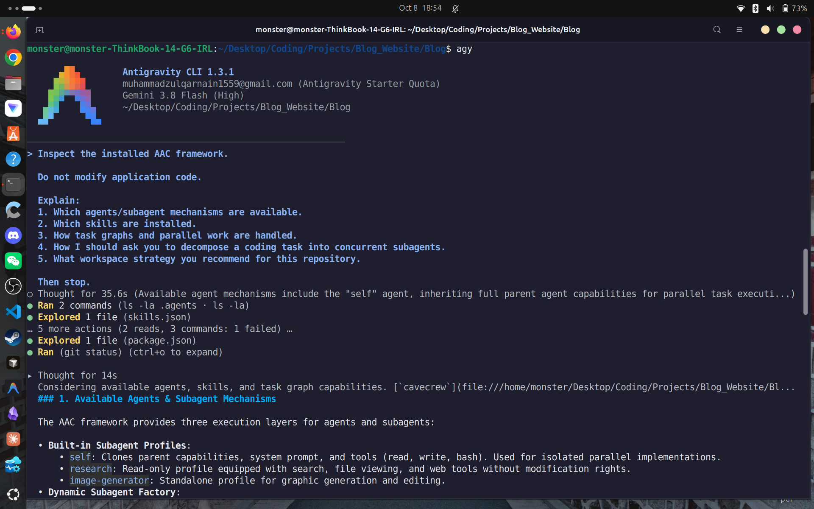
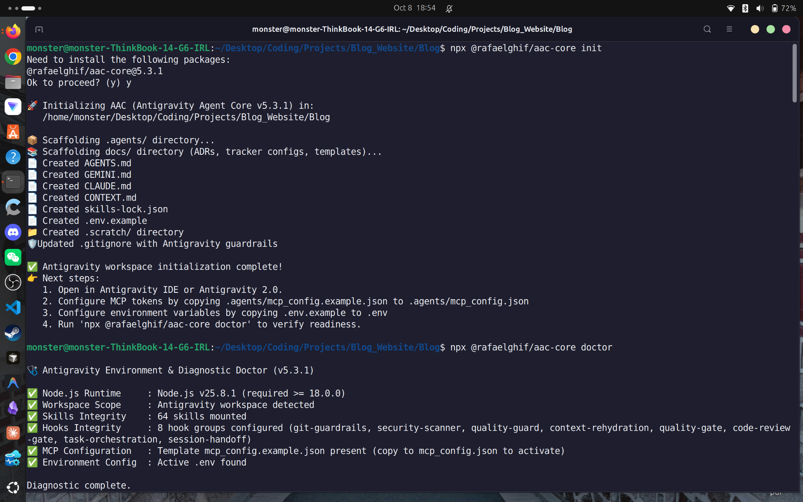
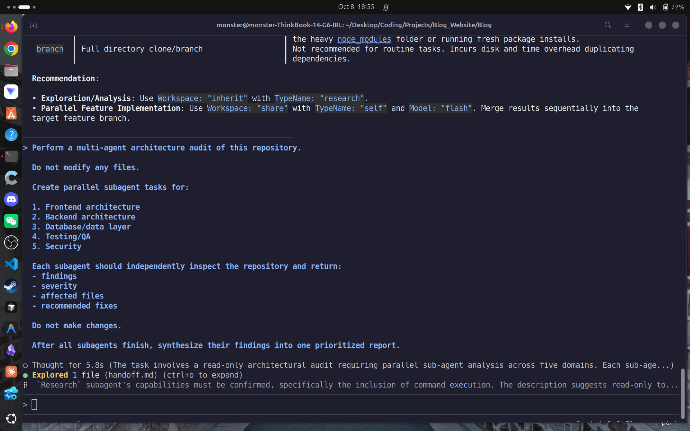
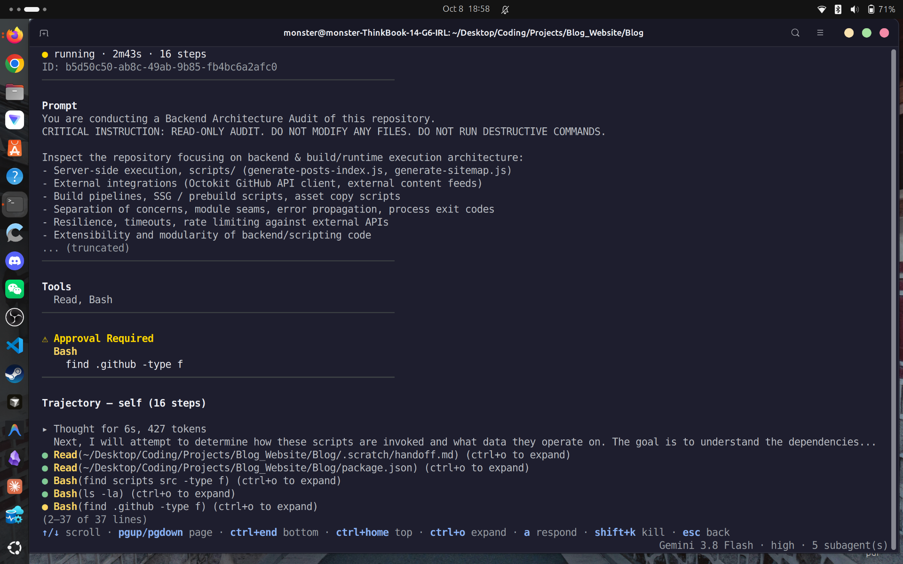
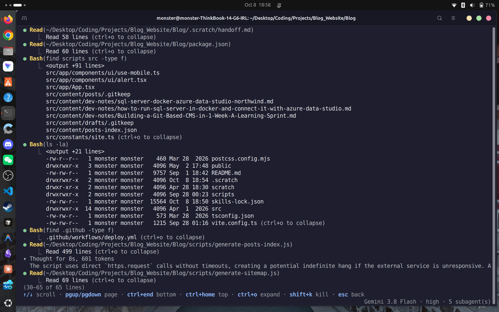
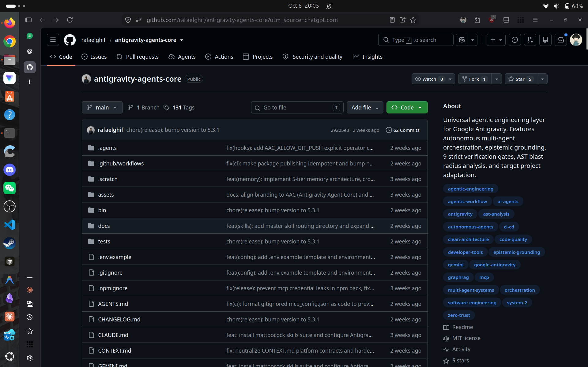
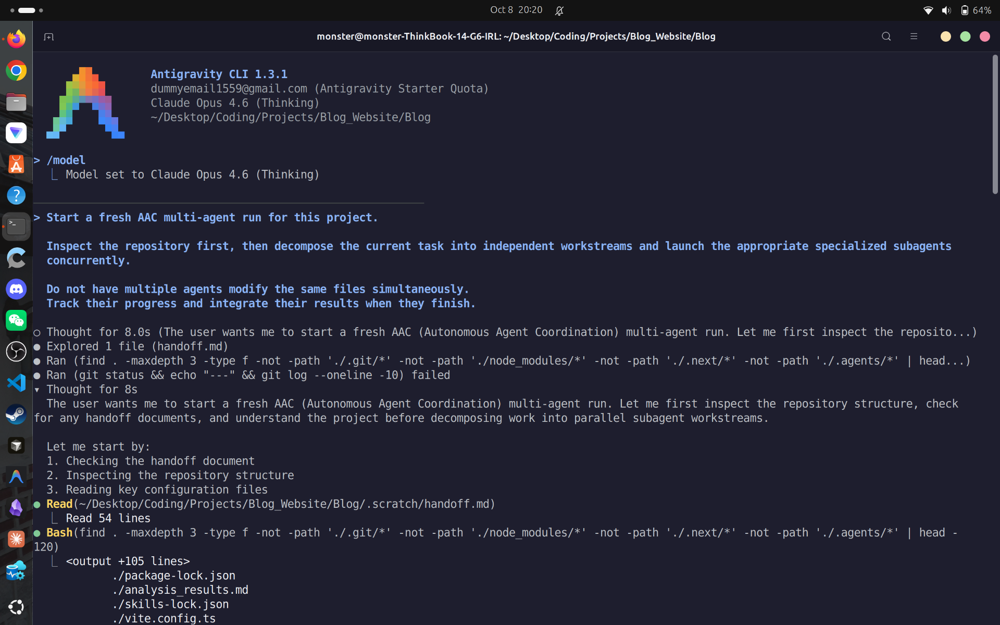
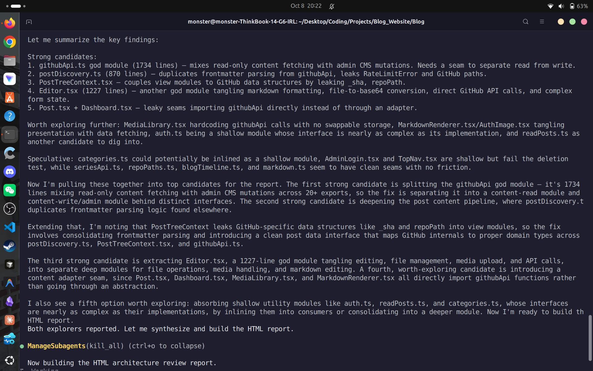
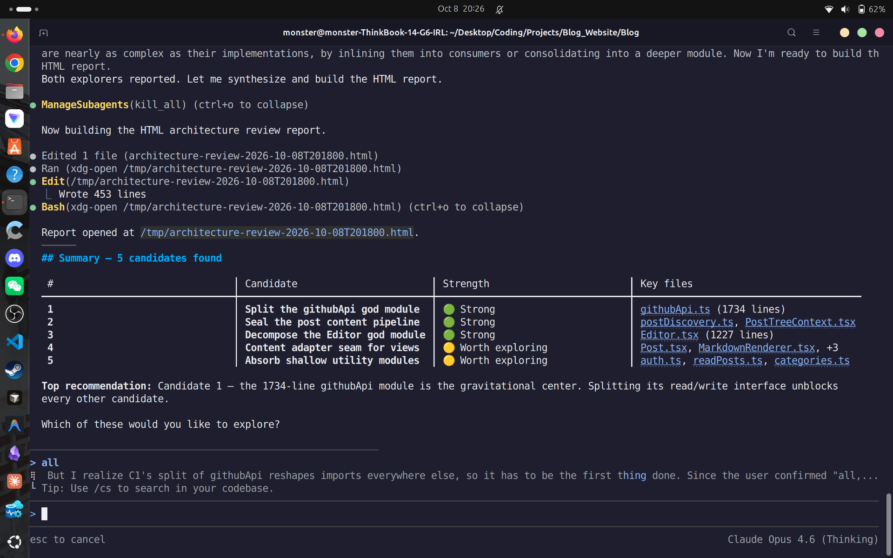

# Exploring AI Coding Agents — Gemini CLI, Antigravity, and My First Multi-Agent Workflow

Today was less about building a new application and more about understanding how AI coding agents can actually fit into my development workflow.

I've been using AI coding tools for a while, but I wanted to go further than simply asking an agent to write code. I wanted to understand the difference between a coding agent, its underlying model, skills, and — most importantly — whether I could have multiple specialized agents working on different parts of the same codebase at the same time.

The day started with a problem in my existing setup.

My Claude Code setup was being routed through OmniRoute, but the experience was laggy and it wasn't working properly enough for me to rely on it as my main coding workflow. Instead of spending the entire day fighting the proxy setup, I decided to try Gemini CLI directly.

That ended up leading me to Antigravity and, eventually, a much more interesting idea:

> What if I stop thinking of AI as one coding assistant and start treating it like a small engineering team?

---

## 1. Moving Away From the Claude Code + OmniRoute Setup

I had previously configured Claude Code to run through OmniRoute with Gemini as the underlying model.

The architecture was interesting technically:

    Claude Code
         |
         v
      OmniRoute
         |
         v
       Gemini

It proved that an Anthropic-compatible coding client could be routed through a local gateway toward another model.

But in actual use, the setup was too laggy and unreliable for the workflow I wanted. Simple interactions could take noticeably long, and the experience wasn't stable enough to make me want to build my entire development workflow around it.

So today I decided to stop optimizing that setup and try something more direct.

---

## 2. Installing Gemini CLI

I installed Gemini CLI and started experimenting with it directly from the terminal.

This immediately felt more interesting for what I wanted to do.

Instead of treating an AI model as something I access only through a chat interface, Gemini CLI gave me a proper terminal-based coding environment where the model could inspect the repository, reason about the project, and work with the development environment.

That terminal-first approach is important to me.

I prefer having direct control over:

- the current working directory
- Git
- shell commands
- project files
- configuration
- installed tools
- permissions
- agent behavior

The GUI can be useful for observing what is happening, but the terminal gives me much more control over the actual environment.

---

## 3. Letting Gemini Understand the Repository First

One of the more useful things I discovered was Gemini's built-in repository exploration capability.

Instead of immediately asking it to modify something, I could let it inspect the codebase first and produce an explanation of how the repository was structured.

That was surprisingly useful.

For a reasonably large project, there is a huge difference between asking:

> "What does this repository do?"

and actually letting an agent inspect the source tree, configuration, scripts, workflows, and project structure before explaining how everything fits together.

The output gave me a much clearer picture of the repository architecture before I started asking the agent to make changes.

This is a workflow I want to keep:

    Explore
       |
       v
    Understand
       |
       v
      Plan
       |
       v
    Modify
       |
       v
    Verify

rather than:

    Prompt
       |
       v
    Generate code
       |
       v
    Hope it works

That distinction becomes even more important when multiple agents are involved.

---

## 4. Discovering Antigravity CLI

While exploring the available AI coding-agent ecosystem, I started looking more seriously at Antigravity CLI.

My setup today was:

- Antigravity CLI 1.3.1
- Gemini 3.8 Flash (High)
- Antigravity Starter Quota

I launched it directly inside my Blog repository.

The first thing I noticed was that Antigravity wasn't simply another terminal chatbot.

It had concepts around subagents, where a primary agent can delegate work to other agents.

That was exactly the direction I had been looking for.

---

## 5. The Idea of Subagents

The important difference is between one agent doing everything sequentially and several agents handling independent pieces of work.

Instead of:

    Agent
     |
     +-- inspect frontend
     |
     +-- inspect backend
     |
     +-- inspect database
     |
     +-- inspect tests
     |
     +-- inspect security

I wanted something closer to:

                     Main Agent
                         |
          +--------------+--------------+
          |              |              |
          v              v              v
      Frontend        Backend        Database
       Agent          Agent           Agent
          |              |              |
          +--------------+--------------+
                         |
                 +-------+-------+
                 |               |
                 v               v
                QA            Security
               Agent            Agent

The interesting part is that independent investigations can happen concurrently.

That can dramatically change how useful an AI coding environment becomes.

---

## 6. Installing Antigravity Agent Core

I didn't want to manually create dozens of agent definitions and orchestration files.

So I looked for something that had already been built for this purpose.

I found Antigravity Agent Core (AAC), an open-source framework designed to add a structured multi-agent engineering workflow around Antigravity.

Instead of manually building everything from scratch, AAC provides project-level scaffolding for agents, skills, hooks, task orchestration, and verification.

I initialized it directly inside the Blog repository with:

    npx @rafaelghif/aac-core init

The setup created the project-level agent infrastructure.

The repository now contained things such as:

- .agents/
- AGENTS.md
- CONTEXT.md
- GEMINI.md
- CLAUDE.md
- skills-lock.json
- .scratch/

What I liked about this approach is that the configuration lives with the project instead of being hidden somewhere in a global installation.

That makes the workflow easier to understand and reproduce.

---

## 7. Skills Are Not Agents

One thing I wanted to understand properly was the difference between skills and agents.

They sound similar, but they solve different problems.

### A skill is a capability or playbook

A skill tells an agent how to perform a certain type of work.

For example:

- React quality
- Security auditing
- Testing
- API design
- Database design

A skill is basically reusable knowledge and instructions.

### An agent is the worker

An agent has a role and can actually perform a task.

For example:

- Frontend Engineer
- Backend Engineer
- Database Engineer
- QA Engineer
- Security Engineer
- Code Reviewer

A useful way to think about it is:

> Skill = how to do something  
> Agent = who is responsible for doing it

An agent can use multiple skills.

For example:

    Frontend Agent
       |
       +-- React skill
       +-- TypeScript skill
       +-- Accessibility skill
       +-- Performance skill

That distinction became important when I started looking at multi-agent workflows.

---

## 8. Giving the Agents a Real Task

Once AAC was installed, I wanted to test the architecture without allowing the agents to randomly modify my project.

So I gave the system a read-only architectural audit.

The task was to inspect five areas independently:

1. Frontend
2. Backend
3. Database
4. Testing
5. Security

The agents were instructed to return:

- findings
- severity
- affected files
- recommended fixes

and, importantly:

> Do not modify any files.

This was a much better test of the architecture than immediately asking several agents to start changing code.

Before giving agents permission to modify a codebase concurrently, I want to know whether they can first understand it.

---

## 9. Watching a Subagent Work

The next part was where the setup started feeling genuinely different from a normal coding assistant.

A subagent was launched in the background to investigate part of the repository.

It performed normal repository inspection commands such as finding files under .github and examining the project's workflows, scripts, and integrations.

The important thing wasn't the individual command.

It was the fact that this investigation could happen as a separate agent task while the overall orchestration continued.

That is the beginning of the "AI engineering team" model I was looking for.

---

## 10. The Agents Actually Explored the Codebase

The repository exploration went beyond simply listing the top-level directory.

The agents inspected:

- src/
- package.json
- .github/workflows/
- deployment configuration
- scripts
- project structure

That matters because architectural analysis without actually reading the repository is mostly guesswork.

I wanted the agents to base their conclusions on the real code.

---

## 11. Looking at the AAC Project Itself

I also spent some time inspecting the actual Antigravity Agent Core project to understand what I had installed rather than treating it like a black box.

The project is essentially an engineering layer around Antigravity's agent capabilities.

The interesting pieces for me were the combination of:

- skills
- agent instructions
- orchestration
- task handling
- verification
- project context

That combination is much closer to the development workflow I want than simply installing a large collection of isolated skills.

---

## 12. Experimenting With the Model

I also experimented with model selection inside Antigravity.

At one point I switched the active model to Claude Opus 4.6 (Thinking) and started another analysis run.

This was useful because I wanted to separate two concepts:

    Agent architecture
            !=
    Underlying model

The agent system determines how work is organized.

The model determines the reasoning engine performing that work.

Being able to experiment with the model without completely changing the agent workflow makes the architecture much more interesting.

---

## 13. Finding Real Architectural Problems

The multi-agent analysis wasn't just generic advice like:

> "Your code could be cleaner."

It identified concrete areas of the repository that deserved attention.

One of the strongest findings was the size and responsibility of some modules.

For example:

- githubApi.ts — 1734 lines
- Editor.tsx — 1227 lines

Those are classic signs that a module may have accumulated too many responsibilities.

The recommendation wasn't simply "rewrite the file."

Instead, the analysis suggested separating responsibilities such as read/write operations and reducing leaky abstractions.

That's the kind of analysis I actually want from an AI coding agent:

> specific enough that I can act on it.

---

## 14. Turning the Analysis Into a Report

After the different investigations were completed, the workflow produced a structured HTML architecture report.

The report summarized the main refactoring candidates in a much cleaner format than a long terminal dump.

That gave me a useful artifact that I could inspect separately from the agent conversation.

The overall workflow was becoming:

    Repository
        |
        v
      Explore
        |
        v
    Parallel analysis
        |
        +---- Frontend
        +---- Backend
        +---- Database
        +---- Testing
        +---- Security
        |
        v
    Aggregate findings
        |
        v
    Architecture report

That is much closer to how I would want an AI-assisted engineering workflow to operate.

---

## 15. What I Learned About Multi-Agent Coding

The biggest thing I learned today is that AI coding and multi-agent engineering are not really the same thing.

A normal coding assistant looks roughly like:

    Me
     |
     v
    One model
     |
     v
    Code changes

A multi-agent workflow can look like:

                         Orchestrator
                              |
          +-------------------+-------------------+
          |                   |                   |
          v                   v                   v
      Frontend             Backend             Database
       Agent                Agent                Agent
          |                   |                   |
          +-------------------+-------------------+
                              |
                    +---------+---------+
                    |                   |
                    v                   v
                   QA               Security
                  Agent                Agent
                    |                   |
                    +---------+---------+
                              |
                              v
                          Reviewer

The goal isn't to create as many agents as possible.

The goal is to give independent responsibilities to independent workers.

If two agents need to edit the same file at the same time, parallelism can quickly become a liability instead of an advantage.

So good orchestration matters just as much as having multiple agents.

---

## 16. Why I Prefer the Terminal

Today also reinforced something I already suspected:

> For serious AI-assisted development, the terminal gives me more control than the GUI.

From the terminal I can directly control:

- Git
- Docker
- npm
- Python
- environment variables
- permissions
- files
- agent configuration
- project directories

I can see exactly what commands are being executed and reproduce the workflow later.

The GUI is useful for visibility, but the CLI is where I feel I have actual control over the development environment.

---

## 17. The Workflow I Want to Build

I don't want an AI system where I simply type:

> "Build my entire application."

and then hope the generated code is good.

What I'm moving toward is:

                        Me
                         |
                         v
                   Main Agent
                         |
                  Understand task
                         |
                         v
                   Decompose work
                         |
             +-----------+-----------+
             |           |           |
             v           v           v
          Agent A     Agent B     Agent C
             |           |           |
             +-----------+-----------+
                         |
                         v
                        QA
                         |
                         v
                     Security
                         |
                         v
                      Reviewer
                         |
                         v
                   Final changes

That gives me a much clearer separation between planning, implementation, verification, and review.

---

## 18. What I Want to Explore Next

This is still the beginning.

The next thing I want to experiment with is letting multiple agents actually implement independent pieces of a real feature rather than only performing a read-only audit.

For example:

- Frontend Agent → UI
- Backend Agent → API
- Database Agent → schema and migrations
- QA Agent → tests
- Security Agent → security review

The difficult part won't be spawning the agents.

The difficult part will be coordinating their changes without creating conflicts, keeping the context consistent, and making sure the final code still makes sense as one system.

That is the part I'm most interested in learning.

---

# Final Thoughts

Today started with a pretty ordinary problem:

**Claude Code through OmniRoute was too laggy and wasn't working properly enough for me to rely on.**

That pushed me toward Gemini CLI.

Gemini CLI then showed me how useful it can be to let an agent understand an entire repository before asking it to change anything.

From there I discovered Antigravity's subagent model and installed AAC to experiment with actual multi-agent engineering.

The most interesting shift for me was this:

> I don't just want an AI that writes code. I want to understand how to build a development workflow where several AI agents can reason about different parts of a system, work independently, and then have their work verified and integrated.

I'm still figuring out the best way to do that without losing control of the codebase.

But today's experiment was a pretty good first step.
