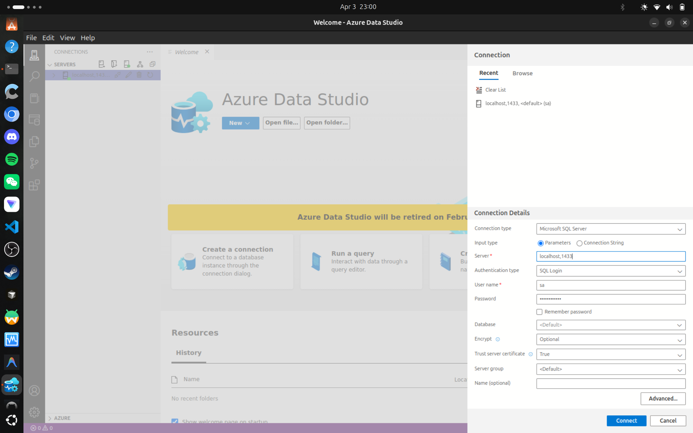
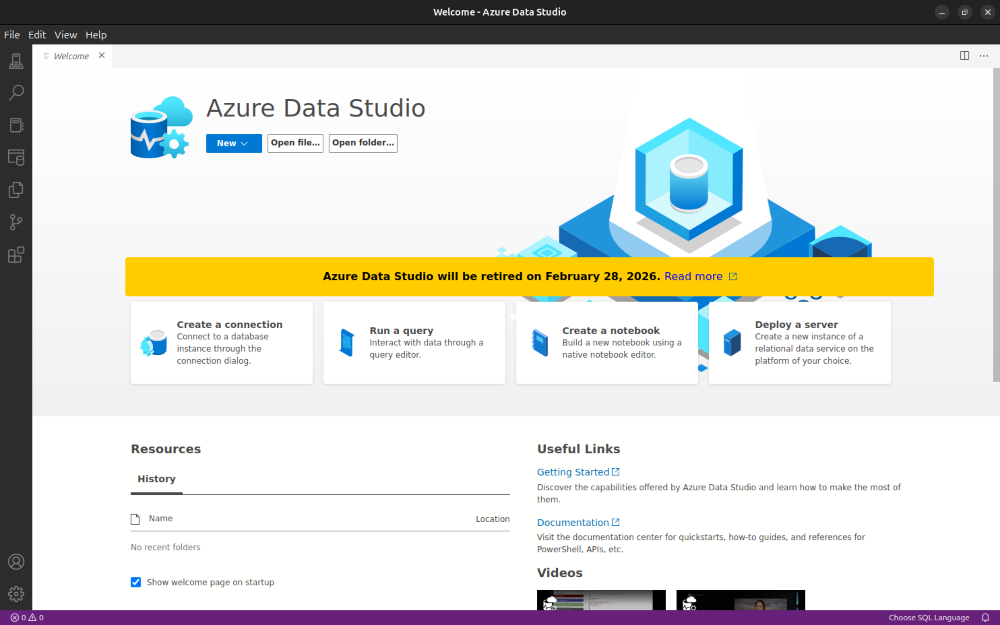

## Creating a Students Table using Docker SQL Server and Azure Data Studio

In this section, I set up a **Microsoft SQL Server instance using Docker**, connected it to **Azure Data Studio**, and performed several SQL tasks ranging from simple queries to slightly more advanced database operations. Running SQL Server in a container makes it easy to manage databases without installing them directly on your system.

---

## 1. Running SQL Server in Docker

First, start a SQL Server container using Docker.

```bash
docker run -e "ACCEPT_EULA=Y"\
-e "MSSQL_SA_PASSWORD=Password123@"   
-p 1433:1433 
--name mssql-server   
-d mcr.microsoft.com/mssql/server:2022-latest
```

### Explanation

- `ACCEPT_EULA=Y` → Accepts the Microsoft SQL Server license agreement.
- `SA_PASSWORD` → Sets the password for the `sa` (system administrator) account.
- `-p 1433:1433` → Exposes SQL Server's default port to your local machine.
- `--name sqlserver` → Names the container.
- `-d` → Runs the container in detached mode.
- `mcr.microsoft.com/mssql/server:2022-latest` → Official SQL Server Docker image.

After running this command, SQL Server will be available at **localhost:1433**.

---

**Docker SQL Server Container Running**


---

## 2. Connecting to SQL Server using Azure Data Studio

Next, connect to the running SQL Server instance using Azure Data Studio.

Steps:

1. Open **Azure Data Studio**
2. Click **New Connection**
3. Enter the following details:

| Setting | Value |
|-------|------|
| Server | `localhost` |
| Authentication Type | SQL Login |
| Username | `sa` |
| Password | Your SA password |

Once connected, the SQL Server instance will appear in the **Connections panel**.

---

**Azure Data Studio Connection**


---

# SQL Tasks

Below are a series of tasks performed on the **Students table** to demonstrate SQL operations.

---

## Task 01 — Create the Students Table

### Query

```sql
CREATE TABLE Students (
    StudentID INT PRIMARY KEY,
    Name VARCHAR(100),
    Age INT,
    Department VARCHAR(100)
);
```

### Screenshot


### Explanation

*(Add explanation here)*

---

## Task 02 — Insert Student Records

### Query

```sql
INSERT INTO Students (StudentID, Name, Age, Department)
VALUES
(1, 'Ali', 20, 'Computer Science'),
(2, 'Sara', 21, 'Electrical Engineering'),
(3, 'Ahmed', 22, 'Mechanical Engineering');
```

### Screenshot



### Explanation

*(Add explanation here)*

---

## Task 03 — Retrieve All Students

### Query

```sql
SELECT * FROM Students;
```

### Screenshot


### Explanation

*(Add explanation here)*

---

## Task 04 — Retrieve Students from a Specific Department

### Query

```sql
SELECT * 
FROM Students
WHERE Department = 'Computer Science';
```

### Screenshot


### Explanation

*(Add explanation here)*

---

## Task 05 — Update Student Information

### Query

```sql
UPDATE Students
SET Age = 23
WHERE StudentID = 3;
```

### Screenshot


### Explanation

*(Add explanation here)*

---

## Task 06 — Delete a Student Record

### Query

```sql
DELETE FROM Students
WHERE StudentID = 2;
```

### Screenshot


### Explanation

*(Add explanation here)*

---

## Task 07 — Count Total Students

### Query

```sql
SELECT COUNT(*) AS TotalStudents
FROM Students;
```

### Screenshot


### Explanation

*(Add explanation here)*

---

## Task 08 — Order Students by Age

### Query

```sql
SELECT *
FROM Students
ORDER BY Age DESC;
```

### Screenshot


### Explanation

*(Add explanation here)*

---

## Conclusion

In this exercise, we deployed **SQL Server using Docker**, connected it through **Azure Data Studio**, and performed several SQL operations including table creation, data insertion, querying, updating, deleting, and sorting records. This workflow demonstrates a practical development environment for learning and experimenting with SQL databases.

