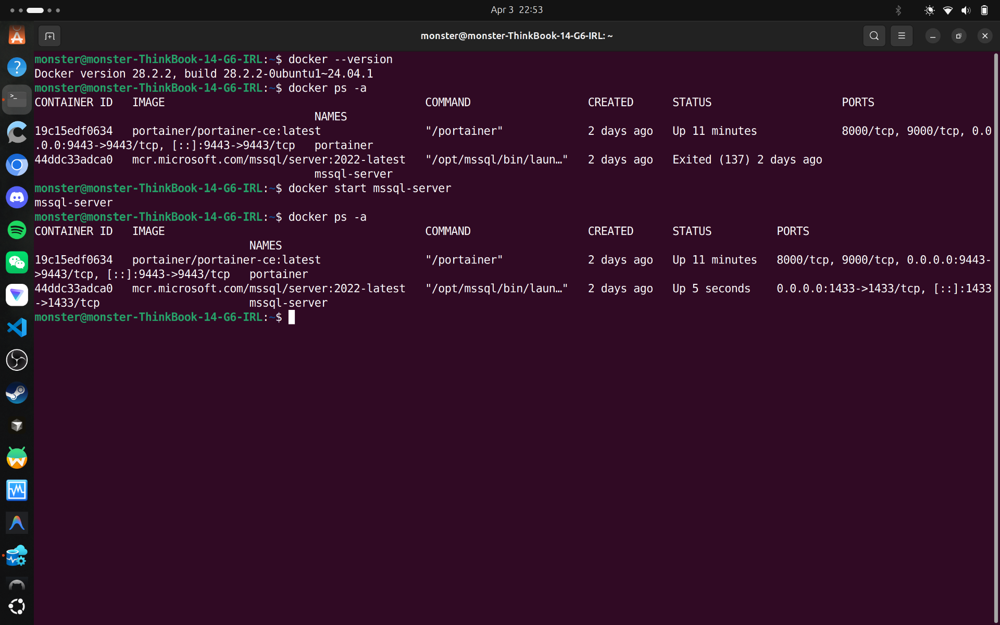
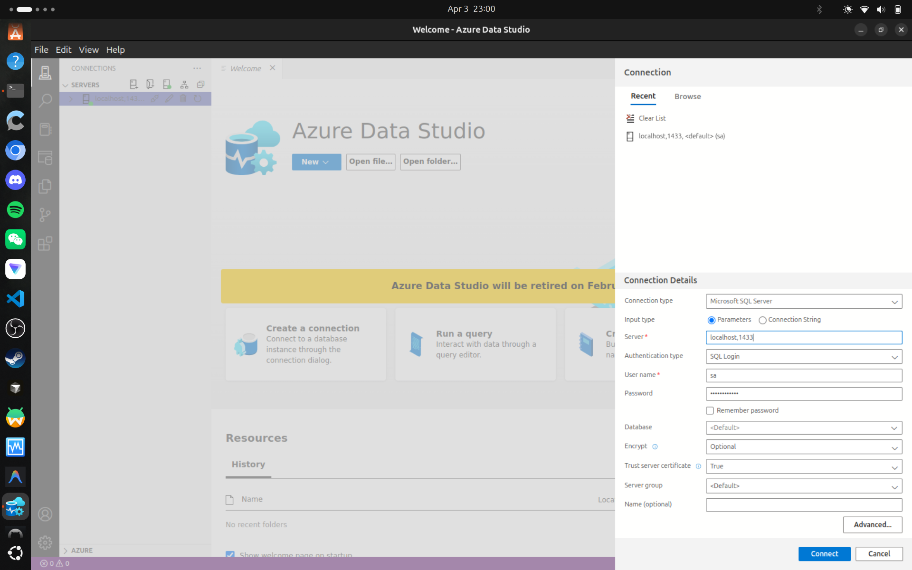
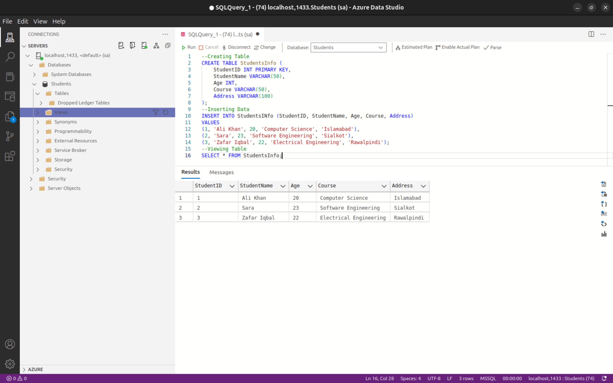
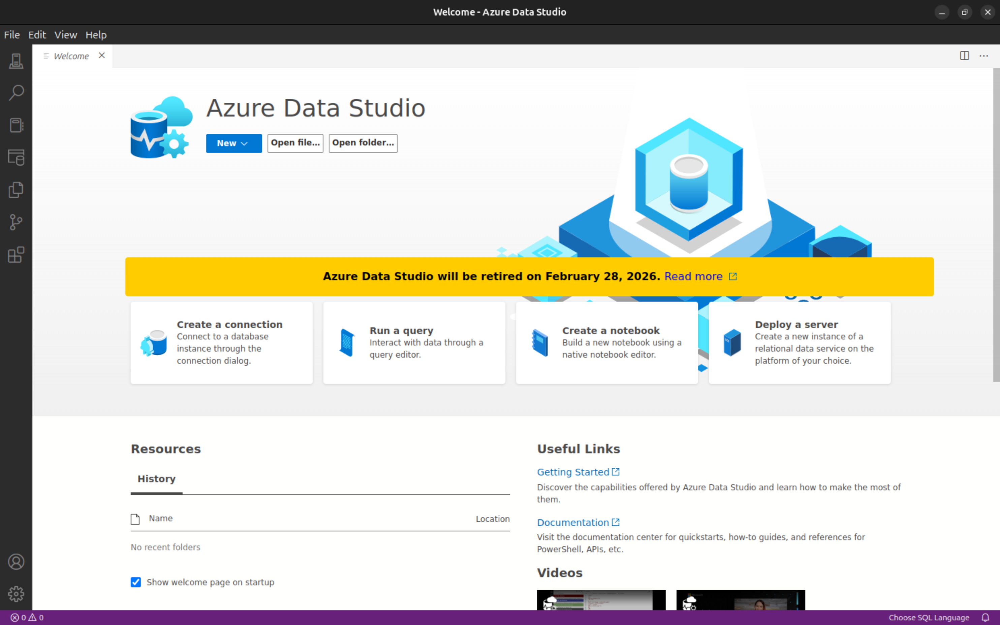

## Creating a Students Table using Docker SQL Server and Azure Data Studio

This was the first thing I did for my Database Management Systems coursework this semester — get SQL Server running somewhere I actually understood, instead of fighting a local install. I'd already used Docker for other things, so containerizing the database instead of installing SQL Server directly on Ubuntu felt like the obvious move: no messing with ODBC drivers system-wide, no uninstall headaches if I got it wrong, just `docker rm` and start over.

This post is basically my lab notes from that session — spin up the container, connect with Azure Data Studio, run through the standard CRUD operations on a small `Students` table.

---

## 1. Running SQL Server in Docker

First, start a SQL Server container using Docker.

```bash
docker run -e "ACCEPT_EULA=Y"\
-e "MSSQL_SA_PASSWORD=Password123@"   
-p 1433:1433 
--name mssql-server   
-d mcr.microsoft.com/mssql/server:2022-latest
```

### Explanation

- `ACCEPT_EULA=Y` → Accepts the Microsoft SQL Server license agreement.
- `SA_PASSWORD` → Sets the password for the `sa` (system administrator) account.
- `-p 1433:1433` → Exposes SQL Server's default port to your local machine.
- `--name sqlserver` → Names the container.
- `-d` → Runs the container in detached mode.
- `mcr.microsoft.com/mssql/server:2022-latest` → Official SQL Server Docker image.

After running this command, SQL Server will be available at **localhost:1433**.

One thing I only realized after doing this a few times: `docker run` builds a brand-new container every time you call it. If you stop the container and want it back, you use `docker start mssql-server`, not `docker run` again — running it again just tries to create a second container with a name that's already taken, and Docker complains. Small distinction, but it tripped me up the first time I came back to this after a reboot.

---

**Docker SQL Server Container Running**



---

## 2. Connecting to SQL Server using Azure Data Studio

Next, connect to the running SQL Server instance using Azure Data Studio.

Steps:

1. Open **Azure Data Studio**
2. Click **New Connection**
3. Enter the following details:

| Setting | Value |
|-------|------|
| Server | `localhost` |
| Authentication Type | SQL Login |
| Username | `sa` |
| Password | Your SA password |

Once connected, the SQL Server instance will appear in the **Connections panel**.

I went with Azure Data Studio over SSMS mostly because it's cross-platform and I'm on Ubuntu day-to-day — SSMS is Windows-only. It also felt closer to VS Code, which meant less time relearning a UI and more time actually writing SQL.

---

**Azure Data Studio Connection**



---

# SQL Tasks

Below are a series of tasks performed on the **Students table** to demonstrate SQL operations. This was mostly about getting comfortable with basic DDL/DML before touching anything more complex — the kind of thing you need to be fast at before a real schema (with foreign keys, constraints, joins) stops feeling intimidating.

---

## Task 01 — Create the Students Table

### Query

```sql
CREATE TABLE Students (
    StudentID INT PRIMARY KEY,
    Name VARCHAR(100),
    Age INT,
    Department VARCHAR(100)
);
```

### Screenshot


### Explanation

`StudentID` as a `PRIMARY KEY` was the whole point of this task for me — it's the first constraint I set up by hand instead of copying from a lecture slide. SQL Server enforces uniqueness on it automatically, so a second `INSERT` with the same `StudentID` gets rejected instead of silently creating a duplicate row. `VARCHAR(100)` for `Name` and `Department` is generous on purpose; at this stage I wasn't optimizing storage, just avoiding truncation errors while I was still getting used to the syntax.

---

## Task 02 — Insert Student Records

### Query

```sql
INSERT INTO Students (StudentID, Name, Age, Department)
VALUES
(1, 'Ali', 20, 'Computer Science'),
(2, 'Sara', 21, 'Electrical Engineering'),
(3, 'Ahmed', 22, 'Mechanical Engineering');
```

### Screenshot


### Explanation

Multi-row `INSERT` with one statement and comma-separated value tuples — I'd been writing a separate `INSERT` per row up to this point, so this was a small but genuinely useful thing to pick up. Fewer round trips, less boilerplate.

---

## Task 03 — Retrieve All Students

### Query

```sql
SELECT * FROM Students;
```

### Screenshot



### Explanation

The obligatory first `SELECT`. Confirms the insert actually worked — trusting the query editor's "Commands completed successfully" message without checking the data is how you end up debugging the wrong thing later.

---

## Task 04 — Retrieve Students from a Specific Department

### Query

```sql
SELECT * 
FROM Students
WHERE Department = 'Computer Science';
```

<!-- IMAGE: Query results panel showing only the Computer Science row(s) filtered from the Students table -->

### Explanation

Basic `WHERE` filtering. The main thing to get right here is that string comparisons in SQL Server are case-insensitive by default under the standard collation — `'computer science'` would have matched too. That's not something you think about until you've been burned by a case-sensitive filter in another language and bring the wrong assumption into SQL.

---

## Task 05 — Update Student Information

### Query

```sql
UPDATE Students
SET Age = 23
WHERE StudentID = 3;
```

<!-- IMAGE: Query results showing "(1 row affected)" after the UPDATE, plus a follow-up SELECT confirming Ahmed's age changed to 23 -->

### Explanation

The thing that actually matters in this task isn't the `SET` clause, it's the `WHERE` clause. Leave it off and you update every row in the table. I ran a `SELECT` with the same `WHERE` condition first, before the `UPDATE`, just to double check I was about to touch exactly one row — a habit I picked up here that's stuck with me since.

---

## Task 06 — Delete a Student Record

### Query

```sql
DELETE FROM Students
WHERE StudentID = 2;
```

<!-- IMAGE: Query results showing "(1 row affected)" after the DELETE, plus a follow-up SELECT showing Sara's row gone -->

### Explanation

Same lesson as `UPDATE`, higher stakes — a `DELETE` without a `WHERE` clause wipes the whole table and there's no undo unless you're inside a transaction. I made a point of running `SELECT * FROM Students WHERE StudentID = 2` first to confirm which row I was about to remove before actually running the `DELETE`.

---

## Task 07 — Count Total Students

### Query

```sql
SELECT COUNT(*) AS TotalStudents
FROM Students;
```

<!-- IMAGE: Query results showing TotalStudents = 2 after Sara's row was deleted in Task 06 -->

### Explanation

`COUNT(*)` counts rows regardless of NULLs in any particular column, which is different from `COUNT(ColumnName)` — that variant skips NULLs in that column. Worth knowing before you use `COUNT` on a column instead of `*` and get a number that's smaller than you expected.

---

## Task 08 — Order Students by Age

### Query

```sql
SELECT *
FROM Students
ORDER BY Age DESC;
```

<!-- IMAGE: Query results showing remaining students sorted oldest to youngest -->

### Explanation

`ORDER BY` is the last clause the query engine evaluates conceptually, even though you write it last syntactically too — it sorts the final result set, it doesn't affect how rows are stored on disk. `DESC` for oldest-first; leaving it off defaults to ascending.

---

## Conclusion

In this exercise, we deployed **SQL Server using Docker**, connected it through **Azure Data Studio**, and performed several SQL operations including table creation, data insertion, querying, updating, deleting, and sorting records.

Nothing here was hard, exactly, but it was the first time I'd set up a database from a blank container myself instead of connecting to something a lab environment already had running for me. That distinction mattered more than it sounds — the next time I needed SQL Server in Docker (for a full-stack DBMS project with a real backend on top of it), none of this setup was unfamiliar anymore.


