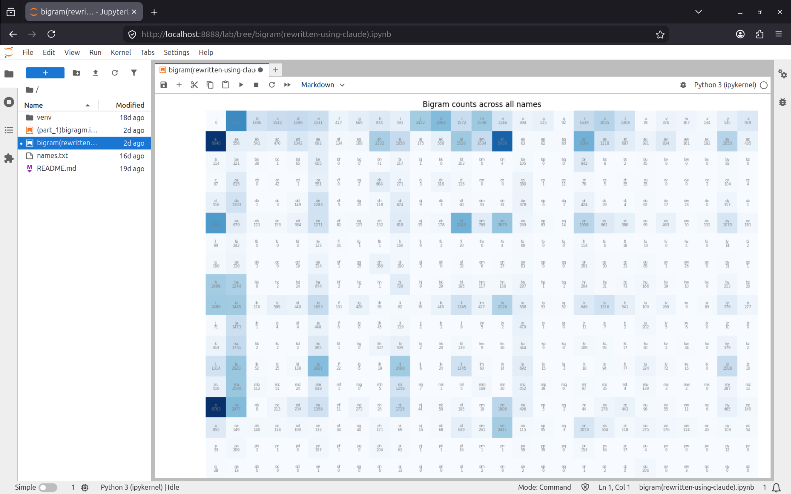
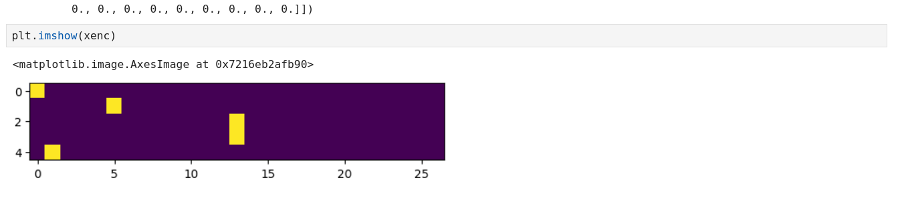
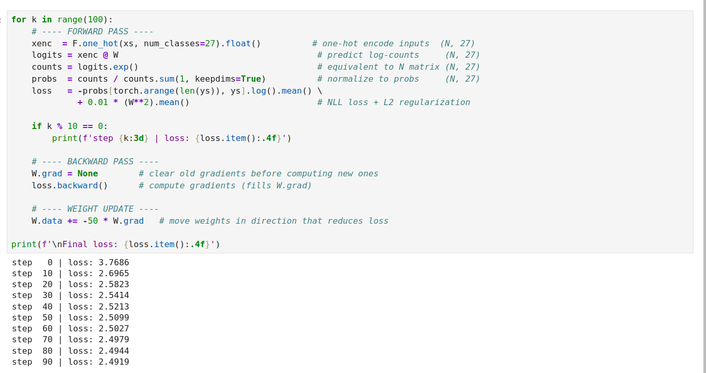
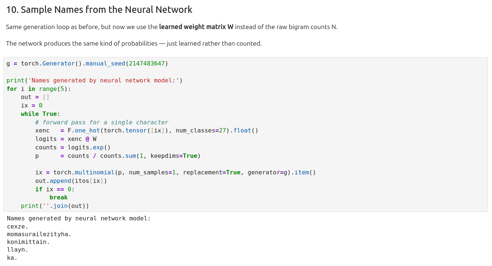
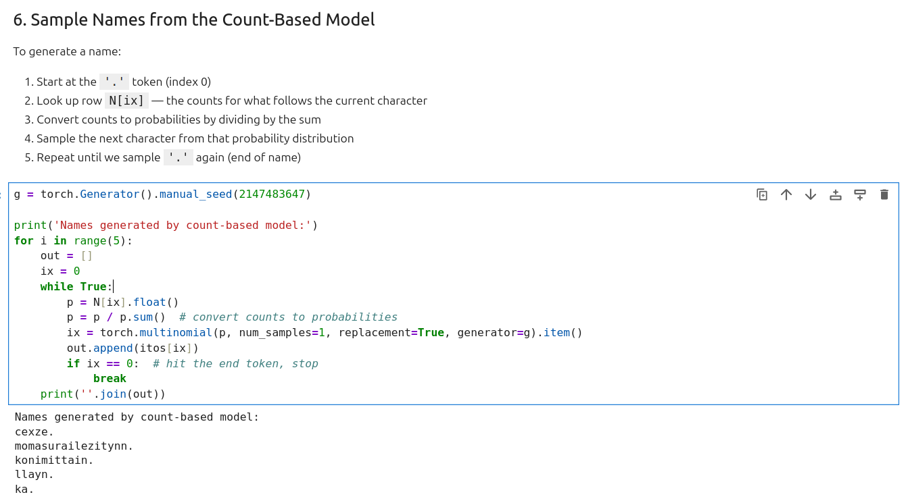

## Building a Character-Level Language Model from Scratch

After finishing micrograd I started the next video in Karpathy's series: **makemore**. The goal is to build a model that generates new names — things that sound like real names but aren't. The first step is a bigram model. This is my learning log.

---

## What is a Bigram?

A bigram is just a pair of consecutive characters. Take the name `emma`. Wrap it in start/end tokens and you get:

```
. e   →   name starts with e
e m   →   e is followed by m
m m   →   m is followed by m
m a   →   m is followed by a
a .   →   a ends the name
```

A bigram model learns: _given a character, what character is most likely to come next?_ That's it. It only looks one character back, which makes it simple — but it's enough to generate things that at least _sound_ like names.

---

## The Dataset

32,033 human names from `names.txt`. One per line. That's all.

```python
words = open('names.txt', 'r').read().splitlines()

# ['emma', 'olivia', 'ava', 'isabella', 'sophia', ...]
# Total: 32033 words
# Shortest: 2 characters, Longest: 15 characters
```


---

## Part A: The Count-Based Model

### Step 1 — Character Mappings

Neural networks need numbers, not letters. So we build two lookup tables:

```python
chars = sorted(list(set(''.join(words))))  # all 26 letters
stoi  = {s: i+1 for i, s in enumerate(chars)}  # 'a'→1, 'b'→2, ..., 'z'→26
stoi['.'] = 0                                    # special start/end token
itos  = {i: s for s, i in stoi.items()}          # reverse: 0→'.', 1→'a', ...
```

The `.` token is clever — using the same token for both start and end means you don't need two separate special characters. A name begins when you see `.` and ends when you sample `.` again.

### Step 2 — The Count Matrix N

We build a 27×27 matrix `N` where `N[i, j]` = how many times character `j` followed character `i` across all 32,033 names.

```python
N = torch.zeros((27, 27), dtype=torch.int32)

for w in words:
    chs = ['.'] + list(w) + ['.']
    for ch1, ch2 in zip(chs, chs[1:]):
        N[stoi[ch1], stoi[ch2]] += 1
```

Row 0 (the `.` row) tells you how often each letter _starts_ a name. `N[0, 5]` is the count for names starting with `e`.

### Step 3 — The Bigram Heatmap

Plotting `N` makes the structure immediately visible. Darker blue = that pair appears more often.



You can see things like `an`, `na`, `ar` are very dark (common in names), while most combinations in the top-right (letters following `.`) are light except for common starting letters like `a`, `j`, `m`.

### Step 4 — Generating Names

To generate a name, we:

1. Start at index 0 (the `.` token)
2. Look up row `N[ix]`, convert counts to probabilities
3. Sample the next character
4. Repeat until we sample `.` again

```python
g = torch.Generator().manual_seed(2147483647)

for i in range(5):
    out, ix = [], 0
    while True:
        p  = N[ix].float()
        p  = p / p.sum()
        ix = torch.multinomial(p, num_samples=1, replacement=True, generator=g).item()
        out.append(itos[ix])
        if ix == 0:
            break
    print(''.join(out))
```

Output: `mor`, `axx`, `minaymoryles`, `kondlaisah`, `anchshizarie`

Not amazing — but recognisably name-shaped. The model has no idea about word structure, it's just using character-level statistics.

### Step 5 — Model Smoothing

There's a problem. If a bigram like `jq` never appears in the training data, its count is 0. Then `log(0) = -inf` and the loss explodes.

The fix is **model smoothing** — add a fake count of 1 to every cell before normalizing:

```python
P = (N + 1).float()           # add 1 to every count
P /= P.sum(1, keepdim=True)   # normalize rows to probabilities
```

Adding 1 to everything pulls the model slightly toward a **uniform distribution** (predicting every character equally). Add more fake counts and you get a more uniform model. Add less and you get a more peaked one. This whole process is called **Laplace smoothing**.

I found this out the hard way by testing the word `andrejq` — the bigram `jq` has zero probability, so the NLL instantly becomes infinity.

### Step 6 — Negative Log-Likelihood Loss

To measure how good the model is, we use **negative log-likelihood (NLL)**:

```python
log_likelihood = 0.0
for w in words:
    chs = ['.'] + list(w) + ['.']
    for ch1, ch2 in zip(chs, chs[1:]):
        prob = P[stoi[ch1], stoi[ch2]]
        log_likelihood += torch.log(prob)

nll = -log_likelihood
print(nll / n)   # average NLL per bigram
```

The idea:

- A perfect model assigns probability 1.0 to every correct character → `log(1) = 0` → loss = 0
- A bad model assigns low probabilities → `log(small number)` is very negative → NLL is large
- We want to **minimize** the average NLL

The comment I left in my original notebook explains it well enough:

```python
# Goal: maximize likelihood of data w.r.t. model parameters
# = maximize log likelihood (log is monotonic)
# = minimize negative log likelihood
# = minimize average negative log likelihood
# log(a*b*c) = log(a) + log(b) + log(c)
```

---

## Part B: The Neural Network Model

Now we implement the **exact same bigram model** but as a neural network. Instead of counting and dividing, the network _learns_ the probability table through gradient descent.

This seems like more work for the same result — and right now it is. But this approach scales. The counting approach can't be extended to look at 3, 4, or 10 characters back. The neural network version can.

### The Architecture

One weight matrix `W` of shape `(27, 27)`:

- Each row corresponds to an input character
- Each column corresponds to a possible next character
- The values are _learned_ — they start random and get adjusted by backprop

```python
g = torch.Generator().manual_seed(2147483647)
W = torch.randn((27, 27), generator=g, requires_grad=True)
```

### One-Hot Encoding

We can't feed a character index directly into `W`. We convert each index into a **one-hot vector** — a vector of zeros with a single 1 at the character's position.

Then `xenc @ W` selects the row of `W` corresponding to the input character. That's literally all a one-hot matmul does — it's a row lookup.

```python
xenc  = F.one_hot(xs, num_classes=27).float()   # (N, 27)
logits = xenc @ W                                # (N, 27)  — raw scores
```



### Softmax

The raw output of `xenc @ W` is called **logits**. To turn those into probabilities we apply **softmax**:

```python
counts = logits.exp()                            # make everything positive
probs  = counts / counts.sum(1, keepdims=True)   # normalize each row to sum to 1
```

This two-liner is softmax. It's used at the end of basically every classifier network.

### The Training Loop

```python
for k in range(100):
    # Forward pass
    xenc   = F.one_hot(xs, num_classes=27).float()
    logits = xenc @ W
    counts = logits.exp()
    probs  = counts / counts.sum(1, keepdims=True)
    loss   = -probs[torch.arange(len(ys)), ys].log().mean() \
             + 0.01 * (W**2).mean()   # L2 regularization

    # Backward pass
    W.grad = None        # zero gradients
    loss.backward()

    # Update
    W.data += -50 * W.grad
```

`probs[torch.arange(len(ys)), ys]` — this line is doing something elegant. It uses fancy indexing to grab, for each training example, _only the probability the model assigned to the correct next character_. Then we take the log and negate to get NLL. One line for the entire loss.

The `+ 0.01 * (W**2).mean()` at the end is **L2 regularization**. It penalises large weights, which pushes the model toward predicting more uniform probabilities. This is the neural network equivalent of model smoothing.



### What `W.grad = None` Does

In my original notebook I was setting `W.grad = None` before each backward pass. I wasn't completely sure why at first — I just knew from micrograd that you have to zero the gradients. The reason: `.backward()` _accumulates_ into `.grad`. If you don't clear it, gradients from step 1 are still sitting in `W.grad` when you do step 2, and your update is wrong.

Setting to `None` is slightly more memory-efficient than setting to `torch.zeros_like(W)` — PyTorch will just allocate a fresh tensor on the next backward. Both work.

### Generated Names

After 100 training steps:

```
mor.
axx.
minaymoryles.
kondlaisah.
anchshizarie.
```

Same seed, same names — which confirms the neural network learned the same distribution as the count-based model. The two approaches are mathematically equivalent for bigrams.


---

## The Thing That Confused Me Most

The indexing line:

```python
loss = -probs[torch.arange(len(ys)), ys].log().mean()
```

Breaking it down:

- `torch.arange(len(ys))` → `[0, 1, 2, 3, 4, ...]` — row indices
- `ys` → `[5, 13, 13, 1, 0, ...]` — column indices (the correct next characters)
- `probs[rows, cols]` → grabs one element per row — the probability of the correct character
- `.log().mean()` → average log probability
- `-` → negate to get NLL (we want to minimize a positive number)

Once I understood that `probs[i, j]` means "probability that character `j` follows character `i`", the whole thing made sense. You're just asking: how much probability did the model give to the right answer?

---

## Count-Based vs Neural Network — Summary

|               | Count-based           | Neural Network                      |
| ------------- | --------------------- | ----------------------------------- |
| How it works  | Count bigrams, divide | Learn W via gradient descent        |
| Training      | None needed           | 100 gradient descent steps          |
| Smoothing     | Add fake counts       | L2 regularization on W              |
| Loss function | NLL computed from P   | NLL computed from softmax(xenc @ W) |
| Extensible?   | No                    | Yes                                 |
| Results       | Identical             | Identical                           |

Both are equivalent for bigrams. The point of doing it twice is to understand _why_ the neural network approach is worth the extra complexity — it extends to trigrams, to MLPs looking at 5 characters, all the way to transformers. The counting approach doesn't.

---

## Screenshots





---

## Repos

| Repo                                                                                                                                            | Description                                     |
| ----------------------------------------------------------------------------------------------------------------------------------------------- | ----------------------------------------------- |
| [My Implementation](https://github.com/Mzaq1559/Following-the-tutorial-of-Micrograd-implementing-Backpropagation-on-a-Neural-Net-from-scratch-) | Original notebook written while following along |
| [Rewritten Notebook](https://github.com/Mzaq1559/micrograd)                                                                                     | Cleaned-up version with full comments           |
| [Original Makemore](https://github.com/karpathy/makemore)                                                                                       | Karpathy's repo                                 |

## Tutorial

📺 [Andrej Karpathy — The spelled-out intro to language modeling: building makemore](https://www.youtube.com/watch?v=PaCmpygFfXo)

---

## What's Next

Part 2: MLP — instead of looking at one character, the model will look at a **context window** of multiple characters and use a proper multi-layer perceptron to predict the next one. That's where it starts feeling like a real language model.
