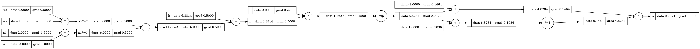
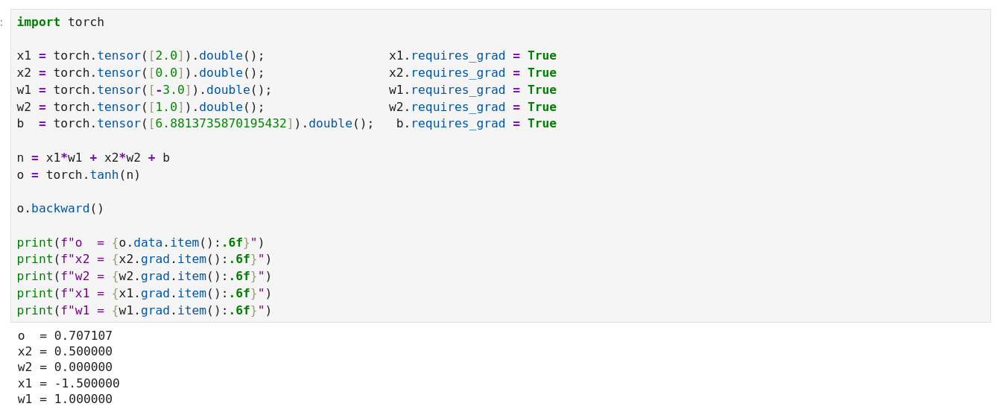
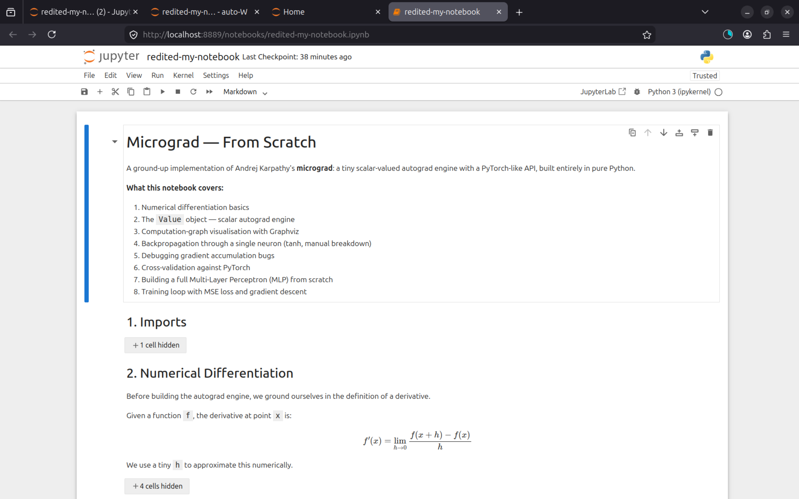
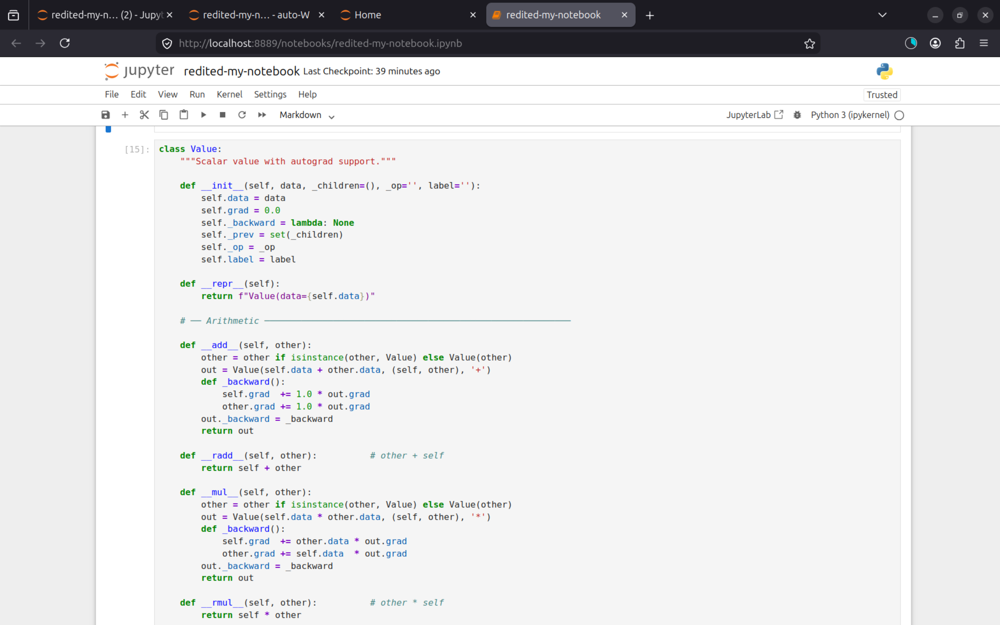
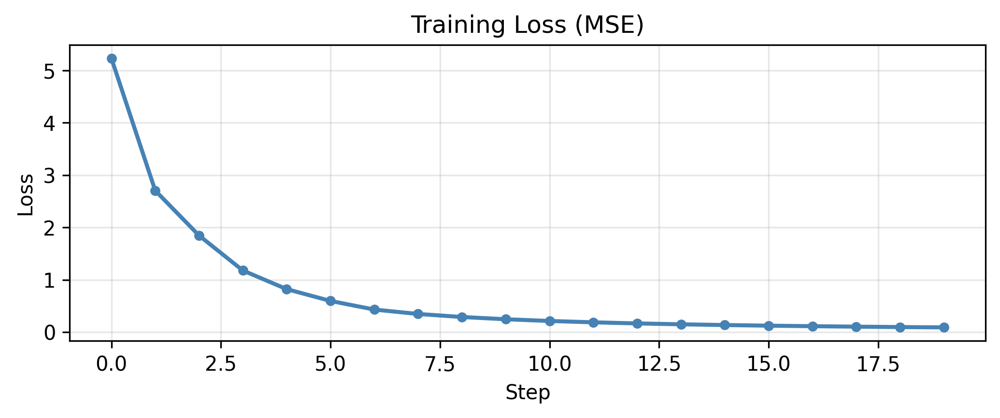
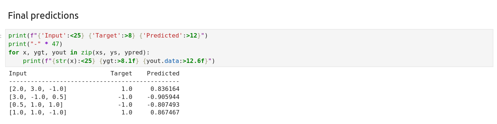

## Building a Neural Network Engine from Scratch

I followed Andrej Karpathy's [micrograd tutorial](https://www.youtube.com/watch?v=VMj-3S1tku0) and implemented a complete scalar-valued autograd engine and neural network in pure Python — no PyTorch, no NumPy, no magic. This is my learning log: what I understood, what broke, and what finally clicked.

---

## What is Micrograd?

Micrograd is a tiny neural network engine. The entire thing is built around one idea: if you can track every arithmetic operation a number goes through, you can automatically compute how changing that number affects any final output — that's a **gradient**, and that's what makes neural networks trainable.

The core is the `Value` class — a scalar (just a number) wrapped in a Python object that silently records every operation done to it, building up a **computation graph** as you go. Once you have that graph, you can walk it backwards and apply the chain rule at each step. That process is **backpropagation**.

---

## What I Implemented

### The `Value` Object

```python
class Value:
    def __init__(self, data, _children=(), _op='', label=''):
        self.data  = data
        self.grad  = 0.0            # gradient, filled in by backward()
        self._prev = set(_children) # the nodes that produced this value
        self._op   = _op            # the operation: '+', '*', 'tanh', …
        self._backward = lambda: None
```

Every time you write `a + b` or `a * b`, the result is a new `Value` whose `_prev` contains `a` and `b`, and whose `_backward` closure knows exactly how to push gradients back to them.

### Supported Operations

| Operation          | How it's built                                      |
| ------------------ | --------------------------------------------------- |
| `+`, `-`, `*`, `/` | Direct operator overloads                           |
| `**`               | `__pow__` with int/float exponent                   |
| `tanh`             | Fused kernel _and_ manual `exp`-based decomposition |
| `exp`              | Primitive used to build `tanh` from scratch         |

### The Backward Pass

```python
def backward(self):
    self.grad = 1.0          # seed: ∂output/∂output = 1
    topo = []
    visited = set()

    def build_topo(v):
        if v not in visited:
            visited.add(v)
            for child in v._prev:
                build_topo(child)
            topo.append(v)

    build_topo(self)
    for node in reversed(topo):   # reverse topological order = backprop
        node._backward()
```

No magic — just a topological sort and the chain rule applied locally at each node.

### The Neural Network

Three classes built on top of `Value`:

```
Neuron(nin)       →  o = tanh(w · x + b)
Layer(nin, nout)  →  nout neurons, each seeing the full input
MLP(nin, nouts)   →  a stack of layers, e.g. MLP(3, [4, 4, 1])
```

A 3-input, two-hidden-layer network is just:

```python
n = MLP(3, [4, 4, 1])
output = n([2.0, 3.0, -1.0])
```

### Training Loop

```python
for k in range(20):
    # Forward pass — build the graph
    ypred = [n(x) for x in xs]
    loss  = sum([(yout - ygt)**2 for ygt, yout in zip(ys, ypred)], Value(0.0))

    # Zero gradients — critical, or they accumulate across steps
    for p in n.parameters():
        p.grad = 0.0

    # Backward pass — fill every .grad in the graph
    loss.backward()

    # Gradient descent — nudge each parameter opposite its gradient
    for p in n.parameters():
        p.data -= 0.05 * p.grad

    print(k, loss.data)
```

After 20 steps, the loss goes from ~5.0 down to near zero and the network correctly learns to output `+1` or `-1` for each input.

---

## The Part That Confused Me

The `draw_dot` function that visualises the computation graph uses a library called **Graphviz**. I didn't understand the code at first and just used it as a black box. But the graph it produces made the whole backprop story click visually — you can literally _see_ every node, every edge, and watch the gradients fill in after `.backward()` runs.



---

## The Bug That Taught Me the Most

There's a subtle bug that appears when the **same `Value` node is used more than once** in an expression. For example:

```python
a = Value(3.0)
b = a + a       # a appears twice
b.backward()
print(a.grad)   # should be 2.0 — is it?
```

If `_backward` uses `=` instead of `+=` to write gradients, the second branch overwrites the first and you get `1.0` instead of `2.0`. The fix is always accumulating:

```python
# Wrong
self.grad = 1.0 * out.grad

# Right
self.grad += 1.0 * out.grad
```

Small change, but it's the difference between a correct autograd engine and a broken one.

---

## The Moment It Clicked

When I cross-validated my `Value` engine against PyTorch and got identical gradients:

```python
import torch
x1 = torch.tensor([2.0]).double(); x1.requires_grad = True
# ... same inputs, same weights ...
o = torch.tanh(x1*w1 + x2*w2 + b)
o.backward()
print(x1.grad.item())   # matches Value's x1.grad exactly
```

That's when I understood why micrograd manually sets `requires_grad=True` on every node — in PyTorch, input tensors don't track gradients by default because the graph is optimised to skip leaf nodes unless you ask. Micrograd tracks everything explicitly so nothing is hidden.



---

## Screenshots






---

## Repos

| Repo                                                                                                                                            | Description                               |
| ----------------------------------------------------------------------------------------------------------------------------------------------- | ----------------------------------------- |
| [My Implementation](https://github.com/Mzaq1559/Following-the-tutorial-of-Micrograd-implementing-Backpropagation-on-a-Neural-Net-from-scratch-) | Full notebook — Value, MLP, training loop |
| [Original Micrograd](https://github.com/Mzaq1559/micrograd)                                                                                     | Karpathy's reference implementation       |

## Tutorial

📺 [Andrej Karpathy — The spelled-out intro to neural networks and backpropagation](https://www.youtube.com/watch?v=VMj-3S1tku0)

---

## What's Next

Next in the series: building a character-level language model from scratch — [makemore](https://github.com/karpathy/makemore).