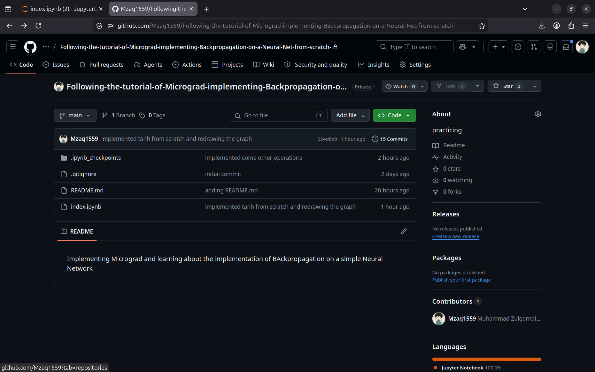
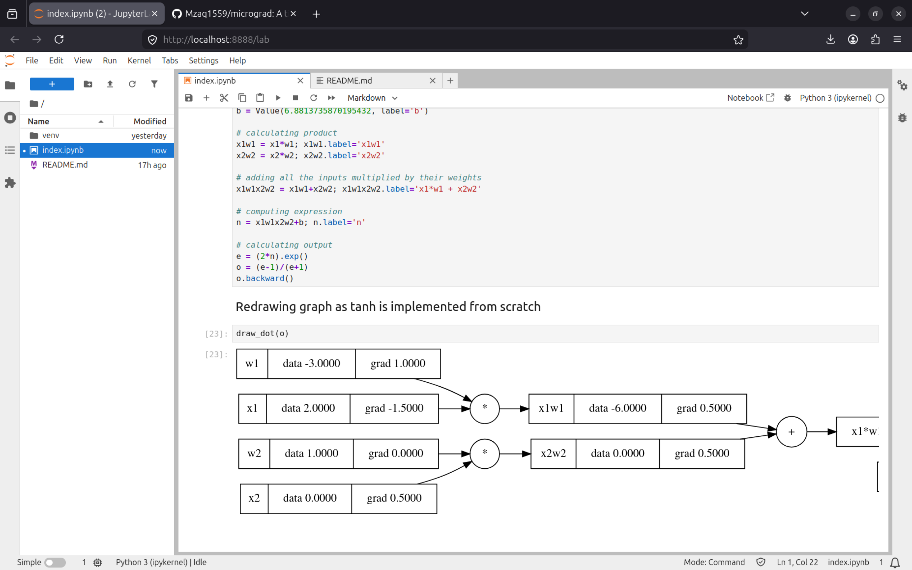
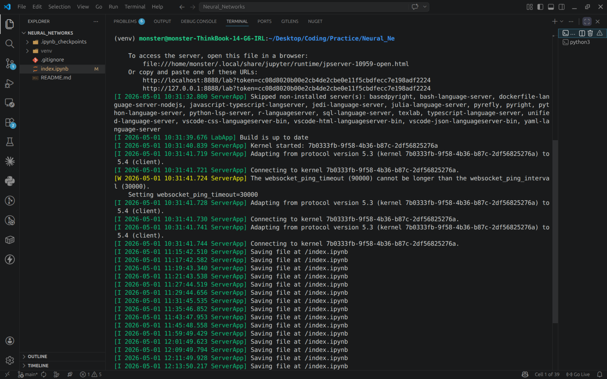

## Building a Neural Network Engine from Scratch with Andrej Karpathy

I followed Andrej Karpathy's micrograd tutorial and built a
neural network engine from scratch in Python. This is my
learning log of what I understood, what confused me, and
what I built.

## What is Micrograd?

Micrograd is a tiny neural network engine built from scratch.
The core of it is a Value object — a simple implementation of
a tensor with zero dimensions. Basically a number wrapped in
a class that tracks every operation done to it so we can
run backpropagation later.

## What I Implemented

- **Value class** — wraps a number and builds a computation graph
- **Neuron** — takes inputs, multiplies by weights, adds bias
- **tanh** — activation function that squashes any value
  to between -1 and 1

## The Part That Confused Me

The code that draws the computation graph uses a library
called Graphviz. I have no idea how it works yet and I
just copy pasted it. But the graph it produces makes
the whole thing click visually.

## The Moment It Clicked

When I realized that in PyTorch, gradients of input
tensors aren't calculated by default because they are
leaf nodes. You have to explicitly set
requires_grad=True to track them. That's when I
understood why micrograd builds the whole graph
manually — so nothing is hidden from you.

## Code

[paste a small snippet from your notebook here]

## Screenshots

## Repos

| Repo                                                                                                                                            | Description              |
| ----------------------------------------------------------------------------------------------------------------------------------------------- | ------------------------ |
| [My Implementation](https://github.com/Mzaq1559/Following-the-tutorial-of-Micrograd-implementing-Backpropagation-on-a-Neural-Net-from-scratch-) | My code following along  |
| [Original Micrograd](https://github.com/Mzaq1559/micrograd)                                                                                     | Karpathy's repo I cloned |

## Tutorial

📺 [Andrej Karpathy — Micrograd](https://www.youtube.com/watch?v=VMj-3S1tku0)

## What's Next

Next video in the series — building a language model
from scratch.
