# Running SQL Server in Docker & Exploring the Northwind Database with Azure Data Studio

In this post, I set up a **Microsoft SQL Server instance using Docker**, connected it to **Azure Data Studio**, and explored the classic **Northwind sample database** — inspecting its structure through SQL queries and generating a full ER diagram using **DBeaver**.

---

## 1. Running SQL Server in Docker

Start a fresh SQL Server container using Docker:

```bash
docker run -e "ACCEPT_EULA=Y" -e "MSSQL_SA_PASSWORD=Password123@" \
  -p 1433:1433 --name mssql-server \
  -d mcr.microsoft.com/mssql/server:2022-latest
```

If you already created the container before and it is stopped, just restart it:

```bash
docker start mssql-server
```

Verify it is running:

```bash
docker ps
```

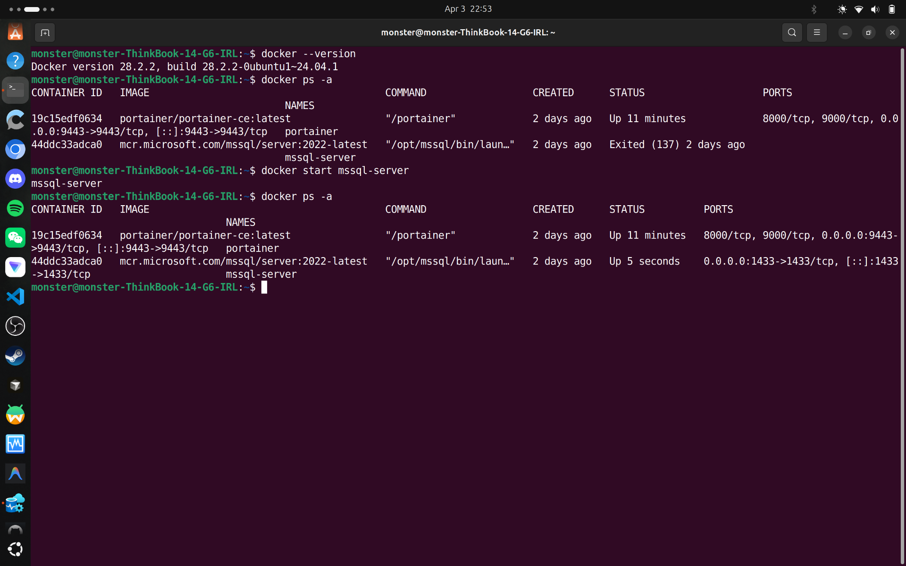

> **Note:** `docker run` creates a brand new container. To restart an existing one, always use `docker start <name>` — not `docker run`.

---

## 2. Connecting to Azure Data Studio

Open **Azure Data Studio** and click **New Connection**. Fill in the following details:

| Field | Value |
|---|---|
| Server | `localhost,1433` |
| Authentication Type | SQL Login |
| Username | `sa` |
| Password | `Password123@` |
| Trust Server Certificate | Enabled ✅ |


After clicking **Connect**, the left sidebar populates with your server and databases.

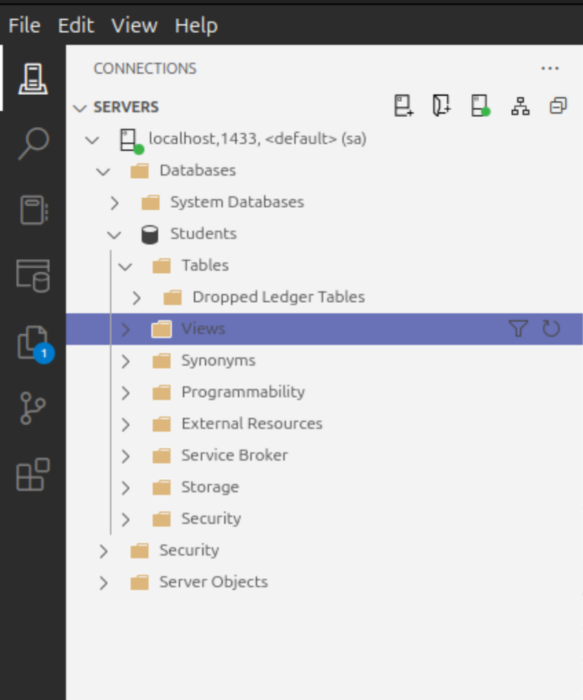

---

## 3. Loading the Northwind Sample Database

The **Northwind** database is a classic Microsoft sample dataset used to teach SQL for decades. It represents a fictional trading company and contains 13 interconnected tables covering customers, orders, products, employees, and suppliers.

The script is available on Microsoft's official GitHub repository:

> [github.com/microsoft/sql-server-samples](https://github.com/microsoft/sql-server-samples/blob/master/samples/databases/northwind-pubs/instnwnd%20(Azure%20SQL%20Database).sql)

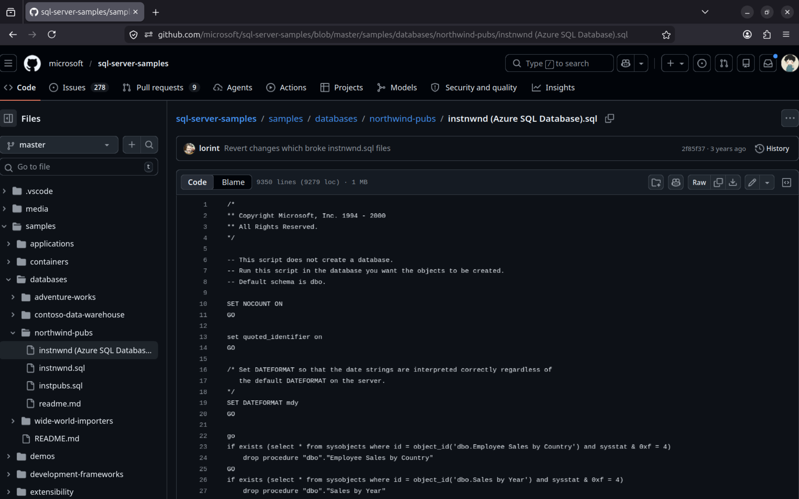

A database script like this has three main sections:

1. **Table creation** — creates all tables with columns and data types
2. **Constraints and indexes** — adds primary keys, foreign keys, and indexes
3. **Seed data** — populates the tables with sample records

Open the file in Azure Data Studio, make sure you are connected to your server, and press **F5**. The Messages tab will scroll through hundreds of success messages as each block executes.

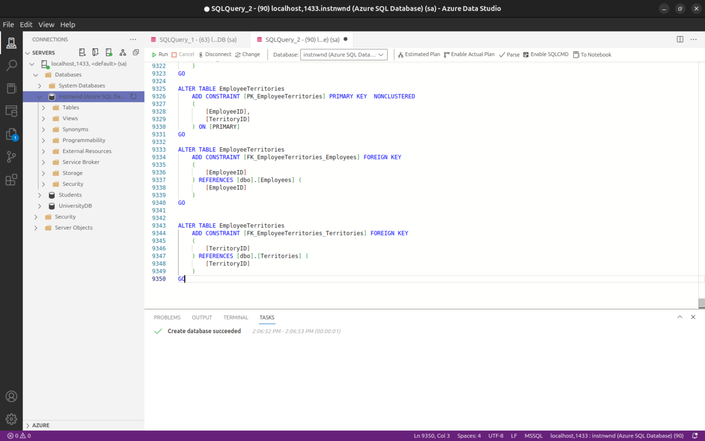

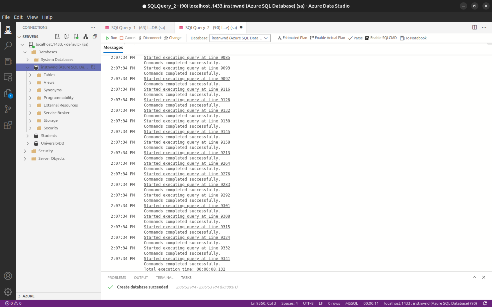

---

## 4. Exploring the Database Structure with SQL

Once Northwind is loaded, you can inspect its architecture using SQL queries directly in Azure Data Studio.

### List all tables

```sql
SELECT TABLE_NAME
FROM INFORMATION_SCHEMA.TABLES
WHERE TABLE_TYPE = 'BASE TABLE';
```

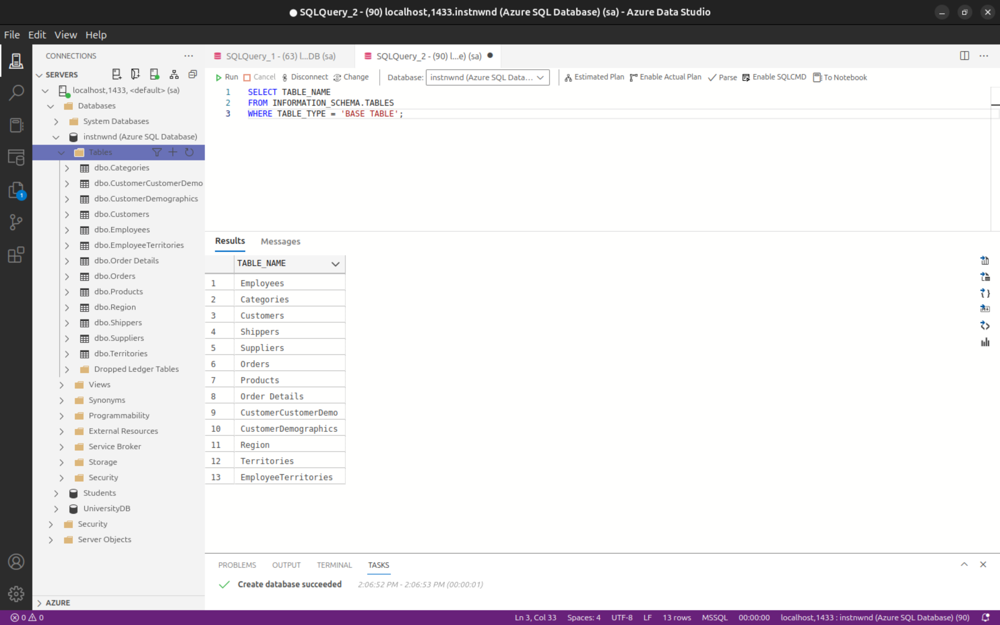

### View all foreign key relationships

```sql
SELECT
    fk.name AS ForeignKey,
    OBJECT_NAME(fk.parent_object_id) AS TableName,
    COL_NAME(fc.parent_object_id, fc.parent_column_id) AS ColumnName,
    OBJECT_NAME(fk.referenced_object_id) AS ReferencedTable
FROM sys.foreign_keys fk
JOIN sys.foreign_key_columns fc
ON fk.object_id = fc.constraint_object_id;
```

This query shows exactly how every table connects to another — for example, `Orders` references `Customers` via `CustomerID`, and `Products` references `Categories` via `CategoryID`.

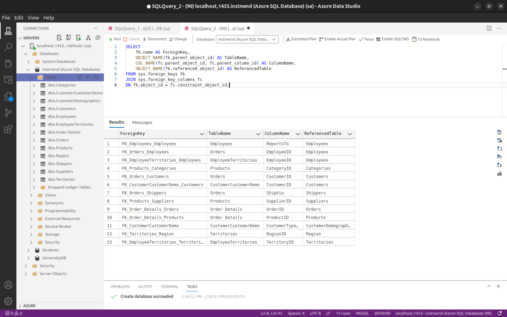

---

## 5. Quick Test — Creating a StudentsInfo Table

To practice basic DDL alongside the Northwind exploration, I created a simple `StudentsInfo` table and ran all the commands — `CREATE TABLE`, `INSERT`, `SELECT`, and `EXEC sp_rename` — in a single query window.

```sql
CREATE TABLE StudentsInfo (
    StudentID   INT          PRIMARY KEY,
    StudentName VARCHAR(50)  NOT NULL,
    Age         INT,
    Course      VARCHAR(50),
    Address     VARCHAR(100)
);

INSERT INTO StudentsInfo (StudentID, StudentName, Age, Course, Address)
VALUES
    (1, 'Ali Khan',    20, 'Computer Science',    'Islamabad'),
    (2, 'Sara Ahmed',  22, 'Software Engineering', 'Lahore'),
    (3, 'Umar Farooq', 21, 'Data Science',         'Karachi');

SELECT * FROM StudentsInfo;

EXEC sp_rename 'StudentsInfo', 'StudentRecords';
```

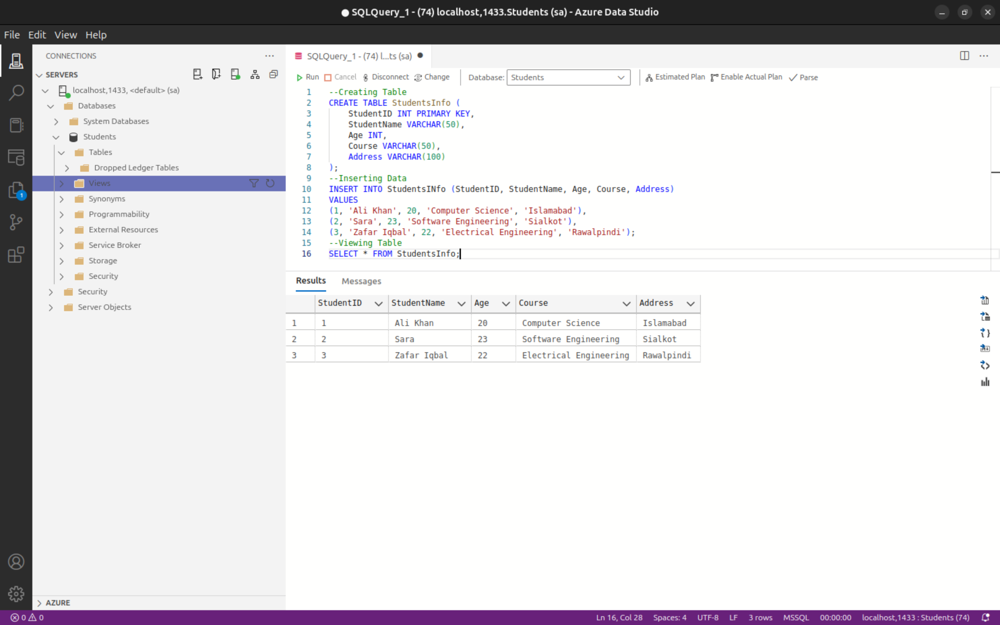

---

## 6. Generating the ER Diagram with DBeaver

Azure Data Studio does not include ER diagram support by default. For a visual overview of the Northwind schema, I used **DBeaver** — a free, cross-platform database client that auto-generates entity-relationship diagrams.

Connect DBeaver to the same `localhost:1433` endpoint using SQL Server authentication:

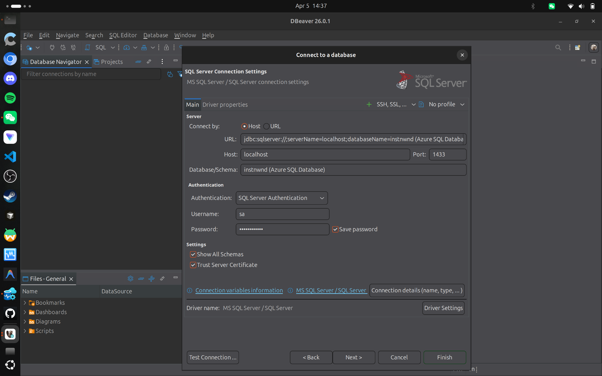

Once connected, expand the database in the navigator panel to see all schemas and their properties:

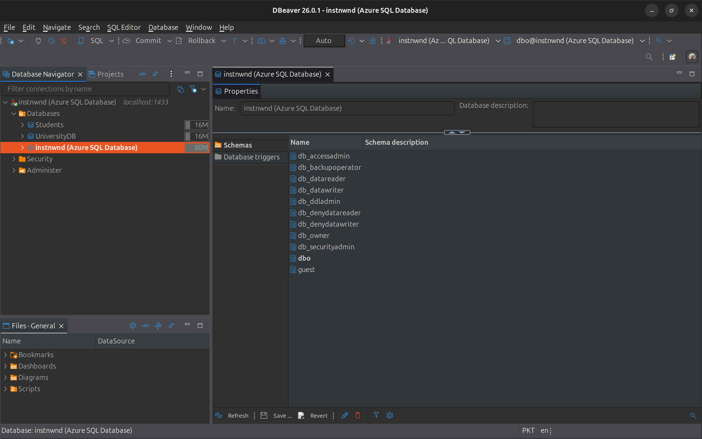

Right-click the `dbo` schema and select **View Diagram** to auto-generate the full ER diagram:

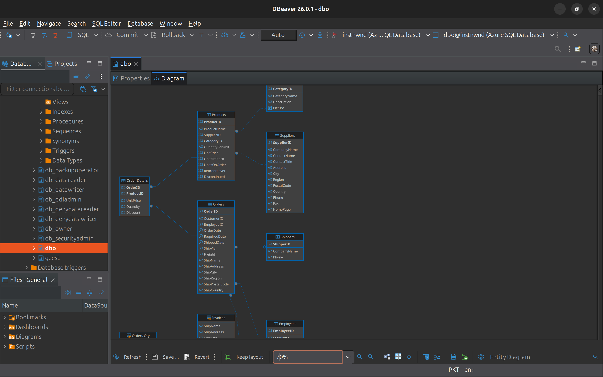

The full diagram makes the database design immediately clear — `Orders` sits at the centre, connecting outward to `Customers`, `Employees`, `Shippers`, and `Order Details`, which links further to `Products` and `Categories`.

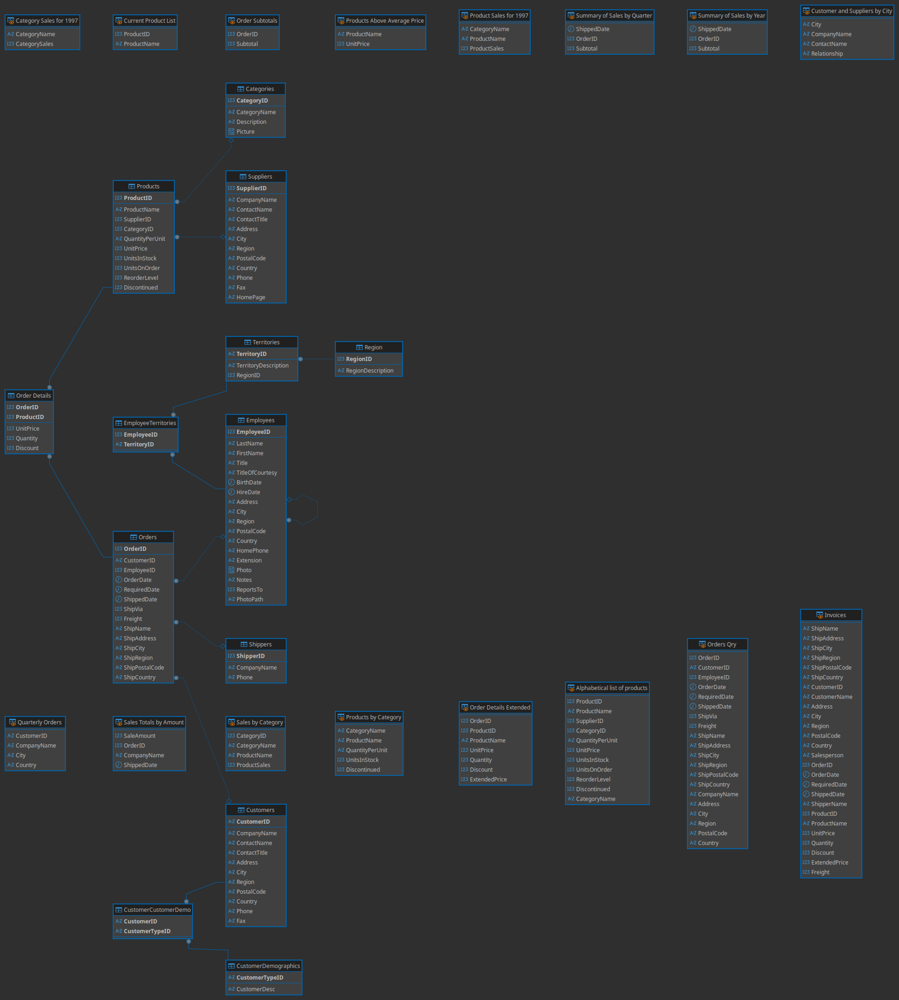

---

## Summary

In this lab we:

- Spun up **SQL Server 2022** inside a Docker container
- Connected to it using **Azure Data Studio**
- Loaded the **Northwind** sample database from Microsoft's GitHub
- Explored the schema using `INFORMATION_SCHEMA` queries and foreign key inspection
- Practiced basic DDL with a quick `StudentsInfo` table
- Generated a full **ER diagram** using DBeaver

Running databases in Docker removes all installation friction and lets you focus on what actually matters — writing SQL and understanding how relational databases work.

---
